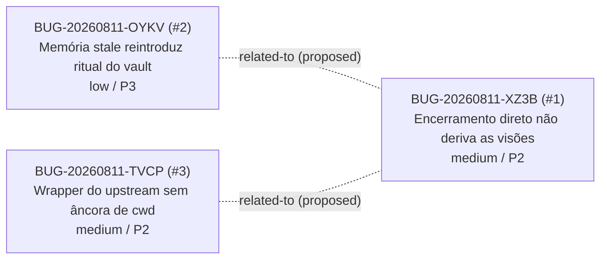

# Contexto: encerramento-de-sessao — grafo de relações

> View gerada em 2026-08-11. Não edite à mão. Arestas `proposed` são hipótese, nunca fato,
> e ficam fora de priorização automática.

## Arestas

| De | Tipo | Para | Estado | Evidência |
|----|------|------|--------|-----------|
| BUG-20260811-OYKV | related-to | BUG-20260811-XZ3B | proposed | (mesmo episódio de encerramento no comentarios-concursos) |
| BUG-20260811-TVCP | related-to | BUG-20260811-XZ3B | proposed | (descoberto durante a correção do XZ3B; mesma família de bordas do ciclo de sessão) |
