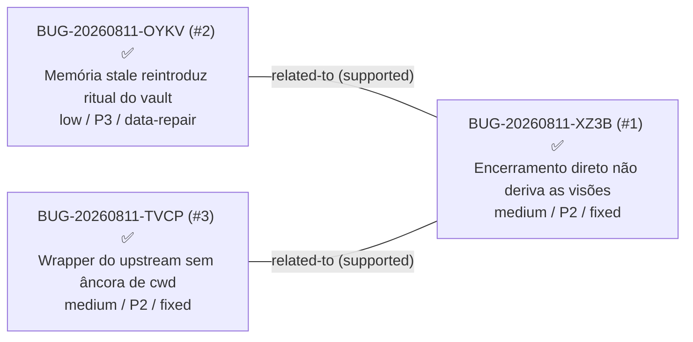

# Contexto: encerramento-de-sessao — grafo de relações

> View gerada em 2026-08-11. Não edite à mão. Arestas `proposed` são hipótese, nunca fato,
> e ficam fora de priorização automática. Todos os bugs do contexto estão RESOLVIDOS
> (travados por DONE.md em 2026-08-11).

## Arestas

| De | Tipo | Para | Estado | Evidência |
|----|------|------|--------|-----------|
| BUG-20260811-OYKV | related-to | BUG-20260811-XZ3B | supported | relatados no mesmo episódio real de encerramento no comentarios-concursos (intake 2026-08-11); promovida no fix |
| BUG-20260811-TVCP | related-to | BUG-20260811-XZ3B | supported | achado colateral confirmado da correção do XZ3B: o SessionStart do compact semeou o artefato espúrio durante aquela sessão; promovida no fix |
