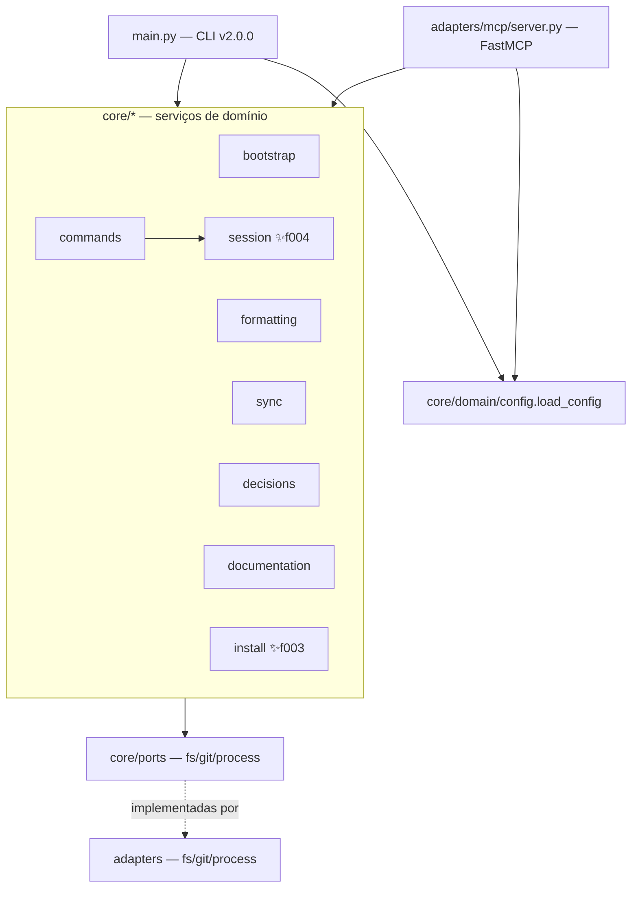

# Visão Geral Arquitetural (Architecture) — harness

> Regenerado pelo Architect em 2026-06-24 (Re-extração após as features 003, 004 e 005)
> Nível de Documentação: **Completo** · Escala: 🟢 CONFIRMADO · 🟡 INFERIDO · 🔴 LACUNA

Síntese arquitetural do núcleo `harness-core`, consolidando estilo estrutural, containers, componentes, modelo de dados, integrações de borda, dívidas técnicas e matriz de rastreabilidade. Reflete o estado ATUAL do repositório após o purge do legado `claude-config/` (commit `5624f78`) e a migração de estado e decisões para `.harness/`.

> ⚠️ **Mudança estrutural vs extração anterior (feature 002):** (1) o módulo `claude-config/` **não existe mais** — foi purgado; (2) o estado de sessão saiu de `ESTADO-DA-SESSAO.md` (raiz) para `.harness/estado-da-sessao.md` (feature 004); (3) as microdecisões saíram de `decisoes/` (raiz) para `.harness/decisoes/`, com caminhos lidos de `[decisions]` no `harness.toml` (feature 005); (4) surgiram dois novos serviços de capacidade — `install` (feature 003) e `session` (feature 004).

---

## 🗺️ 1. Estilo de Arquitetura

O `harness-core` adota **Arquitetura Hexagonal (Portas e Adaptadores)** — categoria **Aplicação** (Princípio nº 4). A regra de negócio (`src/core/`) é mantida isolada da infraestrutura e comunica-se exclusivamente por interfaces (`src/core/ports/`). 🟢

Hexágono em três anéis:

* **Núcleo de domínio (`src/core/`):** regras de negócio puras, uma pasta por capacidade. Depende apenas de `core/ports/` (`ABC`), nunca de adaptadores concretos.
* **Portas (`src/core/ports/`):** contratos abstratos `FileSystemPort`, `GitPort`, `ProcessPort` — fronteira de inversão de dependência.
* **Adaptadores (`src/adapters/`):** implementações físicas (`fs/local.py`, `git/subprocess.py`, `process/formatter.py`) e os **dois drivers de entrada** — a CLI (`src/main.py`) e o servidor MCP (`src/adapters/mcp/server.py`).

**Inversão de dependência preservada:** os serviços recebem as portas por injeção no construtor; quem as instancia (`main.py`, `server.py`, testes) escolhe a implementação concreta. 🟢

São **11 unidades**: 8 serviços de capacidade (`bootstrap`, `formatting`, `sync`, `decisions`, `commands`, `documentation`, **`install`** ✨f003, **`session`** ✨f004), o pacote `domain` (modelos + config + cache), o pacote `ports` e o pacote `adapters`.

---

## 🏗️ 2. Modelagem C4

Diagramas detalhados em Mermaid, divididos em artefatos:

1. **Contexto (Nível 1):** o sistema, o desenvolvedor humano, os três agentes de IA (Claude/Gemini/Antigravity) e as integrações de borda. Ver [c4-context.md](file:///Users/iagoleal/dev/harness/_reversa_sdd/c4-context.md).
2. **Containers (Nível 2):** wrapper Bash, venv, CLI Python, servidor MCP, artefatos versionados em `.harness/` e a documentação HTML. Ver [c4-containers.md](file:///Users/iagoleal/dev/harness/_reversa_sdd/c4-containers.md).
3. **Componentes (Nível 3):** os 8 serviços de domínio, as 3 portas, os adaptadores e os dois drivers. Ver [c4-components.md](file:///Users/iagoleal/dev/harness/_reversa_sdd/c4-components.md).

---

## 📊 3. Modelo de Dados e Rastreabilidade

* **Sem banco de dados relacional.** 🟢 Não há DDL, migrations, ORM nem `database_hints` (confirmado em `surface.json`). A "persistência" é toda em **arquivos versionados** (Markdown com front-matter, JSON e TOML). O modelo das estruturas de configuração, estado e decisão está em [erd-complete.md](file:///Users/iagoleal/dev/harness/_reversa_sdd/erd-complete.md).
* A matriz que liga componentes a regras de negócio, features e requisitos está em [spec-impact-matrix.md](file:///Users/iagoleal/dev/harness/_reversa_sdd/traceability/spec-impact-matrix.md).

---

## 🔌 4. Integrações de Borda

O núcleo não consome APIs REST/GraphQL nem produz webhooks. Suas únicas conexões externas são locais: 🟢

* **Servidor MCP (FastMCP "Harness"):** driver de entrada via Model Context Protocol (JSON-RPC sobre `stdin`/`stdout`), expondo **4 tools** ao agente: `format_file`, `check_repository_sync`, `process_decisions`, `session_command`.
* **Subprocessos `git`:** `git rev-parse HEAD` (local) e `git ls-remote origin main` (remoto), via `SubprocessGitAdapter` — usados em `sync`, `bootstrap` e `commands`.
* **Formatadores de terceiros do host:** `ruff format`, `prettier --write`, `rustfmt`, disparados em subprocesso por `HostFormatterAdapter`, sempre não-bloqueantes.
* **Servidor HTTP local:** `doc-serve` expõe `harness-docs.html` em `http://localhost:8000` via `http.server` nativo.
* **Ganchos de ciclo de vida do agente:** `SessionStart`/`PostToolUse`/`Stop` (Claude) e `SessionStart` (Gemini), configurados em `.claude/settings.json` e `.gemini/settings.json`, invocam o wrapper `./harness`.

---

## ⚠️ 5. Dívidas Técnicas e Bugs Latentes

Catalogados pelo Archaeologist/Detective (contexto, **não corrigidos** nesta extração):

| ID | Local | Sintoma | Sev. | Conf. |
|---|---|---|---|---|
| **T1** | `adapters/mcp/server.py:60` | `load_config` usado sem import → `NameError`; a tool MCP `process_decisions` nunca processa decisões (erro capturado e devolvido como string). | Alta | 🟢 |
| **T2** | `adapters/mcp/server.py:92` | `session_command` aponta para `ESTADO-DA-SESSAO.md` (raiz), divergente da CLI (`.harness/estado-da-sessao.md`); estado de sessão CLI×MCP não convergem. | Alta | 🟢 |
| **T3** | `main.py:63` | `json.loads` sem `import json` → `NameError` no `format` via stdin (hook `PostToolUse`); mascarado por `except`, autoformat por hook não ocorre. | Alta | 🟢 |
| **T4** | `formatting/service.py` | `[formatting]` do `harness.toml` não alimenta o serviço; blindagens e opt-out chumbados. | Média | 🟡 |
| **T5** | `main.py` 21–41/213 | `load_harness_config` (dict legado) coexiste com `load_config` (tipada) — duas vias de configuração. | Baixa | 🟡 |
| **T6** | repositório | Sem lock file; pins apenas `>=` — build não determinístico. | Média | 🟡 |

> Os bugs T1–T3 não impedem o uso primário pela CLI (sessão, decisões e instalação funcionam por ela), mas degradam silenciosamente os caminhos MCP (T1/T2) e o autoformat por hook (T3).

---

## 🧭 6. ADRs Pertinentes (decisões que sustentam o estilo)

`0006` (hexágono no core), `0007` (wrapper de conveniência), `0008` (doc por introspecção), `0009` (abandono de `claude-config/`, centralização em `.harness/`), `0010` (estado de sessão unificado), `0011` (reinjeção/instalação multi-harness por Strategy), `0012` (caminhos de decisão por configuração). Ligados às microdecisões MD-0001..MD-0004.
