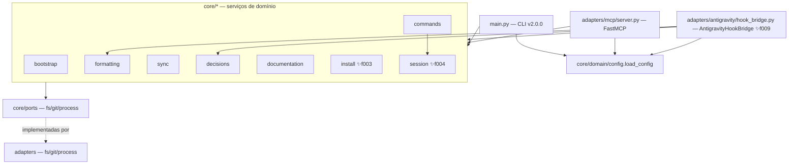

# Visão Geral Arquitetural (Architecture) — harness

> Regenerado pelo Architect em 2026-06-24 (Re-extração após a feature 009-hooks-antigravity)
> Nível de Documentação: **Completo** · Escala: 🟢 CONFIRMADO · 🟡 INFERIDO · 🔴 LACUNA

Síntese arquitetural do núcleo `harness-core`, consolidando estilo estrutural, containers, componentes, modelo de dados, integrações de borda, dívidas técnicas e matriz de rastreabilidade. Reflete o estado ATUAL do repositório após o purge do legado `claude-config/` (commit `5624f78`), a migração de estado e decisões para `.harness/`, o suporte a bootstrapping evolucionário (feature 007), a reprodutibilidade e configuração dinâmica de formatação (feature 008), os ganchos do Antigravity via terceiro driver de entrada (feature 009) e a materialização de slash commands de IDE pelo `init`/`upgrade` (feature 010).

> ⚠️ **Mudança estrutural vs extração anterior (feature 008):** (1) o hexágono ganhou um **terceiro driver de entrada** — `src/adapters/antigravity/hook_bridge.py` (`AntigravityHookBridge`), irmão da CLI e do servidor MCP, que fala o protocolo de ganchos do Antigravity (stdin/stdout JSON camelCase, um formato por evento `PreToolUse`/`PostToolUse`/`Stop`) e delega aos serviços de domínio (feature 009); (2) o `AntigravityProfile` deixou de ser placeholder — `hooks_block()` emite `.agents/hooks.json` válido e `apply_instructions()` aponta esse arquivo; (3) novo módulo `src/core/install/antigravity_hooks.py` (`materialize_hooks_json`) com merge por named-hook, compartilhado por `init` e `upgrade`; (4) `main.py` ganhou o subcomando `agy-hook <evento>`. Persistem do delta anterior: `claude-config/` purgado; estado de sessão em `.harness/estado-da-sessao.md`; microdecisões em `.harness/decisoes/` com caminhos configuráveis; `init`/`upgrade` com evolução não-destrutiva; `[formatting]` consumido dinamicamente pelo `FormattingService` via `fnmatch`; dependências trancadas em `requirements.txt` compilado com `uv`.

---

## 🗺️ 1. Estilo de Arquitetura

O `harness-core` adota **Arquitetura Hexagonal (Portas e Adaptadores)** — categoria **Aplicação** (Princípio nº 4). A regra de negócio (`src/core/`) é mantida isolada da infraestrutura e comunica-se exclusivamente por interfaces (`src/core/ports/`). 🟢

Hexágono em três anéis:

- **Núcleo de domínio (`src/core/`):** regras de negócio puras, uma pasta por capacidade. Depende apenas de `core/ports/` (`ABC`), nunca de adaptadores concretos.
- **Portas (`src/core/ports/`):** contratos abstratos `FileSystemPort`, `GitPort`, `ProcessPort` — fronteira de inversão de dependência.
- **Adaptadores (`src/adapters/`):** implementações físicas (`fs/local.py`, `git/subprocess.py`, `process/formatter.py`) e os **três drivers de entrada** — a CLI (`src/main.py`), o servidor MCP (`src/adapters/mcp/server.py`) e a ponte de ganchos do Antigravity (`src/adapters/antigravity/hook_bridge.py` — `AntigravityHookBridge` ✨f009).

**Inversão de dependência preservada:** os serviços recebem as portas por injeção no construtor; quem as instancia (`main.py`, `server.py`, testes) escolhe a implementação concreta. 🟢

São **11 unidades**: 8 serviços de capacidade (`bootstrap`, `formatting`, `sync`, `decisions`, `commands`, `documentation`, **`install`** ✨f003, **`session`** ✨f004), o pacote `domain` (modelos + config + cache), o pacote `ports` e o pacote `adapters` — este último abriga agora os **três drivers de entrada** (CLI, MCP e `antigravity/hook_bridge.py` ✨f009) ao lado dos adaptadores de infraestrutura.

---

## 🏗️ 2. Modelagem C4

Diagramas detalhados em Mermaid, divididos em artefatos:

1. **Contexto (Nível 1):** o sistema, o desenvolvedor humano, os três agentes de IA (Claude/Gemini/Antigravity) e as integrações de borda. Ver [c4-context.md](file:///Users/iagoleal/dev/harness/_reversa_sdd/c4-context.md).
2. **Containers (Nível 2):** wrapper Bash, venv, CLI Python, servidor MCP, artefatos versionados em `.harness/` e a documentação HTML. Ver [c4-containers.md](file:///Users/iagoleal/dev/harness/_reversa_sdd/c4-containers.md).
3. **Componentes (Nível 3):** os 8 serviços de domínio, as 3 portas, os adaptadores e os três drivers. Ver [c4-components.md](file:///Users/iagoleal/dev/harness/_reversa_sdd/c4-components.md).

---

## 📊 3. Modelo de Dados e Rastreabilidade

- **Sem banco de dados relacional.** 🟢 Não há DDL, migrations, ORM nem `database_hints` (confirmado em `surface.json`). A "persistência" é toda em **arquivos versionados** (Markdown com front-matter, JSON e TOML). O modelo das estruturas de configuração, estado e decisão está em [erd-complete.md](file:///Users/iagoleal/dev/harness/_reversa_sdd/erd-complete.md).
- A matriz que liga componentes a regras de negócio, features e requisitos está em [spec-impact-matrix.md](file:///Users/iagoleal/dev/harness/_reversa_sdd/traceability/spec-impact-matrix.md).

---

## 🔌 4. Integrações de Borda

O núcleo não consome APIs REST/GraphQL nem produz webhooks. Suas únicas conexões externas são locais: 🟢

- **Servidor MCP (FastMCP "Harness"):** driver de entrada via Model Context Protocol (JSON-RPC sobre `stdin`/`stdout`), expondo **4 tools** ao agente: `format_file`, `check_repository_sync`, `process_decisions`, `session_command`.
- **Ponte de ganchos do Antigravity (`AntigravityHookBridge`) ✨f009:** terceiro driver de entrada. Lê o payload no `stdin` (JSON camelCase), age via serviços de domínio e escreve a resposta no `stdout` (um formato por evento), sempre não-bloqueante (exit 0). Três eventos: `PreToolUse` (captura `stepIdx → TargetFile` num scratch sob `artifactDirectoryPath`; emite `{"decision": "allow"}`, nunca `"deny"`), `PostToolUse` (resolve o caminho pelo `stepIdx` e chama `FormattingService.format_file`; emite `{}`) e `Stop` (roda o `DecisionService` para validar/reindexar microdecisões; emite `{}`, nunca `"continue"`). Invocado pelo subcomando `./harness agy-hook <evento>` (`main.py`). 🟢
- **Subprocessos `git`:** `git rev-parse HEAD` (local) e `git ls-remote origin main` (remoto), via `SubprocessGitAdapter` — usados em `sync`, `bootstrap` e `commands`. ✨f013: a porta `GitPort` ganhou `commit_paths(repo_path, paths, message)` — `git add -- <paths>` (restrito a caminhos, nunca `-A`) seguido de `git commit` — usado por `commands` para versionar o `state_file` ao `encerrar-sessao`.
- **Formatadores de terceiros do host:** `ruff format`, `prettier --write`, `rustfmt`, disparados em subprocesso por `HostFormatterAdapter`, sempre não-bloqueantes.
- **Servidor HTTP local:** `doc-serve` expõe `harness-docs.html` em `http://localhost:8000` via `http.server` nativo.
- **Ganchos de ciclo de vida do agente:** `SessionStart`/`PostToolUse`/`Stop` (Claude) e `SessionStart` (Gemini), configurados em `.claude/settings.json` e `.gemini/settings.json`, invocam o wrapper `./harness`. ✨f009 Para o **Antigravity**, os ganchos são declarados em `.agents/hooks.json` (named-hook `harness`, eventos `PreToolUse`/`PostToolUse`/`Stop`, com `matcher` regex sobre o nome da tool e `command` apontando o caminho absoluto de `./harness agy-hook <evento>`). O arquivo é materializado por `materialize_hooks_json` (`src/core/install/antigravity_hooks.py`) — rotina única de merge por named-hook que preserva chaves de terceiros — disparada por `init` e `upgrade` quando `active_harness == "antigravity"`.
- **Slash commands de IDE materializados ✨f010:** além dos ganchos, o `init`/`upgrade` materializa arquivos de slash command que acionam `./harness cmd encerrar-sessao` na IDE — `.claude/commands/encerrar-sessao.md` (Claude, via `${CLAUDE_PROJECT_DIR}` e `!`-bash) e `.agent/workflows/encerrar-sessao.md` (Antigravity, caminho absoluto, singular — ✨f017). A rotina única `materialize_session_commands` (`src/core/install/session_commands.py`) é disparada **incondicionalmente** (sempre os dois harnesses, sem gate por `active_harness`); o conteúdo de cada arquivo vive no respectivo `HarnessProfile` (`session_command_artifact`), `GeminiProfile` devolve `None`. Footprint global zero preservado e fixado por teste. ✨f013: o texto desses artefatos foi reescrito para descrever que o encerramento cria um commit de registro por cima do último commit de trabalho (antes anunciava só "o commit-âncora"); o bump 1.2.49 garante a rematerialização não-stale no `upgrade`. ✨f017: o caminho do workflow do Antigravity passou de `.agents/workflows/` (plural, **ignorado** pelo Antigravity) para `.agent/workflows/` (singular, reconhecido pela IDE e pelo CLI); o frontmatter passou a expor só `description` (sem `name`) e a materialização remove o órfão do caminho plural de forma não-destrutiva (só o arquivo nomeado); bump 1.2.54.

---

## ⚠️ 5. Dívidas Técnicas e Bugs Latentes

Catalogados pelo Archaeologist/Detective. Todos os achados históricos (T1 ao T6) foram **totalmente resolvidos** no HEAD (ver coluna Estado) e encontram-se atualmente zerados no projeto:

| ID     | Local                    | Sintoma                                                                                                                   | Sev.  | Conf. | Estado                                                                                                                                                                                                      |
| ------ | ------------------------ | ------------------------------------------------------------------------------------------------------------------------- | ----- | ----- | ----------------------------------------------------------------------------------------------------------------------------------------------------------------------------------------------------------- |
| **T1** | `adapters/mcp/server.py` | `load_config` era usado sem import → `NameError`; a tool MCP `process_decisions` nunca processava decisões.               | Alta  | 🟢    | **RESOLVIDO** em `cf73980`: `server.py` agora importa `from src.core.domain.config import load_config` (linha 12); a tool não levanta mais `NameError`.                                                     |
| **T2** | `adapters/mcp/server.py` | `session_command` apontava para `ESTADO-DA-SESSAO.md` (raiz), divergente da CLI; estado de sessão CLI×MCP não convergiam. | Alta  | 🟢    | **RESOLVIDO** na feature 006 por configuração: o caminho vem de `config.session.state_file` (`SessionSection`); CLI (`main.py:169`) e MCP (`server.py:94`) leem o mesmo valor. Sem literal chumbado.        |
| **T3** | `main.py`                | `json.loads` sem `import json` → `NameError` no `format` via stdin (hook `PostToolUse`); autoformat por hook não ocorria. | Alta  | 🟢    | **RESOLVIDO** em `cf73980`: `main.py` importa `json` (linha 5); `resolve_format_target` → `json.loads` funciona; o autoformat por hook opera.                                                               |
| **T4** | `formatting/service.py`  | `[formatting]` do `harness.toml` não alimenta o serviço; blindagens e opt-out chumbados.                                  | Média | 🟢    | **RESOLVIDO** na feature 008: `FormattingService` passa a ler e aplicar `formatting.exclude_paths` (com glob patterns e fnmatch) e `formatting.opt_out_file` de forma dinâmica a partir do `HarnessConfig`. |
| **T5** | `main.py`                | `load_harness_config` (dict legado) coexistia com `load_config` (tipada) — duas vias de configuração.                     | Baixa | 🟢    | **RESOLVIDO** na feature 006: `load_harness_config` e `import toml` foram removidos de `main.py`. Via única tipada via `load_config(fs)`; o subcomando `cmd` lê `config.harness.active_harness`.            |
| **T6** | repositório              | Sem lock file; pins apenas `>=` — build não determinístico.                                                               | Média | 🟢    | **RESOLVIDO** na feature 008: Adição do lock file `requirements.txt` compilado via `uv pip compile` de forma determinística a partir de `requirements.in`.                                                  |

> Todos os achados históricos (T1 ao T6) estão totalmente resolvidos no HEAD atual (T1/T3 no fix de drivers; T2/T5 na feature 006; T4/T6 na feature 008). Nenhuma dívida técnica está em aberto atualmente.

---

## 🧭 6. ADRs Pertinentes (decisões que sustentam o estilo)

`0006` (hexágono no core), `0007` (wrapper de conveniência), `0008` (doc por introspecção), `0009` (abandono de `claude-config/`, centralização em `.harness/`), `0010` (estado de sessão unificado), `0011` (reinjeção/instalação multi-harness por Strategy), `0012` (caminhos de decisão por configuração), `0016` (ganchos do Antigravity por `.agents/hooks.json` declarativo + terceiro driver de borda `AntigravityHookBridge` ✨f009), `0017` (slash commands de IDE materializados no `init`/`upgrade`, sempre Claude+Antigravity, conteúdo no perfil ✨f010). Ligados às microdecisões MD-0001..MD-0005.

**Posicionamento do harness-core (MD-0005, feature 006, refina MD-0004):** o `harness-core` é um **módulo per-projeto autocontido, de footprint global zero** — instalá-lo ou executá-lo escreve apenas dentro do repositório, **nunca** em `~/.claude` ou `~/.agent-memory`, e **não** substitui `~/.claude`. MD-0005 reverte a premissa de "config canônica global" do MD-0004 (a aposentadoria do sync cross-harness permanece válida; revista é só a canonicidade global). Há dois níveis de memória nomeados sem competição: global (`~/.agent-memory`, repo próprio) e per-projeto (`<repo>/.harness/`). O contrato de footprint é fixado por teste (`tests/test_footprint.py` + `tests/helpers.py` com `RecordingFileSystem`): falha barulhenta se o harness escrever fora do repositório; a zona protegida BR-MIGRAR-007 fica fixada por teste. 🟡 (cobertura do contrato: cobre só os serviços efetivamente exercitados — é teste, não guard de runtime). Descartado: substituir `~/.claude` por symlink/env/XDG/cópia (estado global invisível, não-versionado, em tensão com BR-MIGRAR-007). RF-04 (ensinar os scripts globais `~/.agent-memory/bin/*` a reconhecer `.harness/`) fica diferido como mudança futura no repo `agent-memory`. Travado pelo mantenedor em 24/06/2026.
