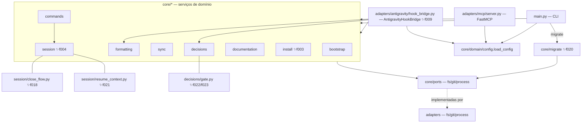

# Visão Geral Arquitetural (Architecture) — harness

> Regenerado pelo Architect em 2026-06-24 (Re-extração após a feature 009-hooks-antigravity)
> Nível de Documentação: **Completo** · Escala: 🟢 CONFIRMADO · 🟡 INFERIDO · 🔴 LACUNA
> **Reconciliação de 2026-06-28** (já incorporada no corpo, §4): cobriu até a feature 018 (`encerrar-sessao` como skill), mas não atualizou este cabeçalho nem a lista de ADRs do §6 — corrigido nesta rodada.
> **Reconciliação de 2026-07-05** (Architect, pós-features 019-021): §1 (contagem de unidades, +`migrate`), §2 (diagrama C4-componentes com `migrate`/`close_flow`/`resume_context`), §4 (integrações — oferta de commit estendida, fonte única + `harness migrate`, resume ancorado), §6 (ADRs 0018-0021 adicionadas). `c4-components.md`, `erd-complete.md` e `traceability/spec-impact-matrix.md` — que este arquivo referencia — estavam **congelados desde a feature 009** e foram re-extraídos estruturalmente nesta mesma rodada.
> **Reconciliação de 2026-07-15** (Architect, pós-MD-0014 e features 022-023): §2 (diagrama com `decisions/gate.py`), §4 (integrações — ganchos do Claude sem `PostToolUse`, Stop com `--gate`; novo item sobre o gate de registro), §6 (ADRs 0022/0023; nota do ADR 0002 parcialmente revertido). Core 2.1.1.

Síntese arquitetural do núcleo `harness-core`, consolidando estilo estrutural, containers, componentes, modelo de dados, integrações de borda, dívidas técnicas e matriz de rastreabilidade. Reflete o estado ATUAL do repositório após o purge do legado `claude-config/` (commit `5624f78`), a migração de estado e decisões para `.harness/`, o suporte a bootstrapping evolucionário (feature 007), a reprodutibilidade e configuração dinâmica de formatação (feature 008), os ganchos do Antigravity via terceiro driver de entrada (feature 009), a materialização de slash commands de IDE pelo `init`/`upgrade` (feature 010, depois skill na 018), a oferta de commit estendida a `.harness/` (feature 019), a fonte única de execução com `harness migrate` (feature 020) e o resume ancorado no índice de decisões (feature 021).

> ⚠️ **Mudança estrutural vs extração anterior (feature 008):** (1) o hexágono ganhou um **terceiro driver de entrada** — `src/adapters/antigravity/hook_bridge.py` (`AntigravityHookBridge`), irmão da CLI e do servidor MCP, que fala o protocolo de ganchos do Antigravity (stdin/stdout JSON camelCase, um formato por evento `PreToolUse`/`PostToolUse`/`Stop`) e delega aos serviços de domínio (feature 009); (2) o `AntigravityProfile` deixou de ser placeholder — `hooks_block()` emite `.agents/hooks.json` válido e `apply_instructions()` aponta esse arquivo; (3) novo módulo `src/core/install/antigravity_hooks.py` (`materialize_hooks_json`) com merge por named-hook, compartilhado por `init` e `upgrade`; (4) `main.py` ganhou o subcomando `agy-hook <evento>`. Persistem do delta anterior: `claude-config/` purgado; estado de sessão em `.harness/estado-da-sessao.md`; microdecisões em `.harness/decisoes/` com caminhos configuráveis; `init`/`upgrade` com evolução não-destrutiva; `[formatting]` consumido dinamicamente pelo `FormattingService` via `fnmatch`; dependências trancadas em `requirements.txt` compilado com `uv`.

---

## 🗺️ 1. Estilo de Arquitetura

O `harness-core` adota **Arquitetura Hexagonal (Portas e Adaptadores)** — categoria **Aplicação** (Princípio nº 4). A regra de negócio (`src/core/`) é mantida isolada da infraestrutura e comunica-se exclusivamente por interfaces (`src/core/ports/`). 🟢

Hexágono em três anéis:

- **Núcleo de domínio (`src/core/`):** regras de negócio puras, uma pasta por capacidade. Depende apenas de `core/ports/` (`ABC`), nunca de adaptadores concretos.
- **Portas (`src/core/ports/`):** contratos abstratos `FileSystemPort`, `GitPort`, `ProcessPort` — fronteira de inversão de dependência.
- **Adaptadores (`src/adapters/`):** implementações físicas (`fs/local.py`, `git/subprocess.py`, `process/formatter.py`) e os **três drivers de entrada** — a CLI (`src/main.py`), o servidor MCP (`src/adapters/mcp/server.py`) e a ponte de ganchos do Antigravity (`src/adapters/antigravity/hook_bridge.py` — `AntigravityHookBridge` ✨f009).

**Inversão de dependência preservada:** os serviços recebem as portas por injeção no construtor; quem as instancia (`main.py`, `server.py`, testes) escolhe a implementação concreta. 🟢

São **12 unidades**: 9 serviços de capacidade (`bootstrap`, `formatting`, `sync`, `decisions`, `commands`, `documentation`, **`install`** ✨f003, **`session`** ✨f004, **`migrate`** ✨f020), o pacote `domain` (modelos + config + cache), o pacote `ports` e o pacote `adapters` — este último abriga os **três drivers de entrada** (CLI, MCP e `antigravity/hook_bridge.py` ✨f009) ao lado dos adaptadores de infraestrutura. `session` é hoje a unidade mais densa: além do serializer/sink originais, abriga `close_flow.py` (orquestração do encerramento, ✨f018) e `resume_context.py` (apêndice do índice de decisões, ✨f021).

---

## 🏗️ 2. Modelagem C4

Diagramas detalhados em Mermaid, divididos em artefatos:

1. **Contexto (Nível 1):** o sistema, o desenvolvedor humano, os três agentes de IA (Claude/Gemini/Antigravity) e as integrações de borda. Ver [c4-context.md](file:///Users/iagoleal/dev/harness/_reversa_sdd/c4-context.md).
2. **Containers (Nível 2):** wrapper Bash, venv, CLI Python, servidor MCP, artefatos versionados em `.harness/` e a documentação HTML. Ver [c4-containers.md](file:///Users/iagoleal/dev/harness/_reversa_sdd/c4-containers.md).
3. **Componentes (Nível 3):** os 8 serviços de domínio, as 3 portas, os adaptadores e os três drivers. Ver [c4-components.md](file:///Users/iagoleal/dev/harness/_reversa_sdd/c4-components.md).

---

## 📊 3. Modelo de Dados e Rastreabilidade

- **Sem banco de dados relacional.** 🟢 Não há DDL, migrations, ORM nem `database_hints` (confirmado em `surface.json`). A "persistência" é toda em **arquivos versionados** (Markdown com front-matter, JSON e TOML). O modelo das estruturas de configuração, estado e decisão está em [erd-complete.md](file:///Users/iagoleal/dev/harness/_reversa_sdd/erd-complete.md).
- A matriz que liga componentes a regras de negócio, features e requisitos está em [spec-impact-matrix.md](file:///Users/iagoleal/dev/harness/_reversa_sdd/traceability/spec-impact-matrix.md).

---

## 🔌 4. Integrações de Borda

O núcleo não consome APIs REST/GraphQL nem produz webhooks. Suas únicas conexões externas são locais: 🟢

- **Servidor MCP (FastMCP "Harness"):** driver de entrada via Model Context Protocol (JSON-RPC sobre `stdin`/`stdout`), expondo **4 tools** ao agente: `format_file`, `check_repository_sync`, `process_decisions`, `session_command`.
- **Ponte de ganchos do Antigravity (`AntigravityHookBridge`) ✨f009:** terceiro driver de entrada. Lê o payload no `stdin` (JSON camelCase), age via serviços de domínio e escreve a resposta no `stdout` (um formato por evento), sempre não-bloqueante (exit 0). Três eventos: `PreToolUse` (captura `stepIdx → TargetFile` num scratch sob `artifactDirectoryPath`; emite `{"decision": "allow"}`, nunca `"deny"`), `PostToolUse` (resolve o caminho pelo `stepIdx` e chama `FormattingService.format_file`; emite `{}`) e `Stop` (roda o `DecisionService` para validar/reindexar microdecisões; emite `{}`, nunca `"continue"`). Invocado pelo subcomando `./harness agy-hook <evento>` (`main.py`). 🟢
- **Subprocessos `git`:** `git rev-parse HEAD` (local) e `git ls-remote origin main` (remoto), via `SubprocessGitAdapter` — usados em `sync`, `bootstrap` e `commands`. ✨f013: a porta `GitPort` ganhou `commit_paths(repo_path, paths, message)` — `git add -- <paths>` (restrito a caminhos, nunca `-A`) seguido de `git commit` — usado por `commands` para versionar o `state_file` ao `encerrar-sessao`.
- **Formatadores de terceiros do host:** `ruff format`, `prettier --write`, `rustfmt`, disparados em subprocesso por `HostFormatterAdapter`, sempre não-bloqueantes.
- **Servidor HTTP local:** `doc-serve` expõe `harness-docs.html` em `http://localhost:8000` via `http.server` nativo.
- **Ganchos de ciclo de vida do agente:** `SessionStart`/`Stop` (Claude — o `PostToolUse` de format-on-edit foi **aposentado** por MD-0014 ✨; o Stop passou a `harness decisions --gate` ✨f022) e `SessionStart` (Gemini), configurados em `.claude/settings.json` e `.gemini/settings.json`, invocam o wrapper `./harness`. ✨f009 Para o **Antigravity**, os ganchos são declarados em `.agents/hooks.json` (named-hook `harness`, eventos `PreToolUse`/`PostToolUse`/`Stop`, com `matcher` regex sobre o nome da tool e `command` apontando o caminho absoluto de `./harness agy-hook <evento>`). O arquivo é materializado por `materialize_hooks_json` (`src/core/install/antigravity_hooks.py`) — rotina única de merge por named-hook que preserva chaves de terceiros — disparada por `init` e `upgrade` quando `active_harness == "antigravity"`.
- **Capacidade de sessão materializada na IDE ✨f010 → skill ✨f018:** além dos ganchos, o `init`/`upgrade` materializa a capacidade `encerrar-sessao` na IDE do agente. ✨f018 trocou a _forma_ do artefato: de slash command/workflow `.md` que delegava ao binário para uma **skill versionável** (`SKILL.md` com `name`/`description`/`version` + `scripts/` finos que consomem o core testado). A rotina única `materialize_session_skills` (`src/core/install/session_skills.py`, antes `materialize_session_commands`) é disparada **incondicionalmente** (sempre os dois harnesses, sem gate por `active_harness`) e grava a **mesma árvore agnóstica** (lida de `src/core/install/assets/skills/encerrar-sessao/`) sob o diretório de skills de cada perfil — `.claude/skills/encerrar-sessao/` (Claude) e `.agents/skills/encerrar-sessao/` (Antigravity, ativação semântica por contexto); o que varia por harness é só `HarnessProfile.skills_dir()` (`session_command_artifact` foi removido; `GeminiProfile` devolve `None`). A migração remove os órfãos legados (`.claude/commands/encerrar-sessao.md`, `.agent/workflows/encerrar-sessao.md` singular de 017 e `.agents/workflows/encerrar-sessao.md` plural pré-017) via `stale_session_command_paths`, preservando arquivos de terceiros. A orquestração do fechamento foi extraída para `SessionCloseFlow` (`src/core/session/close_flow.py`), fonte única consumida pela CLI (`cmd encerrar-sessao`) **e** pelo script da skill (ver `domain.md#2.15`, RN-N33). Footprint global zero preservado e fixado por teste; bump 1.2.54 → 1.2.55. (Histórico: ✨f013 reescreveu o texto do artefato antigo para o commit de registro por cima do trabalho; ✨f017 corrigiu o caminho do Antigravity de plural para singular — ambos superados pela forma de skill em f018.)
- **Pré-check de pendência estreitado ao arquivo de estado ✨f019:** o pré-check de trabalho pendente do `encerrar-sessao` (016, orquestrado por `SessionCloseFlow`) excluía **todo** o diretório `.harness/` da oferta de commit, sob a premissa (falsa) de que o fechamento o versionava por completo. `pending_work_paths` passa a excluir só `session_file`; decisões e o índice regenerado entram na oferta. Ver `domain.md#2.16` (RN-N34/N35), ADR 0019.
- **Fonte única de execução + `harness migrate` ✨f020:** o `init` deixa de replicar o `harness-core`/criar `.venv` no destino — grava só o **shim** (`render_shim()`, `src/core/bootstrap/shim.py`) que executa o core a partir do **upstream** (resolvido por `upstream_path` no `harness.toml` do próprio destino), preservando o footprint de **escrita** per-projeto (toda escrita de estado continua sob `.harness/` do destino). Novo subcomando `harness migrate [root] [--dry-run]` (`src/core/migrate/service.py`) converte instalações no layout antigo (cópia local do core) para a fonte única, com guardas contra autodestruição (`FileSystemPort.remove_tree`, restrito a diretórios `harness-core`). Junto, `install_hooks` (ganchos git) e a materialização de `.claude/settings.json` deixam de ser destrutivos — merge por assinatura/por-item, preservando hooks e itens alheios. **`upgrade`/`SyncService`/o alerta passivo de versão permanecem ativos** (a remoção planejada foi desescopada — sustentam a `UpgradeOffer` do encerramento, feature 014). Ver `domain.md#2.17` (RN-N36..N40), ADR 0020.
- **Resume ancorado no índice de decisões ✨f021:** o `cmd resume` (Claude apenas, nesta iteração) passa a anexar `.harness/microdecisoes.md` ao contexto reinjetado — depois do estado da sessão, cedendo sob o teto de 10.000 caracteres do `HookContextSink` se necessário. Função pura `build_decisions_appendix` (`src/core/session/resume_context.py`), gate calculado na borda (`active_harness == "claude" and session.inject_decisions_index`, novo campo, default `True`). Não-bloqueante: índice ausente → aviso em `stderr`, resume segue com só o estado. Ver `domain.md#2.18` (RN-N41), ADR 0021.
- **Format-on-edit aposentado no perfil Claude ✨MD-0014:** `ClaudeProfile.hooks_block()` deixou de emitir `PostToolUse → harness format`; a assinatura saiu do merge por-item (`claude_settings.py`), de modo que itens legados em projetos-alvo são preservados como se fossem de terceiros (poda ativa descartada). O disparo on-edit sobrevive só no Antigravity; no Claude restam o git pre-commit e o uso manual. Ver `domain.md#2.19` (RN-N42), nota de reversão parcial no ADR 0002.
- **Gate de registro de microdecisões ✨f022/f023:** avaliação pura em `core/decisions/gate.py` (universo = diff da âncora via novo `GitPort.list_changed_paths_since` ∪ sujos; pendente = mudanças sem ficha `MD-*.md`), consumida por **três bordas com três políticas**: 3º portão bloqueante no `SessionCloseFlow` (marker `DECISAO_PENDENTE`, escape auditável `--sem-decisao`, identidade fina rearma com trabalho novo), soft-block JSON único por sessão no hook Stop do Claude (`decisions --gate`, identidade grossa `sha1(âncora)` ✨f023), e advisory em stderr no Antigravity (`gate_evaluator` injetado, RN-N26 preservada). Anti-loop persistido em campos opcionais do front-matter do estado de sessão, zerados no fechamento. Liga/desliga por `decisions.require_registration` (default `True`). Ver `domain.md#2.20-2.21` (RN-N43..N47), ADRs 0022/0023.

---

## ⚠️ 5. Dívidas Técnicas e Bugs Latentes

Catalogados pelo Archaeologist/Detective. Todos os achados (T1 ao T7) estão **resolvidos** no HEAD (ver coluna Estado); T7, encontrado na reconciliação de 2026-07-05, foi saneado no mesmo dia (MD-0013):

| ID     | Local                                                                              | Sintoma                                                                                                                                                                                                                                                                                                                                                                                                                                                                      | Sev.                                                                | Conf.                                            | Estado                                                                                                                                                                                                                                                          |
| ------ | ---------------------------------------------------------------------------------- | ---------------------------------------------------------------------------------------------------------------------------------------------------------------------------------------------------------------------------------------------------------------------------------------------------------------------------------------------------------------------------------------------------------------------------------------------------------------------------- | ------------------------------------------------------------------- | ------------------------------------------------ | --------------------------------------------------------------------------------------------------------------------------------------------------------------------------------------------------------------------------------------------------------------- |
| **T1** | `adapters/mcp/server.py`                                                           | `load_config` era usado sem import → `NameError`; a tool MCP `process_decisions` nunca processava decisões.                                                                                                                                                                                                                                                                                                                                                                  | Alta                                                                | 🟢                                               | **RESOLVIDO** em `cf73980`: `server.py` agora importa `from src.core.domain.config import load_config` (linha 12); a tool não levanta mais `NameError`.                                                                                                         |
| **T2** | `adapters/mcp/server.py`                                                           | `session_command` apontava para `ESTADO-DA-SESSAO.md` (raiz), divergente da CLI; estado de sessão CLI×MCP não convergiam.                                                                                                                                                                                                                                                                                                                                                    | Alta                                                                | 🟢                                               | **RESOLVIDO** na feature 006 por configuração: o caminho vem de `config.session.state_file` (`SessionSection`); CLI (`main.py:169`) e MCP (`server.py:94`) leem o mesmo valor. Sem literal chumbado.                                                            |
| **T3** | `main.py`                                                                          | `json.loads` sem `import json` → `NameError` no `format` via stdin (hook `PostToolUse`); autoformat por hook não ocorria.                                                                                                                                                                                                                                                                                                                                                    | Alta                                                                | 🟢                                               | **RESOLVIDO** em `cf73980`: `main.py` importa `json` (linha 5); `resolve_format_target` → `json.loads` funciona; o autoformat por hook opera.                                                                                                                   |
| **T4** | `formatting/service.py`                                                            | `[formatting]` do `harness.toml` não alimenta o serviço; blindagens e opt-out chumbados.                                                                                                                                                                                                                                                                                                                                                                                     | Média                                                               | 🟢                                               | **RESOLVIDO** na feature 008: `FormattingService` passa a ler e aplicar `formatting.exclude_paths` (com glob patterns e fnmatch) e `formatting.opt_out_file` de forma dinâmica a partir do `HarnessConfig`.                                                     |
| **T5** | `main.py`                                                                          | `load_harness_config` (dict legado) coexistia com `load_config` (tipada) — duas vias de configuração.                                                                                                                                                                                                                                                                                                                                                                        | Baixa                                                               | 🟢                                               | **RESOLVIDO** na feature 006: `load_harness_config` e `import toml` foram removidos de `main.py`. Via única tipada via `load_config(fs)`; o subcomando `cmd` lê `config.harness.active_harness`.                                                                |
| **T6** | repositório                                                                        | Sem lock file; pins apenas `>=` — build não determinístico.                                                                                                                                                                                                                                                                                                                                                                                                                  | Média                                                               | 🟢                                               | **RESOLVIDO** na feature 008: Adição do lock file `requirements.txt` compilado via `uv pip compile` de forma determinística a partir de `requirements.in`.                                                                                                      |
| **T7** | `adapters/mcp/server.py:42` vs. `core/domain/layout.py:SYNC_CACHE_GITIGNORE_ENTRY` | O MCP server chumba o cache de sync em `.harness/sync_cache.json` (underscore); a CLI (`main.py`) usa `.harness/sync-cache.json` (hífen) — mesmo nome que o `.gitignore` gravado pelo `init` cobre. Se o servidor MCP rodar `check_repository_sync`, o arquivo resultante **não fica coberto pelo `.gitignore`** e, desde a feature 019 (pré-check de pendência não mascara mais `.harness/` inteiro), passaria a ser **oferecido para commit** como se fosse trabalho real. | Baixa (ruído cosmético na oferta de commit; nenhuma perda de dados) | 🟢 CONFIRMADO (leitura direta dos dois literais) | **RESOLVIDO (2026-07-05, MD-0013)** — caminho centralizado na constante única `layout.py:SYNC_CACHE_REL_PATH`, consumida por `main.py`, `close_flow.py` e `server.py`; `SYNC_CACHE_GITIGNORE_ENTRY` deriva dela. TDD em `test_mcp.py`; bump do core para 2.0.1. |

> T1-T7 estão totalmente resolvidos no HEAD atual (T1/T3 no fix de drivers; T2/T5 na feature 006; T4/T6 na feature 008; T7 no saneamento de 2026-07-05, MD-0013). Não há dívida técnica em aberto identificada até esta reconciliação.

---

## 🧭 6. ADRs Pertinentes (decisões que sustentam o estilo)

`0006` (hexágono no core), `0007` (wrapper de conveniência), `0008` (doc por introspecção), `0009` (abandono de `claude-config/`, centralização em `.harness/`), `0010` (estado de sessão unificado), `0011` (reinjeção/instalação multi-harness por Strategy), `0012` (caminhos de decisão por configuração), `0013` (harness-core módulo per-projeto, footprint zero), `0014` (bootstrap e evolução do tooling), `0015` (reprodutibilidade e configuração dinâmica de formatação), `0016` (ganchos do Antigravity por `.agents/hooks.json` declarativo + terceiro driver de borda `AntigravityHookBridge` ✨f009), `0017` (slash commands de IDE materializados no `init`/`upgrade`, sempre Claude+Antigravity, conteúdo no perfil ✨f010), `0018` (`encerrar-sessao` como skill versionável, substitui 0017; orquestração extraída para `SessionCloseFlow`), `0019` (pré-check de pendência restrito ao arquivo de estado), `0020` (fonte única de execução + `harness migrate`, parcial — ver Consequências da ADR), `0021` (resume ancorado no índice de decisões, Claude-first), `0022` (gate de registro obrigatório de microdecisões, enforcement híbrido por borda), `0023` (dupla identidade anti-loop do lembrete — grossa no Stop, fina no portão). O ADR `0002` (formatação automática pós-edição) está **parcialmente revertido** desde MD-0014: o gatilho `PostToolUse` foi aposentado no perfil Claude. Ligados às microdecisões MD-0001..MD-0016.

**Posicionamento do harness-core (MD-0005, feature 006, refina MD-0004):** o `harness-core` é um **módulo per-projeto autocontido, de footprint global zero** — instalá-lo ou executá-lo escreve apenas dentro do repositório, **nunca** em `~/.claude` ou `~/.agent-memory`, e **não** substitui `~/.claude`. MD-0005 reverte a premissa de "config canônica global" do MD-0004 (a aposentadoria do sync cross-harness permanece válida; revista é só a canonicidade global). Há dois níveis de memória nomeados sem competição: global (`~/.agent-memory`, repo próprio) e per-projeto (`<repo>/.harness/`). O contrato de footprint é fixado por teste (`tests/test_footprint.py` + `tests/helpers.py` com `RecordingFileSystem`): falha barulhenta se o harness escrever fora do repositório; a zona protegida BR-MIGRAR-007 fica fixada por teste. 🟡 (cobertura do contrato: cobre só os serviços efetivamente exercitados — é teste, não guard de runtime). Descartado: substituir `~/.claude` por symlink/env/XDG/cópia (estado global invisível, não-versionado, em tensão com BR-MIGRAR-007). RF-04 (ensinar os scripts globais `~/.agent-memory/bin/*` a reconhecer `.harness/`) fica diferido como mudança futura no repo `agent-memory`. Travado pelo mantenedor em 24/06/2026.
