```mermaid
graph TB
    subgraph drivers [Drivers de entrada]
        CLI["main.py<br/>[CLI argparse v2.0.0]<br/>7 subcomandos · resolve sink · serve HTTP"]
        MCP["adapters/mcp/server.py<br/>[FastMCP]<br/>4 tools · T1/T2"]
    end

    subgraph core [Núcleo da Aplicação src/core/]
        subgraph domain [Domínio src/core/domain/]
            Models["models.py<br/>Decision · Relationship<br/>SessionState · SessionNarrative"]
            Cfg["config.py<br/>HarnessConfig · DecisionsSection<br/>load_config()"]
            Cache["cache.py<br/>SyncCache"]
        end

        subgraph ports [Portas src/core/ports/]
            FsPort["FileSystemPort [ABC]"]
            GitPort["GitPort [ABC]"]
            ProcPort["ProcessPort [ABC]"]
        end

        subgraph services [Serviços de capacidade]
            BootServ["BootstrapService<br/>install_hooks (pre-commit/post-merge)"]
            FormatServ["FormattingService<br/>format_file (blindagens, opt-out)"]
            SyncServ["SyncService<br/>check_sync (cache TTL)"]
            DecServ["DecisionService<br/>load / validate_integrity / compile_index"]
            CmdServ["CommandService<br/>resume / encerrar-sessao / handoff / clarificar"]
            DocServ["DocumentationService<br/>introspecção argparse + regras + state"]
            InstServ["InstallPromptService ✨f003<br/>render (composição de template)"]
            SessSer["session/serializer ✨f004<br/>parse / render (round-trip)"]
            SessSink["session/sinks ✨f004<br/>HookContextSink / FileProjectionSink"]
            InstProf["install/harness_profiles ✨f003<br/>Claude/Gemini/Antigravity Profile"]
        end
    end

    subgraph adapters [Adaptadores src/adapters/]
        FsAdap["LocalFileSystemAdapter<br/>write_file_atomic (.tmp + os.replace)"]
        GitAdap["SubprocessGitAdapter<br/>rev-parse / ls-remote"]
        FormatAdap["HostFormatterAdapter<br/>ruff / prettier / rustfmt"]
    end

    %% Drivers -> serviços
    CLI --> BootServ & FormatServ & DecServ & CmdServ & DocServ & InstServ
    CLI --> Cfg
    MCP --> FormatServ & SyncServ & DecServ & CmdServ
    MCP -.->|T1: load_config sem import| Cfg

    %% Composição interna do domínio
    CmdServ --> SessSer
    CLI -->|resolve sink por active_harness| SessSink
    InstServ --> InstProf
    DecServ --> Models
    CmdServ --> Models
    SyncServ --> Cache
    Cfg --> Models

    %% Serviços usam portas (injeção)
    BootServ --> FsPort
    FormatServ --> FsPort
    FormatServ --> ProcPort
    SyncServ --> FsPort
    SyncServ --> GitPort
    DecServ --> FsPort
    CmdServ --> FsPort
    CmdServ --> GitPort
    DocServ --> FsPort
    SessSink --> FsPort

    %% Adaptadores implementam portas
    FsAdap -.->|implementa| FsPort
    GitAdap -.->|implementa| GitPort
    FormatAdap -.->|implementa| ProcPort
```

# C4 Component Diagram (Nível 3) — harness-core

> Regenerado pelo Architect em 2026-06-24 (Re-extração após as features 003, 004 e 005)
> Nível de Documentação: **Completo** · Escala: 🟢 CONFIRMADO · 🟡 INFERIDO

Componentes internos de `src/core/` e `src/adapters/` sob arquitetura hexagonal. **Novos** nesta extração: os serviços `install` ✨f003 e `session` ✨f004, e a leitura de config tipada (`load_config`) pelos dois drivers ✨f005.

---

---

## 🛠️ Descrição dos Componentes

### Portas (fronteira de inversão de dependência) 🟢
* **`FileSystemPort`** — `read_file, write_file, write_file_atomic, exists, list_dir, makedirs, remove`.
* **`GitPort`** — `get_head_commit, get_remote_commit`.
* **`ProcessPort`** — `execute_formatter -> (exit, stdout, stderr)`.

### Serviços de capacidade 🟢
* **BootstrapService** — grava `pre-commit`(→`format`) e `post-merge`(→`decisions`) idempotentemente; cada script roda só se o interpretador existir.
* **FormattingService** — `format_file` **sempre retorna 0**; blindagem de `~`/`~/Notas`/`~/.claude`, opt-out por `.no-autoformat`, precedência de binário local, raiz por manifesto (`.git`/`harness.toml`). ⚠️ não consome `[formatting]` (T4).
* **SyncService** — `check_sync` com cache TTL; resiliente (erro → `True`). Exposto **só via MCP** (não há subcomando `sync`).
* **DecisionService** — `load_decisions`, `validate_integrity` (auto-relação e aresta órfã), `compile_index` (backlinks por verbos inversos). Caminhos vêm por parâmetro ✨f005.
* **CommandService** — slash commands agnósticos à IDE; âncora Git no `resume`; distingue ausente (`None`) de malformado (`MalformedSessionStateError`). Não conhece harness (RN-N5).
* **DocumentationService** — introspecção do argparse + regex sobre `domain.md` + `state.json` → injeta JSON no `template.html`.
* **InstallPromptService ✨f003** — `render(active_harness, parser)` por composição (4 placeholders no `template.md`); resolve perfil fail-fast.
* **session/serializer ✨f004** — round-trip `parse(render(x)) == x`; 4 seções fixas mapeiam `SessionNarrative`.
* **session/sinks ✨f004** — `get_sink` por `active_harness`: `HookContextSink` (Claude/Gemini, `additionalContext`, trunca em 10000) ou `FileProjectionSink` (Antigravity). Família por `_FAMILY_BY_HARNESS`; desconhecido → `ValueError`.
* **install/harness_profiles ✨f003** — Strategy (`ABC`) `ClaudeProfile`/`GeminiProfile`/`AntigravityProfile` com `hooks_block()` + `apply_instructions()`.

### Domínio 🟢
* **models.py** — `Decision`, `Relationship`, `SessionState`, `SessionNarrative` (Pydantic v2, com validadores de regex/enum).
* **config.py** — `HarnessConfig` (`[harness]/[formatting]/[sync]/[decisions]`) e `load_config(fs)`. ✨ `[decisions]` é a chave da feature 005.
* **cache.py** — `SyncCache`.

### Adaptadores 🟢
* **LocalFileSystemAdapter** — I/O UTF-8; escrita atômica `.tmp` + `os.replace`.
* **SubprocessGitAdapter** — `git rev-parse HEAD`, `git ls-remote origin main`; erro → `RuntimeError`.
* **HostFormatterAdapter** — mapeia formatador→args; binário ausente → `(127, …)`.

> ⚠️ **Bugs latentes nos drivers (não corrigidos):** **T1** — `server.py` chama `load_config` sem import (NameError, tool de decisões via MCP quebra). **T2** — `server.py` aponta a sessão para `ESTADO-DA-SESSAO.md` (raiz), divergindo da CLI. **T3** — `main.py` usa `json.loads` sem `import json` (autoformat por hook silenciosamente não ocorre).
