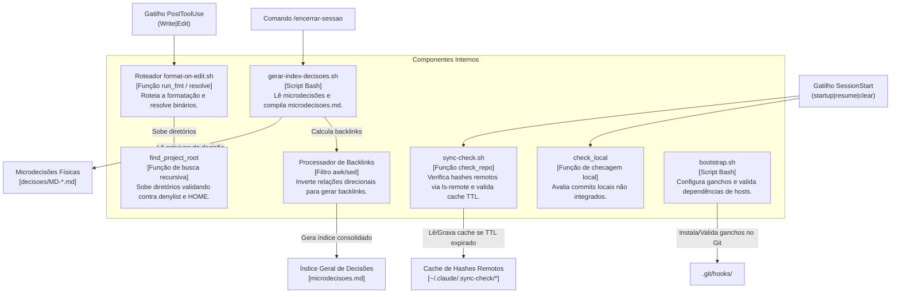

# C4 Components Diagram (Nível 3) — Scripts e Hooks (Shell)

> Gerado pelo Architect em 2026-06-23
> Nível de Documentação: **Completo**

Este diagrama detalha a estrutura interna do container de **Scripts de Automação e Hooks** do `harness-config`.

---

---

## 🛠️ Descrição dos Componentes

1. **Roteador `format-on-edit.sh` (`RouterFmt`):**
   * **Responsabilidade:** Extrai a entrada JSON via `jq`, normaliza o caminho absoluto, verifica a presença de `.no-autoformat` e despacha para os formatadores do sistema utilizando caminhos estáveis (`$HOME/.local/bin`, `/opt/homebrew/bin`, etc.).
2. **Detector de Raiz de Projeto (`RootFinder`):**
   * **Responsabilidade:** Executa busca linear e recursiva ascendente. Possui um vetor de bloqueio (`NON_ROOT_DIRS` e `DENY_PREFIXES`) que blinda o diretório principal do usuário de formatações acidentais.
3. **Verificador de Hashes Remotos (`SyncCheck`):**
   * **Responsabilidade:** Executa `git ls-remote` em modo read-only e compara o hash retornado com a base local. Controla o throttle de requisições web por meio de um TTL em cache.
4. **Verificador de Alterações Locais (`PushCheck`):**
   * **Responsabilidade:** Executa análises locais por commits à frente do upstream ou arquivos modificados, alertando se houver trabalho não pushado nos repositórios críticos.
5. **Compilador de Índice (`IndexGenerator`):**
   * **Responsabilidade:** Vence o particionamento compilando o arquivo de índice navegável geral das microdecisões no repositório local.
6. **Processador de Backlinks (`GraphInversion`):**
   * **Responsabilidade:** Inverte as arestas direcionadas declaradas nos metadados das microdecisões (ex: se A refina B, B ganha automaticamente um backlink `refinado-por A` no índice compilado).
7. **Inicializador (`Bootstrapper`):**
   * **Responsabilidade:** Garante reprodutibilidade do ambiente ao clonar ou subir o projeto em um host novo, vinculando os ganchos locais ao Git.
