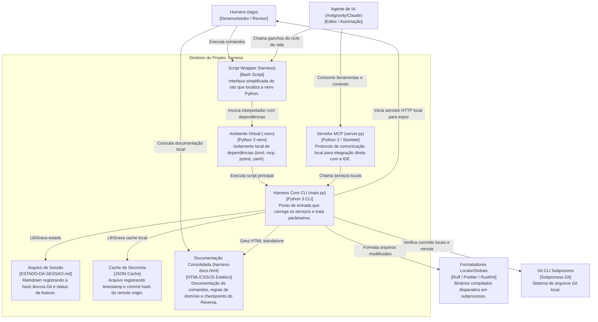

# C4 Container Diagram (Nível 2) — harness-core

> Gerado pelo Architect em 2026-06-23 (Re-extração após Feature 002)
> Nível de Documentação: **Completo**

Este diagrama detalha a divisão em containers lógicos do `harness-core`, ilustrando a comunicação, tecnologias e armazenamento.

---

---

## 🛠️ Descrição dos Containers

1. **Script Wrapper (harness):** Utilitário simples e idempotente que localiza o executável correto da venv Python local e despacha chamadas.
2. **Ambiente Virtual (.venv):** Contém o runtime Python 3 e as dependências isoladas instaladas a partir de `requirements.txt`.
3. **Harness Core CLI:** Container contendo os serviços principais de ciclo de vida, decisões, sincronia, formatação e o novo serviço de documentação.
4. **Servidor MCP (Model Context Protocol):** Comunicação baseada em JSON-RPC via `stdin`/`stdout` que disponibiliza ganchos e comandos diretamente ao editor.
5. **ESTADO-DA-SESSAO.md:** Persistência em arquivo Markdown do estado da sessão da feature ativa.
6. **harness-docs.html:** Arquivo consolidado HTML standalone que serve como central informativa e interativa de comandos CLI, regras legadas e progresso do Reversa.
