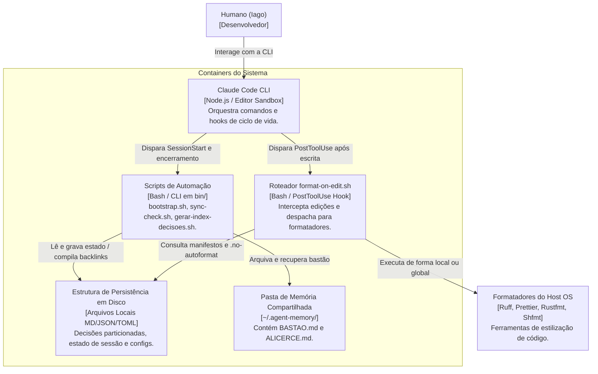

# C4 Containers Diagram (Nível 2) — harness-config

> Gerado pelo Architect em 2026-06-23
> Nível de Documentação: **Completo**

Este diagrama detalha as aplicações, serviços, scripts e estruturas de persistência em disco que compõem o sistema `harness-config`.

---

---

## 🏗️ Detalhamento dos Containers

1. **Claude Code CLI:**
   * **Papel:** O container de execução principal que atua como interpretador e sandbox para os agentes de IA. Ele gerencia as configurações locais e dispara os ganchos do ciclo de vida definidos em `settings.json`.
2. **Scripts de Automação (bin/):**
   * **Tecnologia:** Bash puro.
   * **Papel:** Automatiza tarefas de bootstrapping de hosts novos, verificação periódica de sincronia de código (ls-remote com TTL cache) e compilação do índice de microdecisões resolvendo backlinks de relações inversas.
3. **Roteador `format-on-edit.sh`:**
   * **Tecnologia:** Bash puro.
   * **Papel:** Escuta gravações e edições feitas pelo Claude Code e aciona ferramentas de linting/formatting de forma síncrona não-bloqueante (retorna status 0).
4. **Estrutura de Persistência em Disco:**
   * **Tecnologia:** Sistema de arquivos local.
   * **Papel:** Persiste os dados estruturados de estado da sessão (`ESTADO-DA-SESSAO.md`), configurações globais e individuais do Claude (`settings.json`, `.claude/`), e a base de conhecimento de decisões técnicas em arquivos Markdown individuais (`decisoes/MD-NNNN.md`).
5. **Pasta de Memória Compartilhada:**
   * **Tecnologia:** Sistema de arquivos local sob `~/.agent-memory/`.
   * **Papel:** Serve como ponte de comunicação assíncrona entre o Claude e o Gemini, permitindo a troca de bastões sem dependência de rede.
