```mermaid
graph TB
    %% Atores
    User["Humano (Iago)"]
    IA["Agente de IA<br/>(Claude / Gemini / Antigravity)"]

    subgraph Upstream [Repositório Upstream — fonte compartilhada, f020]
        UpCoreCLI["CLI (.harness/harness-core/src/main.py)<br/>[Python 3 / argparse]<br/>13 subcomandos (+progress f026); orquestra serviços; resolve sink; serve doc."]
        UpVenv["Ambiente Virtual (.venv)<br/>[Python 3.14 venv]<br/>fastmcp, pydantic, pytest, toml."]
        MCPServer["Servidor MCP (adapters/mcp/server.py)<br/>[FastMCP / JSON-RPC stdio]<br/>4 tools: format_file, check_repository_sync, process_decisions, session_command."]
        AgyDriver["Driver Antigravity (adapters/antigravity/hook_bridge.py)<br/>[AntigravityHookBridge, f009]<br/>stdin/stdout JSON por evento; sempre exit 0."]
    end

    subgraph ProjectRoot [Diretório de um Projeto-Alvo — pós f020]
        Shim["Shim (./harness)<br/>[Bash, render_shim()]<br/>cd na raiz + exec do CLI do upstream, repassa argumentos e exit code."]
        Migrate["harness migrate --dry-run<br/>[core/migrate/service.py, f020]<br/>Converte instalação do layout copiado p/ o Shim."]

        subgraph HarnessDir [.harness/ — estado e decisões versionados, per-projeto]
            SessionFile["estado-da-sessao.md<br/>[Markdown front-matter YAML + corpo]<br/>Âncora Git + narrativa de retomada (f004)."]
            DecisionsDir["decisoes/MD-NNNN.md + _cabecalho.md<br/>[Markdown front-matter]<br/>20 fichas do grafo de decisões (f005; MD-0001..MD-0020)."]
            IndexFile["microdecisoes.md<br/>[Markdown DERIVADO]<br/>Índice com backlinks (hook Stop, decisions --gate f022); lido também pelo resume (f021)."]
            CacheFile["sync-cache.json<br/>[JSON]<br/>Cache TTL único (layout.py:SYNC_CACHE_REL_PATH); CLI, close_flow e MCP; coberto pelo .gitignore do init (T7 saneado, MD-0013)."]
            ProgressFile["progresso.md<br/>[Markdown DERIVADO, f026]<br/>Medidor sem valor volátil; write-only-when-changed."]
        end
        BoardFile[".vscode/vscode-kanban.json<br/>[JSON DERIVADO, f027, opt-in]<br/>Cards harness recomputados + ilha manual preservada (canal de demandas)."]

        Config["harness.toml<br/>[TOML]<br/>harness.active_harness+upstream_path; formatting; sync; decisions; session (f021); progress+progress.kanban (f026/f027)."]
        DocHTML["harness-docs.html<br/>[HTML/CSS/JS estático autossuficiente]<br/>Superfície da CLI + regras de domínio + checkpoints."]
        AgyFile[".agents/rules/estado-sessao.md<br/>[Markdown projetado]<br/>Sink de arquivo p/ Antigravity (f004)."]
        SkillsDir[".claude/skills/ ou .agents/skills/encerrar-sessao/<br/>[SKILL.md + scripts/, f018]<br/>Consome SessionCloseFlow do upstream."]
    end

    %% Bordas do Host
    Formatters["Formatadores<br/>[ruff / prettier / rustfmt]<br/>Subprocessos não-bloqueantes."]
    GitCli["Git CLI<br/>[git rev-parse / ls-remote / commit_paths]"]
    HttpSrv["HTTP local<br/>[http.server :8000]"]

    %% Fluxos humano
    User -->|Executa subcomandos| Shim
    User -->|Roda avulso p/ converter a base| Migrate
    User -->|Edita decisões / config| Config
    User -->|Consulta doc| HttpSrv
    Shim -->|cd + exec com upstream_path| UpCoreCLI
    Migrate -->|Escreve Shim + hooks + settings; remove core local por ultimo| ProjectRoot

    %% Fluxos IA
    IA -->|Hooks de ciclo de vida| Shim
    IA -->|Consome 4 tools| MCPServer
    IA -->|Ganchos .agents/hooks.json p/ agy-hook| AgyDriver

    %% Drivers -> servicos / config
    UpCoreCLI -->|load_config do PROJETO, via cwd| Config
    MCPServer -->|load_config tipada| Config
    UpCoreCLI -->|Le/grava estado via config.session.state_file| SessionFile
    MCPServer -->|Le/grava estado via config.session.state_file| SessionFile
    UpCoreCLI -->|resume: + apendice do indice, f021, Claude only| IndexFile
    UpCoreCLI -->|Compila indice| IndexFile
    UpCoreCLI -->|Le fichas| DecisionsDir
    MCPServer -->|Le fichas| DecisionsDir
    UpCoreCLI -->|Le/grava cache| CacheFile
    MCPServer -->|Le/grava cache| CacheFile
    UpCoreCLI -->|progress: deriva medidor f026| ProgressFile
    UpCoreCLI -->|progress: exporta board com opt-in f027| BoardFile
    UpCoreCLI -->|Projeta estado p/ Antigravity| AgyFile
    UpCoreCLI -->|materialize: grava skill| SkillsDir
    AgyDriver -->|format_file / decisions| Formatters
    AgyDriver -->|reindexacao Stop| DecisionsDir

    %% Drivers -> bordas
    UpCoreCLI -->|format_file| Formatters
    MCPServer -->|format_file / sync| Formatters
    UpCoreCLI -->|Ancora / sincronia / commit_paths| GitCli
    MCPServer -->|Ancora / sincronia| GitCli
    UpCoreCLI -->|doc-gen / doc-serve| DocHTML
    DocHTML --> HttpSrv
```

# C4 Container Diagram (Nível 2) — harness-core

> Regenerado pelo Architect em 2026-06-24 (Re-extração após as features 003, 004 e 005)
> Nível de Documentação: **Completo** · Escala: 🟢 CONFIRMADO · 🟡 INFERIDO
> **Re-extração estrutural de 2026-07-05** (Architect, este documento estava congelado desde 2026-06-24 e não incorporava nem a relocação de 011 nem os drivers/containers de 009-021): ver nota "Mudanças estruturais 010-021" após a nota original, e o split Shim/Upstream no diagrama.
> **Reconciliação de 2026-08-11** (Architect, pós-features 024-027): CLI com **13 subcomandos** (+`progress` ✨f026); dois artefatos derivados novos no projeto-alvo — `.harness/progresso.md` (✨f026) e, com opt-in, `.vscode/vscode-kanban.json` (✨f027); `.harness/decisoes/` com **20 fichas**; `harness.toml` com `[progress]`/`[progress.kanban]`; hook Stop do Claude agora **advisory** (✨f025, mesmo comando `decisions --gate`, stdout sempre vazio).

Containers lógicos do `harness-core`, suas tecnologias, a comunicação entre eles e os artefatos versionados em `.harness/`. **Não há banco de dados** — a persistência é em arquivos.

> ⚠️ **Mudanças vs extração anterior:** o container de estado de sessão foi **realocado** de `ESTADO-DA-SESSAO.md` (raiz) para `.harness/estado-da-sessao.md` (f004); surgiu o conjunto `.harness/decisoes/` + `.harness/microdecisoes.md` (f005), lido via `[decisions]` no `harness.toml`; o cache de sincronia passou a `.harness/sync_cache.json` (chumbado no MCP).

> ⚠️ **Mudanças estruturais 010-021 (reconciliação 2026-07-05):** (1) o core inteiro relocou de `harness-core/` para `.harness/harness-core/` (feature 011) — todos os caminhos abaixo foram corrigidos; (2) surgiu o **driver de ganchos do Antigravity** (`AntigravityHookBridge`, `adapters/antigravity/hook_bridge.py`, feature 009), consumido via subcomando `agy-hook`; (3) `.harness/decisoes/` cresceu de 5 para 12 fichas; (4) **a partir da feature 020, o container muda de forma**: o `init` deixa de instalar uma cópia do `CoreCLI`/`Venv` no projeto-alvo — instala só o **Shim** (`./harness`, agora um script fino que executa o core do **upstream**), a árvore `.harness/` e `harness.toml` (com `upstream_path`). `CoreCLI`/`Venv` passam a ser um container **compartilhado, hospedado no repositório upstream**, não mais um container per-projeto — exceto em instalações ainda não convertidas por `migrate` (novo comando, feature 020), que continuam com a cópia local até serem migradas; (5) `session/close_flow.py` (018) e `session/resume_context.py` (021) são novos componentes dentro do `CoreCLI`, detalhados em `c4-components.md`.

---

---

## 🛠️ Descrição dos Containers

| Container                                                  | Tecnologia                         | Papel                                                                                                                                                                                                                                                                                                                                                    |
| ---------------------------------------------------------- | ---------------------------------- | -------------------------------------------------------------------------------------------------------------------------------------------------------------------------------------------------------------------------------------------------------------------------------------------------------------------------------------------------------- |
| **Shim (`./harness`, projeto-alvo)**                       | Bash (`render_shim()`)             | **Desde a f020**: não é mais o wrapper que invoca uma venv local — resolve `upstream_path` do `harness.toml` do projeto, `cd` para a raiz e executa o CLI do **upstream**, repassando argumentos e exit code. Erro barulhento se upstream ausente. 🟢                                                                                                    |
| **CLI (`main.py`, upstream)**                              | Python / argparse                  | Driver de entrada primário, agora **compartilhado** entre todos os projetos convertidos. 13 subcomandos: `bootstrap`, `format`, `decisions`, `cmd`, `doc-gen`, `doc-serve`, `install-prompt`, `init`, `upgrade`, `agy-hook`, `materialize`, `migrate`, `progress` (✨f026, modos padrão/`--json`/`--em-hook`). 🟢                                                                                                |
| **Venv (`.venv`, upstream)**                               | Python 3.14 venv                   | Runtime + dependências isoladas (`fastmcp`, `pydantic`, `pytest`, `toml`) — **uma só cópia**, no upstream, não mais uma por projeto (f020). 🟢                                                                                                                                                                                                           |
| **Servidor MCP (`server.py`, upstream)**                   | FastMCP (JSON-RPC stdio)           | Driver de entrada secundário; 4 tools. T1 (cf73980) e T2 (f006) resolvidos. 🟢                                                                                                                                                                                                                                                                           |
| **Driver Antigravity (`hook_bridge.py`, upstream)**        | Python (stdin/stdout JSON)         | Terceiro driver de entrada (f009): captura/formatação/decisões por evento, sempre exit 0. 🟢                                                                                                                                                                                                                                                             |
| **`harness migrate` (projeto-alvo, avulso)**               | Python (`core/migrate/service.py`) | Converte instalações no layout copiado (Venv+CoreCLI locais) para o Shim; guardas contra autodestruição; `--dry-run`. **Novo (f020).** 🟢                                                                                                                                                                                                                |
| **`.harness/estado-da-sessao.md`**                         | Markdown (front-matter + corpo)    | Estado de sessão unificado + narrativa de retomada ✨f004. 🟢                                                                                                                                                                                                                                                                                            |
| **`.harness/decisoes/` + `_cabecalho.md`**                 | Markdown front-matter              | Fichas do grafo de microdecisões ✨f005 — **20 fichas** (MD-0001..MD-0020). 🟢                                                                                                                                                                                                                                                                               |
| **`.harness/microdecisoes.md`**                            | Markdown derivado                  | Índice com backlinks, gerado pelo hook `Stop`; **desde f021**, também lido pelo `resume` (Claude) para ancorar a busca do agente. 🟢                                                                                                                                                                                                                     |
| **`.harness/sync-cache.json`**                             | JSON                               | Cache TTL **único** do check de sincronia — fonte única em `layout.py:SYNC_CACHE_REL_PATH`, consumida por CLI (`main.py`), `close_flow.py` e servidor MCP; coberto pelo `.gitignore` que o `init` grava. 🟢 (O MCP chumbava `sync_cache.json`, underscore, que escapava do `.gitignore` — T7, saneado em 2026-07-05, MD-0013. Ver `architecture.md` §5.) |
| **`harness.toml`**                                         | TOML                               | Configuração; `[decisions]` desacopla os caminhos ✨f005; `[session].state_file`+`inject_decisions_index` (f021); `[harness].upstream_path` como âncora de execução (f020); `[progress].file` (✨f026) e `[progress.kanban].enabled`+`file` (✨f027, opt-in default `False`). 🟢                                                                                                                                                                           |
| **`harness-docs.html`**                                    | HTML/CSS/JS estático               | Documentação standalone offline, gerada por introspecção. 🟢                                                                                                                                                                                                                                                                                             |
| **`.agents/rules/estado-sessao.md`**                       | Markdown projetado                 | Sink de arquivo para Antigravity ✨f004. 🟡                                                                                                                                                                                                                                                                                                              |
| **`.harness/progresso.md`** ✨f026                          | Markdown derivado                  | Medidor read-only de entregáveis: derivado da `Medicao` sem timestamp nem caminho absoluto; regravado atômico e só quando o estado medido muda. 🟢                                                                                                                                                                                                       |
| **`.vscode/vscode-kanban.json`** ✨f027                     | JSON derivado (opt-in)             | Board do fork do vscode-kanban: cards `category == "harness"` recomputados a cada `harness progress`; cards manuais preservados byte a byte (fila de demandas); 100% determinístico; o exportador jamais toca `vscode-kanban.js`. 🟢                                                                                                                      |
| **`.claude/skills/` ou `.agents/skills/encerrar-sessao/`** | `SKILL.md` + `scripts/`            | Capacidade de encerramento materializada como skill (f018, substitui slash-command/workflow `.md` da f010/017; **v1.4.0 desde a f024**: reage ao marker `ENCERRAMENTO_NAO_VERSIONADO` por `motivo`); scripts consomem `SessionCloseFlow` do upstream. 🟢                                                                                                                                                                                      |

> **Sem banco de dados / sem container de fila ou cache distribuído.** 🟢 Toda a persistência é em arquivos locais versionados (Markdown/JSON/TOML). O servidor MCP **não** mantém estado de sessão próprio: opera sobre os mesmos arquivos da CLI (embora com um cache de sync próprio e desalinhado, ver dívida acima). O desvio T2 (MCP apontando para `ESTADO-DA-SESSAO.md` na raiz) foi **corrigido** na feature 006 — CLI e MCP leem o mesmo caminho de `config.session.state_file`, sem máquina de estado paralela.
>
> **🟡 Nota de topologia (f020):** instalações **ainda não convertidas** por `harness migrate` continuam no layout antigo — `CoreCLI`/`Venv` per-projeto, sem o Shim. O diagrama acima retrata o estado **pós-conversão** (o alvo da feature 020); o layout antigo é o que este documento descrevia até esta reconciliação.
