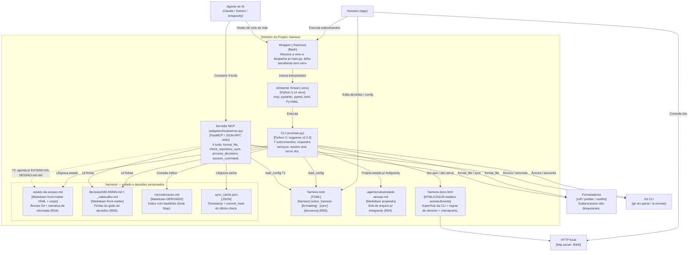

# C4 Container Diagram (Nível 2) — harness-core

> Regenerado pelo Architect em 2026-06-24 (Re-extração após as features 003, 004 e 005)
> Nível de Documentação: **Completo** · Escala: 🟢 CONFIRMADO · 🟡 INFERIDO

Containers lógicos do `harness-core`, suas tecnologias, a comunicação entre eles e os artefatos versionados em `.harness/`. **Não há banco de dados** — a persistência é em arquivos.

> ⚠️ **Mudanças vs extração anterior:** o container de estado de sessão foi **realocado** de `ESTADO-DA-SESSAO.md` (raiz) para `.harness/estado-da-sessao.md` (f004); surgiu o conjunto `.harness/decisoes/` + `.harness/microdecisoes.md` (f005), lido via `[decisions]` no `harness.toml`; o cache de sincronia passou a `.harness/sync_cache.json` (chumbado no MCP).

---

---

## 🛠️ Descrição dos Containers

| Container | Tecnologia | Papel |
|---|---|---|
| **Wrapper (`./harness`)** | Bash | Resolve `harness-core/.venv/bin/python3` e encaminha argumentos; falha barulhenta sem venv. 🟢 |
| **Venv (`.venv`)** | Python 3.14 venv | Runtime + dependências isoladas (`mcp`, `pydantic`, `pytest`, `toml`, `PyYAML`). 🟢 |
| **CLI (`main.py`)** | Python / argparse | Driver de entrada primário. 7 subcomandos: `bootstrap`, `format`, `decisions`, `cmd`, `doc-gen`, `doc-serve`, `install-prompt` ✨f003. 🟢 |
| **Servidor MCP (`server.py`)** | FastMCP (JSON-RPC stdio) | Driver de entrada secundário; 4 tools. Contém T1 e T2. 🟢 |
| **`.harness/estado-da-sessao.md`** | Markdown (front-matter + corpo) | Estado de sessão unificado + narrativa de retomada ✨f004. 🟢 |
| **`.harness/decisoes/` + `_cabecalho.md`** | Markdown front-matter | Fichas do grafo de microdecisões ✨f005. 🟢 |
| **`.harness/microdecisoes.md`** | Markdown derivado | Índice com backlinks, gerado pelo hook `Stop`. 🟢 |
| **`.harness/sync_cache.json`** | JSON | Cache TTL da verificação de sincronia (chumbado no MCP). 🟢 |
| **`harness.toml`** | TOML | Configuração; seção `[decisions]` desacopla os caminhos ✨f005. 🟢 |
| **`harness-docs.html`** | HTML/CSS/JS estático | Documentação standalone offline, gerada por introspecção. 🟢 |
| **`.agents/rules/estado-sessao.md`** | Markdown projetado | Sink de arquivo para Antigravity ✨f004. 🟡 |

> **Sem banco de dados / sem container de fila ou cache distribuído.** 🟢 Toda a persistência é em arquivos locais versionados (Markdown/JSON/TOML). O servidor MCP **não** mantém estado próprio: opera sobre os mesmos arquivos da CLI (exceto pelo desvio T2, que aponta para `ESTADO-DA-SESSAO.md` na raiz).
