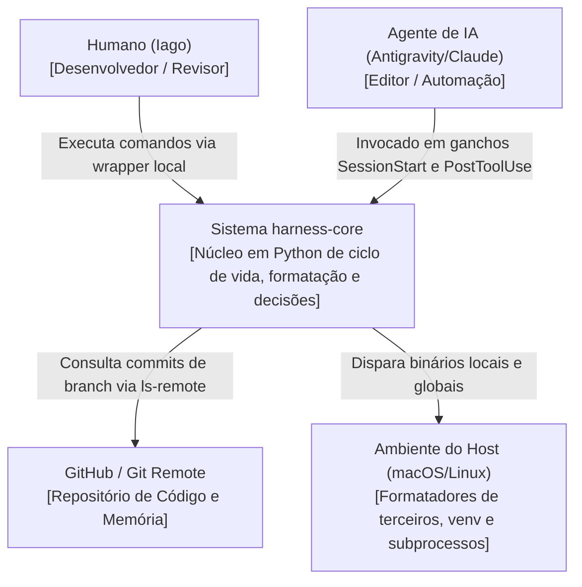

# C4 Context Diagram (Nível 1) — harness-core

> Gerado pelo Architect em 2026-06-23
> Nível de Documentação: **Completo**

Este diagrama apresenta o sistema `harness-core` no centro, ilustrando as fronteiras do sistema, seus usuários (desenvolvedores e agentes) e as integrações externas.

---

---

## 🛠️ Descrição dos Relacionamentos

1. **Atores e Agentes:**
   * **Humano (Iago):** Interage com o sistema rodando a CLI local via wrapper `./harness` e editando arquivos de microdecisões e documentação.
   * **Agente de IA (Antigravity/Claude):** Interage diretamente com o `harness-core` executando os ganchos do ciclo de vida (como formatar arquivos modificados e atualizar backlinks ao parar).
2. **Integrações de Infraestrutura:**
   * **GitHub / Git Remote:** Usado no `SyncService` para obter o commit HEAD do repositório remoto.
   * **Ambiente do Host:** Fornece o ecossistema Python 3, a pasta virtualenv e os formatadores locais/globais (ruff, prettier, rustfmt).
