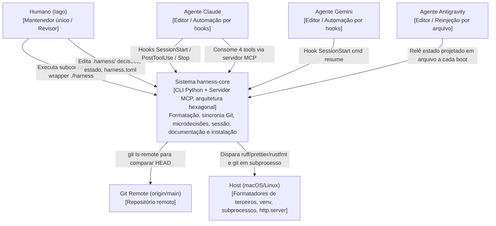

# C4 Context Diagram (Nível 1) — harness-core

> Regenerado pelo Architect em 2026-06-24 (Re-extração após as features 003, 004 e 005)
> Nível de Documentação: **Completo** · Escala: 🟢 CONFIRMADO · 🟡 INFERIDO

O sistema `harness-core` no centro, com seus atores (o mantenedor humano e os três agentes de IA) e as integrações de borda. Não há sistemas de terceiros remotos além do Git remoto; todas as demais bordas são locais ao host.

---

---

## 🛠️ Descrição dos Relacionamentos

1. **Atores:**
   * **Humano (Iago):** mantenedor único. Roda a CLI via wrapper `./harness` e edita os artefatos versionados em `.harness/` (decisões, estado de sessão) e configurações (`harness.toml`, `settings.json`). 🟢
   * **Agente Claude:** dispara os ganchos de ciclo de vida `SessionStart` (→ `cmd resume`, reinjeta o estado), `PostToolUse` em Write|Edit (→ `format`) e `Stop` (→ `decisions`); também pode consumir as **4 tools** do servidor MCP. 🟢
   * **Agente Gemini:** dispara `SessionStart` (→ `cmd resume`); compartilha com o Claude a família de *sink* por hook (`additionalContext`). 🟢
   * **Agente Antigravity:** não recebe contexto por stdout; o estado é **projetado num arquivo** (`.agents/rules/estado-sessao.md`) relido a cada boot (`FileProjectionSink`). 🟡 (mecanismo declarado, instalação ainda não confirmada — `AntigravityProfile`).
2. **Bordas de infraestrutura:**
   * **Git Remote:** consultado por `SyncService` via `git ls-remote origin main` para comparar com o HEAD local. 🟢
   * **Host:** fornece o Python 3 (venv local), os formatadores (`ruff`/`prettier`/`rustfmt`), o binário `git` e o `http.server` que serve a documentação. 🟢

> 🟢 **Nota:** o sistema **não consome APIs REST/GraphQL externas nem produz webhooks**; o único protocolo de integração estruturado é o **MCP** (driver de entrada), e a única borda de rede é o `git ls-remote` ao remoto.
