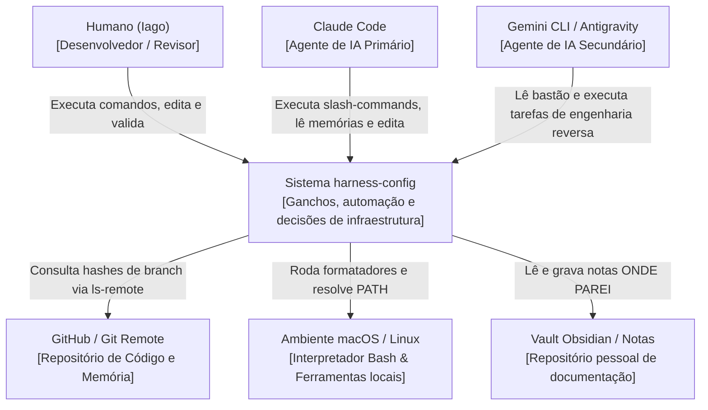

# C4 Context Diagram (Nível 1) — harness-config

> Gerado pelo Architect em 2026-06-23
> Nível de Documentação: **Completo**

Este diagrama apresenta o sistema `harness-config` no centro, ilustrando as fronteiras do sistema, seus usuários (desenvolvedores e agentes) e as integrações externas.

---

---

## 🛠️ Descrição dos Relacionamentos

1. **Atores e Agentes:**
   * **Humano (Iago):** Interage com o sistema editando arquivos, escrevendo decisões e aprovando/travando propostas de IAs.
   * **Claude Code:** CLI executada no host local que interage diretamente com o `harness-config` executando os ganchos (SessionStart, PostToolUse) e slash commands customizados.
   * **Gemini CLI:** Agente alternativo que entra no fluxo de trabalho via handoff consumindo dados de memória compartilhada.
2. **Integrações de Infraestrutura:**
   * **GitHub / Git Remote:** Usado no `sync-check.sh` para verificar de forma read-only se o estado local está defasado em relação ao remote.
   * **Host OS:** Sistema que fornece o ambiente Unix, shebang bash e binários de formatação (ruff, prettier, rustfmt, shfmt).
   * **Vault Obsidian / Notas:** Pasta de documentos de texto que servem de histórico cross-host e registro de pendências de atividades.
