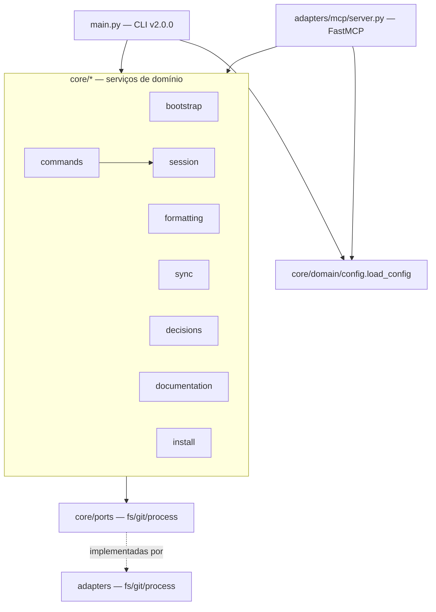

# Análise de Código — harness-core

> Regenerado pelo Archaeologist em 2026-06-24 (re-extração após as features 003, 004, 005 e 006, incorporando o fix `cf73980` dos drivers T1/T2/T3).
> Projeto: `/Users/iagoleal/dev/harness`. Módulo único: **harness-core** — CLI Python + servidor MCP em arquitetura hexagonal (ports & adapters). `doc_level = completo`.

Categoria (Princípio nº 4): **Aplicação** — ferramenta com usuário (o próprio mantenedor), evolui no tempo, organizada em camadas.

## Visão geral da arquitetura

Hexágono clássico em três anéis:

- **Núcleo de domínio** (`src/core/`): regras de negócio puras, uma pasta por capacidade. Depende apenas de `core/ports/` (interfaces `ABC`), nunca de adaptadores concretos.
- **Portas** (`src/core/ports/`): contratos abstratos `FileSystemPort`, `GitPort`, `ProcessPort`.
- **Adaptadores** (`src/adapters/`): implementações físicas — `fs/local.py`, `git/subprocess.py`, `process/formatter.py` — e os dois drivers de entrada: a CLI (`src/main.py`) e o servidor MCP (`src/adapters/mcp/server.py`).

Inversão de dependência preservada: os serviços recebem as portas por injeção no construtor; quem as instancia (`main.py`, `server.py`, testes) escolhe a implementação concreta.

São **11 unidades** analisadas: 8 serviços de capacidade (`bootstrap`, `formatting`, `sync`, `decisions`, `commands`, `documentation`, `install`, `session`), o pacote `domain` (modelos + config + cache), o pacote `ports` e o pacote `adapters`.

---

## 1. `core/bootstrap` — instalação de ganchos Git locais 🟢

**Arquivo:** `src/core/bootstrap/service.py` (57 linhas).

`BootstrapService.install_hooks(repo_path)` cria `.git/hooks/` e grava dois scripts Bash **idempotentemente** (reescreve a cada execução):

- `pre-commit` → invoca `harness-core/.venv/bin/python3 harness-core/src/main.py format "$@"`.
- `post-merge` → invoca o mesmo binário com `decisions "$@"`.

Os caminhos do interpretador e da CLI são literais chumbados dentro dos scripts (`_pre_commit_script`/`_post_merge_script`, `@staticmethod`). Cada script só executa se `$PYTHON_CLI` existir, senão `exit 0` (não bloqueia). Retorna a lista de caminhos instalados.

- **Fluxo:** linear, sem condicionais de negócio. Único efeito colateral: I/O em `.git/hooks/`.
- 🟡 **Observação:** os ganchos gravados por `bootstrap` (pre-commit/post-merge) são um caminho de instalação **diferente** dos hooks de ciclo de vida do agente (`SessionStart`/`PostToolUse`/`Stop`) descritos em `harness_profiles.py` e nos `settings.json`. Coexistem dois mecanismos de gancho. Nota: a versão anterior deste documento descrevia um "shadow log" / coexistência paralela com o legado `claude-config` — **não existe mais** no código atual (purgado no commit `5624f78`).

## 2. `core/formatting` — formatação por linguagem com blindagens 🟢

**Arquivo:** `src/core/formatting/service.py` (93 linhas). Serviço mais denso em regras de negócio.

`FormattingService.format_file(file_path) -> int` **sempre retorna 0** (no-op silencioso/não bloqueia — BR-MIGRAR-006), com `try/except Exception` envolvendo todo o corpo. Etapas:

1. **Blindagem de diretórios pessoais** (BR-MIGRAR-007): se `abs_path == ~`, ou começa por `~/Notas` ou `~/.claude`, retorna 0 sem formatar.
2. **Descoberta da raiz do projeto + opt-out** (BR-MIGRAR-009): sobe a árvore a partir do arquivo; em cada nível, se existir `.no-autoformat`, aborta (retorna 0); marca como raiz o nível que contiver `.git` **ou** `harness.toml`. Fallback: `os.getcwd()`.
3. **Seleção do formatador por extensão:** `.py`→`ruff`; `.js/.ts/.json/.css/.md`→`prettier`; `.rs`→`rustfmt`; extensão não suportada → retorna 0.
4. **Precedência de executável local** (BR-MIGRAR-008): para `ruff` procura `<root>/.venv/bin/ruff` e depois `venv/bin/ruff`; para `prettier`, `<root>/node_modules/.bin/prettier`. Se achar, passa o caminho; senão deixa o adaptador resolver no PATH.
5. **Execução** via `ProcessPort.execute_formatter(...)`, ignorando o código de retorno.

- **Loop não-trivial:** subida da árvore com parada quando `parent == current` (raiz do FS).
- ⚠️ **Divergência de configuração:** `format_file` **não** consulta `FormattingSection` (`exclude_paths`, `opt_out_file`). As blindagens (`~/Notas`, `~/.claude`) e o nome do opt-out (`.no-autoformat`) estão chumbados no código, embora `harness.toml` declare `[formatting]` com esses mesmos valores. A config existe no domínio mas não alimenta o serviço — mudar o `harness.toml` não muda o comportamento. 🟡 (dívida, candidato a ticket T4).

## 3. `core/sync` — verificação de sincronia Git com cache TTL 🟢

**Arquivo:** `src/core/sync/service.py` (69 linhas).

`SyncService.check_sync(repo_path) -> bool` decide se o repo local está em sincronia com o remoto, **resiliente a falhas** (BR-MIGRAR-005): retorna `True` em qualquer erro de rede/git (imprime aviso e prossegue).

Algoritmo:

1. **Cache** (BR-MIGRAR-003): se `cache_filepath` existe, lê JSON, parseia `last_checked_time` (ISO, coerção tz → UTC se naive). Dentro do TTL (`cache_ttl_hours`, default 24): retorna `True` — se o `commit_hash` do cache bate com o HEAD local, por consistência; mas **mesmo divergindo, retorna `True`** dentro do TTL (política de evitar excesso de rede). Falha no parse → cai para checagem de rede.
2. **Rede:** `git rev-parse HEAD` (local) e `git ls-remote origin main` (remoto).
3. **Atualiza cache** atomicamente via `SyncCache(...).model_dump_json()` + `write_file_atomic`.
4. Retorna `local_commit == remote_commit`.

- **Estrutura:** `SyncCache` (Pydantic): `last_checked_time: datetime`, `commit_hash` validado por regex SHA1.
- 🟢 **Exposição:** consumido apenas pelo MCP (`check_repository_sync` lê `cache_filepath=".harness/sync_cache.json"`, `cache_ttl=24` chumbados na ferramenta). **Não há subcomando `sync` na CLI** — capacidade só acessível via servidor MCP.

## 4. `core/decisions` — grafo de microdecisões e índice derivado 🟢

**Arquivo:** `src/core/decisions/service.py` (147 linhas). Três responsabilidades:

**`load_decisions(directory) -> List[Decision]`:** lista ordenada de `MD-*.md`; para cada, split por `---` (front-matter YAML, máx. 3 partes). Extrai `id`, `gancho`, `estado` (default `ativo`); parseia `relacoes` (cada string = `<verbo> <MD-XXXX>`, dois tokens). Diretório ausente → lista vazia. Front-matter ausente ou YAML inválido → `ValueError` barulhento.

**`validate_integrity(decisions) -> List[str]`:** agrega erros (lista vazia = grafo válido):

- Validação individual de cada ficha (`Decision.validate_integrity` — ver §9).
- **Auto-relação** (`target == self.id`): erro.
- **Aresta órfã** (alvo fora do `decision_map`): erro.

**`compile_index(decisions, output, header)`:** deriva backlinks e grava o índice consolidado:

- Tabela de **verbos inversos**: `refina→refinado-por`, `depende-de→requerido-por`, `estende→estendido-por`, `substitui→substituído-por`, `relaciona→relacionado-com`, `bloqueia→bloqueado-por`. Verbo fora da tabela → `inverso-de-<verbo>`.
- Backlinks ordenados por ID de origem (determinismo).
- Título de cada item extraído do H1 `# MD-XXXX — <título>` por regex.
- Sub-linha `↳ <saídas> · <entradas>` montada por composição.
- Cabeçalho opcional concatenado no topo. Gravação **atômica**.

- 🟢 **Caminhos desacoplados (feature 005):** `directory`, `output` e `header` são parâmetros; o serviço **não chumba** `decisoes/`. Quem fornece é `main.py`/`server.py` lendo `load_config().decisions`.

## 5. `core/commands` — slash commands de sessão agnósticos à IDE 🟢

**Arquivo:** `src/core/commands/service.py` (92 linhas).

`CommandService.execute_command(command, args, repo_path, session_filepath) -> str` normaliza o comando (`strip().lower().lstrip("/")`) e despacha:

- **`encerrar-sessao`:** carrega sessão; se ausente/inativa → erro. Senão lê HEAD (`git`), `session.close_session(commit)`, salva atomicamente. (BR-MIGRAR-014/015: âncora Git + isolamento).
- **`resume`:** sem sessão → cria `SessionState` com HEAD atual e feature `args[0]` (ou `"default_feature"`), salva, retorna "Nova sessão". Com sessão → compara `session.commit_hash` com HEAD; se divergir, monta `⚠️ ALERTA` de âncora; `start_session` reativa **preservando a narrativa** escrita pelo agente; salva; retorna `<warning><corpo da narrativa>\n<footer>`. O corpo vem de `serializer.render_narrative`.
- **`clarificar`:** texto fixo (limite de 2 rodadas de diálogo).
- **`handoff`:** monta bloco Markdown com feature ativa + HEAD.
- Desconhecido → `"Comando desconhecido: <command>"`.

`load_session` distingue **arquivo ausente** (→ `None`, sessão nova normal) de **arquivo malformado** (→ `MalformedSessionStateError`, RN-N4: falha barulhenta). `save_session` serializa via `serializer.render` atomicamente.

- **Acoplamento:** depende de `GitPort`, `FileSystemPort`, do domínio `SessionState`/`SessionNarrative` e do `session.serializer`. Não conhece harness — a seleção do sink fica em `main.py` (RN-N5).

## 6. `core/documentation` — geração do HTML por introspecção 🟢

**Arquivo:** `src/core/documentation/service.py` (114 linhas).

`DocumentationService` compõe um HTML estático injetando dados num template:

- **`extract_commands(parser)`:** varre `parser._actions`, acha o `_SubParsersAction`, lê `help` das pseudo-ações (`_choices_actions`) como fallback de `subparser.description`, e coleta args de cada subparser (flags, help, required, default). Introspecção do argparse — fonte única com a CLI real.
- **`parse_markdown_rules(domain_filepath)`:** regex extrai regras `**RN-XX: título** detalhes <emoji-confiança>` de `_reversa_sdd/domain.md`.
- **`load_checkpoints(state_filepath)`:** lê `.reversa/state.json` como dict (erro → `{}`).
- **`generate_html(...)`:** lê o template (ausente → `FileNotFoundError`), monta `{commands, rules, state}`, serializa em JSON e substitui o placeholder `/* INJECTED_DATA_PLACEHOLDER */` por `const HARNESS_DOC_DATA = {...};`. Grava atomicamente.

- **Acoplamento de leitura:** caminhos `_reversa_sdd/domain.md` e `.reversa/state.json` são passados por `main.py` (chumbados lá). O HTML consome artefatos **do próprio Reversa** — dependência do produto sobre o tooling de análise.

## 7. `core/install` — prompt de instalação colável (feature 003) 🟢 **NOVO**

**Arquivos:** `service.py` (45), `harness_profiles.py` (98), `template.md`.

Papel: gerar, por **composição**, um prompt Markdown que o usuário cola no agente para instalar o harness passo a passo, idempotente. Fonte única — nada mantido à mão em paralelo.

**`InstallPromptService.render(active_harness, parser) -> str`:**

1. Resolve o perfil **primeiro** (`get_profile`) — harness inválido falha antes de qualquer I/O (fail-fast).
2. Lê `template.md` e substitui 4 placeholders: `{{ACTIVE_HARNESS}}`, `{{APPLY_HOOKS}}` (instrução do perfil), `{{HOOKS_BLOCK}}` (bloco de ganchos do perfil), `{{COMMANDS}}` (introspecção do argparse, reaproveitando o padrão de `DocumentationService`).

**Estratégia por harness (`HarnessProfile`, padrão Strategy/OOP):** `ABC` com `hooks_block()` + `apply_instructions()`. Três concretas:

- `ClaudeProfile`: bloco JSON `hooks` real (`SessionStart`→`harness cmd resume`; `PostToolUse` Write|Edit→`harness format`; `Stop`→`harness decisions`, com `${CLAUDE_PROJECT_DIR}` e timeouts).
- `GeminiProfile`: comentário orientando a ponte `context.*` do settings do Gemini.
- `AntigravityProfile`: bloco-aviso ("mecanismo ainda não confirmado").

`get_profile(name)` resolve via dict `_PROFILES`; desconhecido → `ValueError` barulhento. Exposto pela CLI como `install-prompt` (apenas CLI, não MCP).

## 8. `core/session` — estado de sessão unificado (feature 004) 🟢 **NOVO**

**Arquivos:** `serializer.py` (109), `sinks.py` (77), `errors.py` (7).

Papel: persistir e reinjetar o estado da última sessão entre boots do agente. Formato canônico de `.harness/estado-da-sessao.md` = **front-matter YAML** (header-máquina) + **corpo Markdown** (`##` por seção da narrativa).

**`serializer`** — round-trip com invariante `parse(render(x)) == x`:

- `parse(text)`: regex `_FRONTMATTER_RE` separa meta e corpo. Sem `---` → `MalformedSessionStateError`. YAML inválido / não-dict → erro. Campos obrigatórios `_REQUIRED_META = (commit, feature, start_time, status)`; ausência → erro. `status == "active"` (case-insensitive) define `is_active`. Constrói `SessionState`; `ValueError` do domínio (ex.: commit não-SHA1) → `MalformedSessionStateError`.
- `render(state)`: monta meta (`commit/feature/start_time/status`), `yaml.safe_dump(sort_keys=False)`, anexa o corpo.
- `render_narrative(narrative)`: 4 seções fixas `_SECTIONS` — "O que foi feito"→`feito`, "Próximos passos"→`proximos_passos`, "Pendências / bloqueios"→`pendencias`, "Ponteiros"→`ponteiros`. Reusado na reinjeção de contexto.
- `_coerce_datetime`: aceita `datetime` ou string ISO (troca `Z`→`+00:00`); naive → UTC.

**`sinks`** — entrega do estado ao contexto do agente (na borda; o core não conhece harness — RN-N5):

- `HookContextSink` (Claude/Gemini): imprime no stdout `{"hookSpecificOutput": {"hookEventName": "SessionStart", "additionalContext": <texto>}}`; trunca em `MAX_CHARS = 10000` (teto do Claude) com sufixo de aviso.
- `FileProjectionSink` (Antigravity): grava o estado em `.agents/rules/estado-sessao.md` (cria o diretório-pai), pois o agy não injeta stdout no contexto.
- `get_sink(active_harness, fs)`: `_FAMILY_BY_HARNESS` (claude/gemini→hook; antigravity→file); desconhecido → `ValueError` barulhento.

**`errors`:** `MalformedSessionStateError(Exception)` — distingue "ausente" (normal) de "corrompido" (RN-N4).

## 9. `core/domain` — modelos, config tipada e cache 🟢

**Arquivos:** `models.py` (137), `config.py` (40), `cache.py` (6). Pydantic v2.

**`models.py`:**

- `Relationship`: `rel_type` validado contra 6 verbos (`depende-de, substitui, refina, relaciona, estende, bloqueia`, normalizado lower); `target_id` regex `^MD-\d{4}$`.
- `Decision`: `id` (regex MD), `gancho`, `status` (`ativo`/`descartado`), `relationships`, `filepath`, `raw_content`. `add_relationship` e `validate_integrity` (exige H1 com o ID e as 4 seções `D / PORQUÊ / DESCARTADO / ESTADO` via regex case-insensitive; `raw_content` ausente → erro).
- `SessionNarrative`: 4 listas (`feito, proximos_passos, pendencias, ponteiros`) + `is_empty()`. Value-object dentro de `SessionState`.
- `SessionState`: `commit_hash` (regex SHA1 de 40), `active_feature`, `start_time` (default UTC now), `is_active`, `narrative`. Métodos `start_session`/`close_session`/`update_active_feature` (este levanta `ValueError` se a sessão estiver inativa).

**`config.py`** — config tipada (crítico para feature 005; estendida na feature 006):

- `HarnessConfig` = `harness` (`HarnessSection.active_harness` ∈ {claude,gemini,antigravity}) + `formatting` + `sync` + `decisions` + `session` (este último **novo na feature 006** 🟢).
- `DecisionsSection`: `dir=.harness/decisoes`, `index_file=.harness/microdecisoes.md`, `header_file=.harness/decisoes/_cabecalho.md`.
- `SessionSection` 🟢 **NOVO (feature 006)**: `class SessionSection(BaseModel): state_file: str = ".harness/estado-da-sessao.md"`. Passa a ser a fonte única do caminho de sessão lida pelos dois drivers (CLI `main.py:169`, MCP `server.py:94`), eliminando o literal chumbado que causava a divergência V2.
- `load_config(fs, config_path="harness.toml") -> HarnessConfig`: arquivo ausente → defaults; presente → `toml.loads(fs.read_file(...))` → `HarnessConfig(**data)`. **Funcional** (ver verificação dirigida V3). Via **única** de configuração — `load_harness_config` (dict legado) foi removida na feature 006 (ver nota residual e T5).

**`cache.py`:** `SyncCache(last_checked_time: datetime, commit_hash: constr(SHA1))`.

## 10. `core/ports` — contratos abstratos 🟢

`fs.py` (`FileSystemPort`: `read_file, write_file, write_file_atomic, exists, list_dir, makedirs, remove`), `git.py` (`GitPort`: `get_head_commit, get_remote_commit`), `process.py` (`ProcessPort`: `execute_formatter -> (exit, stdout, stderr)`). Todas `ABC` com `@abstractmethod`. São a fronteira de inversão de dependência do hexágono.

## 11. `adapters` — implementações físicas + drivers 🟢

- **`fs/local.py`** (`LocalFileSystemAdapter`): I/O UTF-8; `write_file_atomic` grava `.<nome>.tmp` no mesmo diretório e faz `os.replace` (atômico no SO), com limpeza do tmp em falha.
- **`git/subprocess.py`** (`SubprocessGitAdapter`): `git rev-parse HEAD` e `git ls-remote origin main`; `CalledProcessError` → `RuntimeError` com stderr.
- **`process/formatter.py`** (`HostFormatterAdapter`): mapeia formatador→args (`ruff format`, `prettier --write`, `rustfmt <file>`); `FileNotFoundError`→`(127, ...)`; outro erro→`(-1, ...)`.
- **`mcp/server.py`** (driver MCP — FastMCP "Harness"): instancia os 3 adaptadores e expõe 4 ferramentas: `format_file`, `check_repository_sync`, `process_decisions`, `session_command`. Importava sem `load_config` (V1) e chumbava o caminho de sessão (V2); ambos **corrigidos** — V1 em `cf73980` (import adicionado, server.py:12), V2 na feature 006 (caminho lido de `config.session.state_file`, server.py:94).
- **`main.py`** (driver CLI v2.0.0): argparse com 7 subcomandos (`bootstrap, format, decisions, cmd, doc-gen, doc-serve, install-prompt`); orquestra serviços; resolve sinks de sessão; serve a documentação por `http.server`. O achado adicional (`json` não importado) foi **corrigido** em `cf73980` (`import json` na linha 5); a via única tipada (`load_config`) substituiu o `load_harness_config` legado na feature 006.

---

## Verificação dirigida — vereditos

> Examinados os arquivos-fonte reais. Escala: 🟢 CONFIRMADO / 🟡 INFERIDO / 🔴 LACUNA.

### V1 — `server.py` chamava `load_config(fs)` sem importar `load_config` → 🟢 RESOLVIDO em `cf73980` (era ticket T1)

Histórico do achado: `src/adapters/mcp/server.py` executava `config = load_config(fs)` dentro de `process_decisions` sem que os imports do arquivo incluíssem `from src.core.domain.config import load_config` — diferentemente de `main.py`, que sempre o importou. `load_config` estava fora do escopo do módulo, e toda chamada à ferramenta MCP `process_decisions` levantava `NameError: name 'load_config' is not defined`, capturado pelo `try/except Exception` da própria função e devolvido como string de erro; a ferramenta nunca processava decisões via MCP.

**Correção (commit `cf73980`, "fix 3 bugs latentes de driver T1/T2/T3"):** `server.py:12` agora importa `from src.core.domain.config import load_config`. `process_decisions` e `session_command` chamam `load_config(fs)` com sucesso. A ferramenta MCP `process_decisions` não levanta mais `NameError` e processa decisões normalmente. 🟢 CONFIRMADO no HEAD.

### V2 — divergência de caminho de sessão CLI × MCP → 🟢 RESOLVIDO via configuração na feature 006 (era ticket T2)

Histórico do achado: a CLI lia o local canônico da feature 004 (`.harness/estado-da-sessao.md`), enquanto o MCP chumbava `ESTADO-DA-SESSAO.md` (raiz, caminho legado pré-004). `session_command` via MCP lia/escrevia um arquivo diferente do que a CLI usava; `resume`/`encerrar-sessao` pelo MCP não enxergavam o estado mantido pela CLI (e vice-versa), e podiam criar um `ESTADO-DA-SESSAO.md` órfão na raiz. A causa-raiz era a ausência de uma seção de sessão no domínio, que forçava o literal chumbado.

**Correção (feature 006):** `core/domain/config.py` ganhou `class SessionSection(BaseModel): state_file: str = ".harness/estado-da-sessao.md"`, e `HarnessConfig` passou a ter o campo `session`. Ambos os drivers leem agora `session_file = config.session.state_file` — a CLI em `main.py:169`, o MCP em `server.py:94`. Não há mais literal de caminho de sessão chumbado em nenhum driver; CLI e MCP convergem para o mesmo arquivo. O resíduo de T2 do fix `cf73980` (que removera o uso do literal `"ESTADO-DA-SESSAO.md"`) é assim fechado por configuração. 🟢 CONFIRMADO no HEAD.

### V3 — `load_config` em `config.py` é funcional → 🟢 CONFIRMADO

`src/core/domain/config.py` importa `toml`, `pydantic` e `FileSystemPort`. `load_config(fs, config_path="harness.toml")` está completo e correto: ausência do arquivo → `HarnessConfig()` (defaults); presença → `toml.loads(fs.read_file(...))` → `HarnessConfig(**data)`. **Funcional.** O W003 da feature 005 (decisões lidas de `[decisions]` sem literais) é sustentado por esta função: `main.py` (`decisions` e `install-prompt`) e `server.py` (`process_decisions`) derivam os caminhos de `load_config().decisions`. A falha histórica de V1 estava **no driver MCP** (import ausente), **não** em `config.py`; foi corrigida em `cf73980`, de modo que o caminho configurável agora é de fato exercido via MCP. Na feature 006 esta mesma função passou a expor `config.session.state_file`, fonte única do caminho de sessão para ambos os drivers (ver V2).

### Achado adicional (não solicitado) — `json.loads` em `main.py` sem `import json` → 🟢 RESOLVIDO em `cf73980` (era ticket T3)

Histórico do achado: `resolve_format_target` chamava `payload = json.loads(raw)`, mas `main.py` não importava `json`. Quando `./harness format` rodava **sem** argumento de caminho — exatamente o caso do hook `PostToolUse`, que entrega `tool_input.file_path` pelo stdin —, a leitura do stdin chegava a `json.loads` e levantava `NameError: name 'json' is not defined`. O `except Exception` da própria `resolve_format_target` o capturava e retornava `None`, então `main()` fazia `sys.exit(0)` (no-op): a formatação automática via hook nunca ocorria quando o caminho vinha do stdin. Degradava em silêncio.

**Correção (commit `cf73980`):** `main.py:5` agora importa `json`. `resolve_format_target → json.loads` funciona, e o autoformat via hook `PostToolUse` (caminho por stdin) opera. 🟢 CONFIRMADO no HEAD.

---

## Fluxo de decisões — leitura de caminhos (feature 005) 🟢

Confirmada a **ausência de literais de caminho de decisão chumbados** nos drivers:

- **CLI** (`main.py`, subcomando `decisions`, linhas 160–185): `config = load_config(fs)` → `decisoes_dir = config.decisions.dir`, `output_file = config.decisions.index_file`, `header_file = config.decisions.header_file`. Nenhum literal `decisoes/` ou `microdecisoes.md`.
- **MCP** (`server.py`, `process_decisions`, linhas 60–64): `config = load_config(fs)` → `decisoes_dir = ... or config.decisions.dir`, `output_file = ... or config.decisions.index_file`; `header_file = os.path.join(decisoes_dir, "_cabecalho.md")`.

Diferença sutil: a CLI usa `config.decisions.header_file` (configurável); o MCP **deriva** o header de `os.path.join(decisoes_dir, "_cabecalho.md")` — coincide com o default mas ignora um eventual override de `header_file` no `harness.toml`. 🟡 (inconsistência menor, não bug). Nota: a ressalva anterior (de que, por V1, a chamada a `load_config` quebrava no MCP por import ausente) caducou — V1 foi corrigida em `cf73980`, e o caminho configurável é agora efetivamente exercido via MCP.

`harness.toml` confirma a seção `[decisions]` com os três valores em `.harness/`. O `DecisionService` recebe tudo por parâmetro, sem chumbar nada.

> Nota residual (RESOLVIDA na feature 006): a versão anterior deste documento registrava que `main.py` mantinha a função antiga `load_harness_config` (dict legado, sem a seção `[decisions]`) convivendo com `load_config` (tipada), com o subcomando `cmd` lendo `config["harness"]["active_harness"]` do dict e os demais usando a tipada — duas vias de configuração, dívida de coesão (era T5). A feature 006 **removeu** `load_harness_config` e o `import toml` de `main.py`: agora há **via única** tipada via `load_config(fs)`, e o subcomando `cmd` lê `config.harness.active_harness`. Não há mais duas vias de configuração. 🟢 CONFIRMADO no HEAD.

---

## Resumo de candidatos a ticket

> Pendências abertas no HEAD. T1, T2, T3 e T5 foram fechados (✅) e ficam registrados pela memória histórica; T4 e T6 seguem abertos.

| #   | Local                    | Sintoma                                                                                                                                                | Severidade sugerida                        | Estado                                                                         |
| --- | ------------------------ | ------------------------------------------------------------------------------------------------------------------------------------------------------ | ------------------------------------------ | ------------------------------------------------------------------------------ |
| T1  | `adapters/mcp/server.py` | `load_config` usado sem import → `NameError` em `process_decisions` (MCP)                                                                              | Alta (ferramenta MCP inoperante)           | ✅ RESOLVIDO em `cf73980` (import na linha 12)                                 |
| T2  | `adapters/mcp/server.py` | `session_command` apontava para `ESTADO-DA-SESSAO.md` (raiz), divergente da CLI (`.harness/estado-da-sessao.md`)                                       | Alta (estado de sessão divergente CLI×MCP) | ✅ RESOLVIDO via config na feature 006 (`config.session.state_file`)           |
| T3  | `main.py`                | `json.loads` sem `import json` → `NameError` no `format` via stdin (hook `PostToolUse`); mascarado por `except`, formatação silenciosamente não ocorre | Alta (autoformat por hook não funciona)    | ✅ RESOLVIDO em `cf73980` (`import json` na linha 5)                           |
| T4  | `formatting/service.py`  | Blindagens e opt-out chumbados; `[formatting]` do `harness.toml` não alimenta o serviço                                                                | Média (config declarada sem efeito)        | 🔴 Aberto                                                                      |
| T5  | `main.py`                | `load_harness_config` (dict legado) coexistia com `load_config` (tipada); duas vias de configuração                                                    | Baixa (coesão)                             | ✅ RESOLVIDO na feature 006 (`load_harness_config` removida; via única tipada) |
| T6  | repositório              | Sem lock file; pins apenas `>=` (já levantado pelo Scout)                                                                                              | Média (reprodutibilidade)                  | 🔴 Aberto                                                                      |
