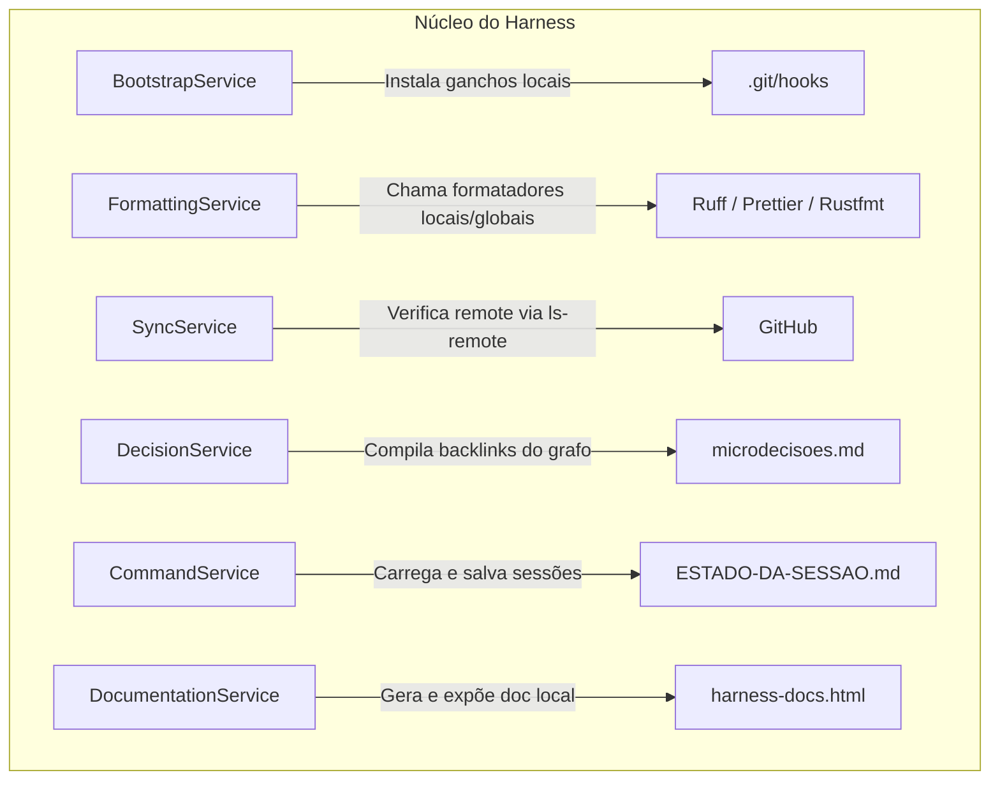

# Análise Técnica Consolidada (Code Analysis) — harness

> Gerado pelo Archaeologist em 2026-06-23 (Re-extração após Feature 002)
> Nível de Documentação: **Completo**

Este documento apresenta a análise técnica detalhada dos submódulos do `harness-core` (núcleo escrito em Python do framework de automação e ganchos).

---

## 🗺️ 1. Visão Geral dos Módulos do Core

O `harness-core` é estruturado em sub-serviços que isolam as lógicas de ganchos Git, formatação de arquivos, sincronia local/remota de repositórios, controle de sessão, gerenciamento de microdecisões de design de arquitetura e geração de guias de documentação em HTML.

---

## 📦 2. Detalhamento Técnico por Submódulo

### ⚙️ 2.1 Módulo `bootstrap`
* **Propósito:** Serviço para instalação idempotente de ganchos locais Git (`.git/hooks/pre-commit` e `.git/hooks/post-merge`).
* **Algoritmos Identificados:**
  * **Parallel/Shadow Coexistence (Coexistência Paralela):** Instala scripts que chamam os ganchos do legado e executam o novo core Python em segundo plano (`&`), redirecionando a saída para `.reversa/logs/shadow-validation.log` para permitir migração sem quebra operacional.
  * **Corte Definitivo:** Reescreve os ganchos locais para apontar exclusivamente ao executável Python local.
* **Confiança:** 🟢 CONFIRMADO

### 🎨 2.2 Módulo `formatting`
* **Propósito:** Roteador central para padronização e linting de arquivos após escrita.
* **Algoritmos Identificados:**
  * **Manifest-based Recursive Root Detection:** Sobe recursivamente o diretório em busca de `.git` ou `harness.toml` para encontrar a raiz real do projeto e buscar executáveis locais correspondentes no `.venv/bin/` ou `node_modules/.bin/`.
  * **Opt-out Detection:** Varre os diretórios recursivamente para encontrar o arquivo `.no-autoformat`. Se presente, cancela a formatação imediatamente.
  * **Blindagem Absoluta de Erros:** Captura qualquer exceção durante a formatação ou falha em formatadores locais/globais e encerra com código `0`, prevenindo que falhas de linter abortem ou travem operações de gravação do editor do agente de IA.
* **Confiança:** 🟢 CONFIRMADO

### 🔄 2.3 Módulo `sync`
* **Propósito:** Verifica a sincronização com o remote origin do Git para o repositório de memória compartilhada.
* **Algoritmos Identificados:**
  * **Cache local com TTL (24h):** Serializa um cache em formato JSON contendo a hora do último check e a hash remota. Se a janela de 24 horas não tiver expirado, retorna `True` (sincronizado) ignorando requisições de rede.
  * **Resiliência Offline:** Se a checagem de rede (`ls-remote`) falhar devido à falta de conexão, o sistema captura a exceção, imprime um aviso legível no terminal e retorna `True`, permitindo que o desenvolvedor continue trabalhando offline.
* **Confiança:** 🟢 CONFIRMADO

### 📂 2.4 Módulo `decisoes`
* **Propósito:** Parser e indexador de microdecisões.
* **Algoritmos Identificados:**
  * **Graph Inversion & Backlink Compilation (Inversão de Grafo):** Lê o front-matter YAML de cada ficha `MD-*.md`, mapeia as relações de saída (`refina`, `substitui`, `depende-de`, `relaciona`), resolve as relações inversas e injeta backlinks de entrada correspondentes (`refinado-por`, `substituído-por`, `requerido-por`) de forma determinística organizada por ordem de ID e compila no arquivo `microdecisoes.md`.
* **Confiança:** 🟢 CONFIRMADO

### 💬 2.5 Módulo `commands`
* **Propósito:** Execução de comandos do ciclo de vida e trânsito do bastão de tarefas de forma agnóstica à IDE.
* **Estrutura de Dados:**
  * `SessionState` — Entidade atômica contendo a hash âncora Git, a feature ativa, data de início e status (active/inactive).
* **Confiança:** 🟢 CONFIRMADO

### 📝 2.6 Módulo `documentation`
* **Propósito:** Compilação automatizada da ajuda dos comandos CLI, regras de negócio e checkpoints do Reversa em um único arquivo HTML standalone e servidor local.
* **Algoritmos Identificados:**
  * **CLI Parser Introspection (Introspecção de Argumentos):** Extrai metadados estruturados dos comandos definidos em `argparse.ArgumentParser` programaticamente, evitando duplicação textual no HTML de documentação.
  * **Markdown Rules Extraction (Parsing Regras):** Varre recursivamente arquivos sob `_reversa_sdd/` via regex para extrair os códigos `RN-*`, confidência e descrições para embutir na documentação.
  * **HTML Compilation (Esquema Standalone):** Injeta os dados consolidados em formato JSON substituindo placeholders no arquivo de template e escreve atomicamente `harness-docs.html`.
  * **Nativo HTTP Server:** Expõe a porta de rede local utilizando o módulo `http.server.HTTPServer` acoplado a um manipulador seguro `SimpleHTTPRequestHandler` para exibir a documentação offline.
* **Confiança:** 🟢 CONFIRMADO
