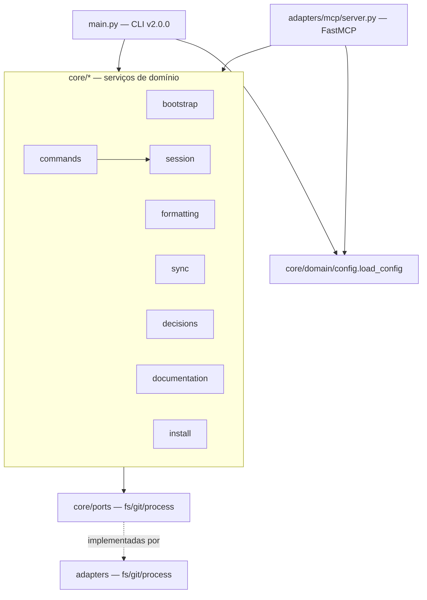

# Análise de Código — harness-core

> Regenerado pelo Archaeologist em 2026-06-24 (re-extração após as features 003, 004, 005, 006 e 007).
> Projeto: `/Users/iagoleal/dev/harness`. Módulo único: **harness-core** — CLI Python + servidor MCP em arquitetura hexagonal (ports & adapters). `doc_level = completo`.

Categoria (Princípio nº 4): **Aplicação** — ferramenta com usuário (o próprio mantenedor), evolui no tempo, organizada em camadas.

## Visão geral da arquitetura

Hexágono clássico em três anéis:

- **Núcleo de domínio** (`src/core/`): regras de negócio puras, uma pasta por capacidade. Depende apenas de `core/ports/` (interfaces `ABC`), nunca de adaptadores concretos.
- **Portas** (`src/core/ports/`): contratos abstratos `FileSystemPort`, `GitPort`, `ProcessPort`.
- **Adaptadores** (`src/adapters/`): implementações físicas — `fs/local.py`, `git/subprocess.py`, `process/formatter.py` — e os dois drivers de entrada: a CLI (`src/main.py`) e o servidor MCP (`src/adapters/mcp/server.py`).

Inversão de dependência preservada: os serviços recebem as portas por injeção no construtor; quem as instancia (`main.py`, `server.py`, testes) escolhe a implementação concreta.

São **12 unidades** analisadas: 8 serviços de capacidade (`bootstrap`, `formatting`, `sync`, `decisions`, `commands`, `documentation`, `install`, `session`), o pacote `domain` (modelos + config + cache), o pacote `ports` e o pacote `adapters`.

---

## 1. `core/bootstrap` — ganchos Git, inicialização de repositório e upgrade 🟢

**Arquivos:** `src/core/bootstrap/service.py` (57 linhas), `src/core/bootstrap/init_service.py` (95 linhas).

Esta unidade é responsável pela instalação dos ganchos Git locais, assim como pelo provisionamento e evolução (upgrade) de novos workspaces físicos do Harness.

### Instalação de Ganchos (`BootstrapService`)
`BootstrapService.install_hooks(repo_path)` cria `.git/hooks/` e grava dois scripts Bash **idempotentemente** (reescreve a cada execução):
- `pre-commit` → invoca `harness-core/.venv/bin/python3 harness-core/src/main.py format "$@"`.
- `post-merge` → invoca o mesmo binário com `decisions "$@"`.

Os caminhos do interpretador e da CLI são literais chumbados dentro dos scripts (`_pre_commit_script`/`_post_merge_script`, `@staticmethod`). Cada script só executa se `$PYTHON_CLI` existir, senão `exit 0` (não bloqueia). Retorna a lista de caminhos instalados.

### Inicialização e Evolução (`InitService` — feature 007)
A feature 007 introduziu a rotina de cópia física e setup evolucionário:
- **`init_target(fs, process, target_path, active_harness, upstream_path, version)`**: 
  1. Cria o diretório de destino se inexistente.
  2. Executa cópia física recursiva dos arquivos do core e do wrapper Bash ignorando pastas de desenvolvimento e cache (`.git/`, `.venv/`, `.pytest_cache/`, `.ruff_cache/`, `tmp/`).
  3. Descarrega o arquivo padrão `harness.toml` contendo o `active_harness`, o `upstream_path` (caminho absoluto para o core original) e a `version` corrente.
  4. Executa a criação da `.venv` local no destino (`python3 -m venv .venv` via `ProcessPort.run_command`). Se falhar por falta de dependências no host, gera um alerta fail-fast e detalhado de setup para ação humana.
  5. Instala os ganchos Git locais de forma automática e idempotente.
- **`upgrade_target(fs, process, target_path, upstream_path, version)`**:
  1. Atualiza o wrapper executável `harness` na raiz do destino.
  2. Realiza a replicação física do `harness-core/` do upstream para o destino de forma **estritamente não-destrutiva**: as pastas `.reversa/` (dados de engenharia reversa) e `.harness/decisoes/` (metadados arquiteturais locais) são preservadas intactas.
  3. Atualiza os campos de configuração no `harness.toml` do destino para sincronizar a versão do core instalado.

---

## 2. `core/formatting` — formatação por linguagem com blindagens 🟢

**Arquivo:** `src/core/formatting/service.py` (93 linhas). Serviço mais denso em regras de negócio.

`FormattingService.format_file(file_path) -> int` **sempre retorna 0** (no-op silencioso/não bloqueia — BR-MIGRAR-006), com `try/except Exception` envolvendo todo o corpo. Etapas:

1. **Blindagem de diretórios pessoais** (BR-MIGRAR-007): se `abs_path == ~`, ou começa por `~/Notas` ou `~/.claude`, retorna 0 sem formatar.
2. **Descoberta da raiz do projeto + opt-out** (BR-MIGRAR-009): sobe a árvore a partir do arquivo; em cada nível, se existir `.no-autoformat`, aborta (retorna 0); marca como raiz o nível que contiver `.git` **ou** `harness.toml`. Fallback: `os.getcwd()`.
3. **Seleção do formatador por extensão:** `.py`→`ruff`; `.js/.ts/.json/.css/.md`→`prettier`; `.rs`→`rustfmt`; extensão não suportada → retorna 0.
4. **Precedência de executável local** (BR-MIGRAR-008): para `ruff` procura `<root>/.venv/bin/ruff` e depois `venv/bin/ruff`; para `prettier`, `<root>/node_modules/.bin/prettier`. Se achar, passa o caminho; senão deixa o adaptador resolver no PATH.
5. **Execução** via `ProcessPort.execute_formatter(...)`, ignorando o código de retorno.

- 🟢 **Configuração viva de formatação:** O `FormattingService` consome o `HarnessConfig` passado em seu construtor e utiliza as regras dinâmicas definidas no `harness.toml` para `opt_out_file` e `exclude_paths` (com suporte a glob matching e checagem de diretórios via `fnmatch`), mantendo a blindagem básica incondicional de segurança como salvaguarda mínima.

---

## 3. `core/sync` — verificação de sincronia Git e alertas passivos de versão 🟢

**Arquivo:** `src/core/sync/service.py` (69 linhas).

### Sincronia Git (`SyncService.check_sync`)
`SyncService.check_sync(repo_path) -> bool` decide se o repo local está em sincronia com o remoto, **resiliente a falhas** (BR-MIGRAR-005): retorna `True` em qualquer erro de rede/git (imprime aviso e prossegue).
1. **Cache** (BR-MIGRAR-003): se `cache_filepath` existe, lê JSON, parseia `last_checked_time` (ISO, coerção tz → UTC se naive). Dentro do TTL (`cache_ttl_hours`, default 24): retorna `True` — se o `commit_hash` do cache bate com o HEAD local, por consistência; mas **mesmo divergindo, retorna `True`** dentro do TTL.
2. **Rede:** `git rev-parse HEAD` (local) e `git ls-remote origin main` (remoto).
3. **Atualiza cache** atomicamente via `SyncCache(...).model_dump_json()` + `write_file_atomic`.
4. Retorna `local_commit == remote_commit`.

### Alertas Passivos de Versão (`check_version_update` — feature 007)
A feature 007 introduziu `check_version_update(fs, local_version, upstream_path)` para ler a configuração do upstream diretamente de forma I/O estritamente local (sem rede ou subprocessos custosos):
1. Se `upstream_path` estiver configurado, lê o `harness.toml` do upstream usando a `FileSystemPort`.
2. Parseia a versão do upstream.
3. Se a versão do upstream for semanticalmente maior que a local, retorna a versão do upstream para que o driver principal exiba alertas discretos de upgrade no boot do agente.

---

## 4. `core/decisions` — grafo de microdecisões e índice derivado 🟢

**Arquivo:** `src/core/decisions/service.py` (147 linhas). Três responsabilidades:

**`load_decisions(directory) -> List[Decision]`**: lista ordenada de `MD-*.md`; para cada, split por `---` (front-matter YAML, máx. 3 partes). Extrai `id`, `gancho`, `estado` (default `ativo`); parseia `relacoes` (cada string = `<verbo> <MD-XXXX>`, dois tokens). Diretório ausente → lista vazia. Front-matter ausente ou YAML inválido → `ValueError` barulhento.

**`validate_integrity(decisions) -> List[str]`**: agrega erros (lista vazia = grafo válido):
- Validação individual de cada ficha (`Decision.validate_integrity` — ver §9).
- **Auto-relação** (`target == self.id`): erro.
- **Aresta órfã** (alvo fora do `decision_map`): erro.

**`compile_index(decisions, output, header)`**: deriva backlinks e grava o índice consolidado:
- Tabela de **verbos inversos**: `refina→refinado-por`, `depende-de→requerido-por`, `estende→estendido-por`, `substitui→substituído-por`, `relaciona→relacionado-com`, `bloqueia→bloqueado-por`.
- Backlinks ordenados por ID de origem (determinismo).
- Título de cada item extraído do H1 `# MD-XXXX — <título>` por regex.
- Sub-linha `↳ <saídas> · <entradas>` montada por composição.
- Cabeçalho opcional concatenado no topo. Gravação **atômica**.

---

## 5. `core/commands` — slash commands de sessão agnósticos à IDE 🟢

**Arquivo:** `src/core/commands/service.py` (92 linhas).

`CommandService.execute_command(command, args, repo_path, session_filepath) -> str` normaliza o comando (`strip().lower().lstrip("/")`) e despacha:
- **`encerrar-sessao`**: carrega sessão; se ausente/inativa → erro. Senão lê HEAD (`git`), `session.close_session(commit)`, salva atomicamente.
- **`resume`**: sem sessão → cria `SessionState` com HEAD atual e feature `args[0]` (ou `"default_feature"`), salva, retorna "Nova sessão". Com sessão → compara `session.commit_hash` com HEAD; se divergir, monta `⚠️ ALERTA` de âncora; `start_session` reativa **preservando a narrativa** escrita pelo agente; salva; retorna `<warning><corpo da narrativa>\n<footer>`.
- **`clarificar`**: texto fixo (limite de 2 rodadas de diálogo).
- **`handoff`**: monta bloco Markdown com feature ativa + HEAD.
- Desconhecido → `"Comando desconhecido: <command>"`.

---

## 6. `core/documentation` — geração do HTML por introspecção 🟢

**Arquivo:** `src/core/documentation/service.py` (114 linhas).

`DocumentationService` compõe um HTML estático injetando dados num template:
- **`extract_commands(parser)`**: varre `parser._actions`, acha o `_SubParsersAction`, lê `help` das pseudo-ações como fallback de `subparser.description`, e coleta args de cada subparser (flags, help, required, default). Introspecção do argparse — fonte única com a CLI real.
- **`parse_markdown_rules(domain_filepath)`**: regex extrai regras `**RN-XX: título** detalhes <emoji-confiança>` de `_reversa_sdd/domain.md`.
- **`load_checkpoints(state_filepath)`**: lê `.reversa/state.json` como dict (erro → `{}`).
- **`generate_html(...)`**: lê o template, monta `{commands, rules, state}`, serializa em JSON e substitui o placeholder `/* INJECTED_DATA_PLACEHOLDER */` por `const HARNESS_DOC_DATA = {...};`. Grava atomicamente.

---

## 7. `core/install` — prompt de instalação colável 🟢

**Arquivos:** `service.py` (45), `harness_profiles.py` (98), `template.md`.

Papel: gerar, por **composição**, um prompt Markdown que o usuário cola no agente para instalar o harness passo a passo, de forma idempotente.

---

## 8. `core/session` — estado de sessão unificado 🟢

**Arquivos:** `serializer.py` (109), `sinks.py` (77), `errors.py` (7).

Papel: persistir e reinjetar o estado da última sessão entre boots do agente. Formato canônico de `.harness/estado-da-sessao.md` = **front-matter YAML** + **corpo Markdown**.

---

## 9. `core/domain` — modelos, config tipada e cache 🟢

**Arquivos:** `models.py` (137), `config.py` (40), `cache.py` (6). Pydantic v2.

`load_config(fs, config_path="harness.toml") -> HarnessConfig` expõe as seções da configuração. Na feature 007, a seção `[harness]` (`HarnessSection`) ganhou suporte opcional aos campos `upstream_path` e `version` para possibilitar a rotina evolucionária de atualização e avisos passivos de versão defasada no boot.

---

## 10. `core/ports` — contratos abstratos 🟢

`fs.py` (`FileSystemPort` com `read_file, write_file, write_file_atomic, exists, list_dir, makedirs, remove, is_dir`), `git.py` (`GitPort`: `get_head_commit, get_remote_commit`), `process.py` (`ProcessPort`: `execute_formatter`, `run_command`). 

As assinaturas `is_dir` e `run_command` foram acrescentadas para viabilizar as rotinas de bootstrap físicas e setup do virtual environment no destino.

---

## 11. `adapters` — implementações físicas + drivers 🟢

- **`fs/local.py`** (`LocalFileSystemAdapter`): Implementa operações físicas no disco local, adicionando suporte a `is_dir` via `os.path.isdir`.
- **`git/subprocess.py`** (`SubprocessGitAdapter`): Mapeia os comandos subprocess de `git`.
- **`process/formatter.py`** (`HostFormatterAdapter`): Mapeia chamadas do formatador e implementa `run_command` via subprocess.
- **`mcp/server.py`** (driver MCP — FastMCP "Harness"): Instancia os adaptadores e expõe 4 ferramentas. Incorpora avisos discretos de atualização passiva no boot do servidor MCP.
- **`main.py`** (driver CLI v2.0.0): Argparse expandido para expor os subcomandos `init` (inicialização de workspace físico no destino) e `upgrade` (atualização evolucionária não destrutiva). Incorpora alertas passivos no topo do boot de comandos da CLI.

---

## Resumo de candidatos a ticket

> Todas as principais pendências abertas no HEAD foram resolvidas.

| #   | Local                    | Sintoma                                                                                 | Severidade sugerida                 | Estado |
| --- | ------------------------ | --------------------------------------------------------------------------------------- | ----------------------------------- | ------ |
| T4  | `formatting/service.py`  | Blindagens e opt-out chumbados; `[formatting]` do `harness.toml` não alimenta o serviço | Média (config declarada sem efeito) | 🟢 Resolvido (feature 008) |
| T6  | repositório              | Sem lock file; pins apenas `>=`                                                         | Média (reprodutibilidade)           | 🟢 Resolvido (feature 008) |
