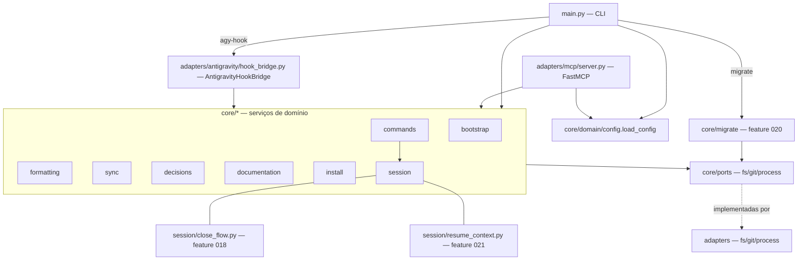

# Análise de Código — harness-core

> Regenerado pelo Archaeologist em 2026-06-24 15:19 (Re-extração após a feature 009-hooks-antigravity; histórico: features 003, 004, 005, 006, 007 e 008). Âncora (HEAD): `e30b9a6`.
> Projeto: `/Users/iagoleal/dev/harness`. Módulo único: **harness-core** — CLI Python + servidor MCP + **driver de ganchos do Antigravity**, em arquitetura hexagonal (ports & adapters). `doc_level = completo`.
> **Reconciliação de 2026-07-05** (Archaeologist, pós-features 010-021 — este documento estava congelado desde a 009): nova unidade **13. `core/migrate`** (feature 020); unidade **8. `core/session`** expandida com `close_flow.py` (018, fonte única de orquestração do encerramento) e `resume_context.py` (021, apêndice do índice de decisões no `resume`). Caminhos confirmados sob `.harness/harness-core/` (a relocação em si é da feature 011). `data-dictionary.md` e `modules.json` reconciliados em conjunto — ver notas no rodapé de cada um.

Categoria (Princípio nº 4): **Aplicação** — ferramenta com usuário (o próprio mantenedor), evolui no tempo, organizada em camadas.

## Visão geral da arquitetura

Hexágono clássico em três anéis:

- **Núcleo de domínio** (`src/core/`): regras de negócio puras, uma pasta por capacidade. Depende apenas de `core/ports/` (interfaces `ABC`), nunca de adaptadores concretos.
- **Portas** (`src/core/ports/`): contratos abstratos `FileSystemPort`, `GitPort`, `ProcessPort`.
- **Adaptadores** (`src/adapters/`): implementações físicas — `fs/local.py`, `git/subprocess.py`, `process/formatter.py` — e os **três drivers de entrada**: a CLI (`src/main.py`), o servidor MCP (`src/adapters/mcp/server.py`) e o **driver de ganchos do Antigravity** (`src/adapters/antigravity/hook_bridge.py`, feature 009).

Inversão de dependência preservada: os serviços recebem as portas por injeção no construtor; quem as instancia (`main.py`, `server.py`, testes) escolhe a implementação concreta. O driver do Antigravity segue o mesmo padrão: recebe `fs` e os serviços de domínio por injeção, e a CLI (`agy-hook`) faz a instanciação concreta na borda.

São **13 unidades** analisadas: 9 serviços de capacidade (`bootstrap`, `formatting`, `sync`, `decisions`, `commands`, `documentation`, `install`, `session`, e o **novo `migrate`**, feature 020), o pacote `domain` (modelos + config + cache), o pacote `ports` e o pacote `adapters` (que abriga o terceiro driver, em `adapters/antigravity/`).

---

## 1. `core/bootstrap` — ganchos Git, inicialização de repositório e upgrade 🟢

**Arquivos:** `src/core/bootstrap/service.py` (57 linhas), `src/core/bootstrap/init_service.py` (95 linhas).

Esta unidade é responsável pela instalação dos ganchos Git locais, assim como pelo provisionamento e evolução (upgrade) de novos workspaces físicos do Harness.

### Instalação de Ganchos (`BootstrapService`)

`BootstrapService.install_hooks(repo_path)` cria `.git/hooks/` e grava dois scripts Bash **idempotentemente** (reescreve a cada execução):

- `pre-commit` → invoca `.harness/harness-core/.venv/bin/python3 .harness/harness-core/src/main.py format "$@"`.
- `post-merge` → invoca o mesmo binário com `decisions "$@"`.

Os caminhos do interpretador e da CLI são literais chumbados dentro dos scripts (`_pre_commit_script`/`_post_merge_script`, `@staticmethod`). Cada script só executa se `$PYTHON_CLI` existir, senão `exit 0` (não bloqueia). Retorna a lista de caminhos instalados.

### Inicialização e Evolução (`InitService` — feature 007)

A feature 007 introduziu a rotina de cópia física e setup evolucionário:

- **`init_target(fs, process, target_path, active_harness, upstream_path, version)`**:
  1. Cria o diretório de destino se inexistente.
  2. Executa cópia física recursiva dos arquivos do core e do wrapper Bash ignorando pastas de desenvolvimento e cache (`.git/`, `.venv/`, `.pytest_cache/`, `.ruff_cache/`, `tmp/`).
  3. Descarrega o arquivo padrão `harness.toml` contendo o `active_harness`, o `upstream_path` (caminho absoluto para o core original) e a `version` corrente.
  4. Executa a criação da `.venv` local no destino (`python3 -m venv .venv` via `ProcessPort.run_command`). Se falhar por falta de dependências no host, gera um alerta fail-fast e detalhado de setup para ação humana.
  5. Instala os ganchos Git locais de forma automática e idempotente.
  6. **(feature 009)** Quando `active_harness == "antigravity"`, materializa `.agents/hooks.json` chamando `materialize_hooks_json(fs, target_path, command_path)`, onde `command_path = os.path.abspath(target_path)` é o prefixo absoluto que substitui `<ABS>` no `command` dos ganchos. 🟢
- **`upgrade_target(fs, process, target_path, upstream_path, version)`**:
  1. Atualiza o wrapper executável `harness` na raiz do destino.
  2. Realiza a replicação física do `.harness/harness-core/` do upstream para o destino de forma **estritamente não-destrutiva**: as pastas `.reversa/` (dados de engenharia reversa) e `.harness/decisoes/` (metadados arquiteturais locais) são preservadas intactas.
  3. Atualiza os campos de configuração no `harness.toml` do destino para sincronizar a versão do core instalado.
  4. **(feature 009)** Lê `active_harness` do `harness.toml`; se for `antigravity`, **reescreve** `.agents/hooks.json` via `materialize_hooks_json` com o caminho absoluto corrente — assim o `command` segue válido caso o repositório tenha sido movido desde o `init` (mitiga a dívida do caminho absoluto). 🟢

---

## 2. `core/formatting` — formatação por linguagem com blindagens 🟢

**Arquivo:** `src/core/formatting/service.py` (93 linhas). Serviço mais denso em regras de negócio.

`FormattingService.format_file(file_path) -> int` **sempre retorna 0** (no-op silencioso/não bloqueia — BR-MIGRAR-006), com `try/except Exception` envolvendo todo o corpo. Etapas:

1. **Blindagem de diretórios pessoais** (BR-MIGRAR-007): se `abs_path == ~`, ou começa por `~/Notas` ou `~/.claude`, retorna 0 sem formatar.
2. **Descoberta da raiz do projeto + opt-out** (BR-MIGRAR-009): sobe a árvore a partir do arquivo; em cada nível, se existir `.no-autoformat`, aborta (retorna 0); marca como raiz o nível que contiver `.git` **ou** `harness.toml`. Fallback: `os.getcwd()`.
3. **Seleção do formatador por extensão:** `.py`→`ruff`; `.js/.ts/.json/.css/.md`→`prettier`; `.rs`→`rustfmt`; extensão não suportada → retorna 0.
4. **Precedência de executável local** (BR-MIGRAR-008): para `ruff` procura `<root>/.venv/bin/ruff` e depois `venv/bin/ruff`; para `prettier`, `<root>/node_modules/.bin/prettier`. Se achar, passa o caminho; senão deixa o adaptador resolver no PATH.
5. **Execução** via `ProcessPort.execute_formatter(...)`, ignorando o código de retorno.

- 🟢 **Configuração viva de formatação:** O `FormattingService` consome o `HarnessConfig` passado em seu construtor e utiliza as regras dinâmicas definidas no `harness.toml` para `opt_out_file` e `exclude_paths` (com suporte a glob matching e checagem de diretórios via `fnmatch`), mantendo a blindagem básica incondicional de segurança como salvaguarda mínima.

---

## 3. `core/sync` — verificação de sincronia Git e alertas passivos de versão 🟢

**Arquivo:** `src/core/sync/service.py` (69 linhas).

### Sincronia Git (`SyncService.check_sync`)

`SyncService.check_sync(repo_path) -> bool` decide se o repo local está em sincronia com o remoto, **resiliente a falhas** (BR-MIGRAR-005): retorna `True` em qualquer erro de rede/git (imprime aviso e prossegue).

1. **Cache** (BR-MIGRAR-003): se `cache_filepath` existe, lê JSON, parseia `last_checked_time` (ISO, coerção tz → UTC se naive). Dentro do TTL (`cache_ttl_hours`, default 24): retorna `True` — se o `commit_hash` do cache bate com o HEAD local, por consistência; mas **mesmo divergindo, retorna `True`** dentro do TTL.
2. **Rede:** `git rev-parse HEAD` (local) e `git ls-remote origin main` (remoto).
3. **Atualiza cache** atomicamente via `SyncCache(...).model_dump_json()` + `write_file_atomic`.
4. Retorna `local_commit == remote_commit`.

### Alertas Passivos de Versão (`check_version_update` — feature 007)

A feature 007 introduziu `check_version_update(fs, local_version, upstream_path)` para ler a configuração do upstream diretamente de forma I/O estritamente local (sem rede ou subprocessos custosos):

1. Se `upstream_path` estiver configurado, lê o `harness.toml` do upstream usando a `FileSystemPort`.
2. Parseia a versão do upstream.
3. Se a versão do upstream for semanticalmente maior que a local, retorna a versão do upstream para que o driver principal exiba alertas discretos de upgrade no boot do agente.

---

## 4. `core/decisions` — grafo de microdecisões e índice derivado 🟢

**Arquivo:** `src/core/decisions/service.py` (147 linhas). Três responsabilidades:

**`load_decisions(directory) -> List[Decision]`**: lista ordenada de `MD-*.md`; para cada, split por `---` (front-matter YAML, máx. 3 partes). Extrai `id`, `gancho`, `estado` (default `ativo`); parseia `relacoes` (cada string = `<verbo> <MD-XXXX>`, dois tokens). Diretório ausente → lista vazia. Front-matter ausente ou YAML inválido → `ValueError` barulhento.

**`validate_integrity(decisions) -> List[str]`**: agrega erros (lista vazia = grafo válido):

- Validação individual de cada ficha (`Decision.validate_integrity` — ver §9).
- **Auto-relação** (`target == self.id`): erro.
- **Aresta órfã** (alvo fora do `decision_map`): erro.

**`compile_index(decisions, output, header)`**: deriva backlinks e grava o índice consolidado:

- Tabela de **verbos inversos**: `refina→refinado-por`, `depende-de→requerido-por`, `estende→estendido-por`, `substitui→substituído-por`, `relaciona→relacionado-com`, `bloqueia→bloqueado-por`.
- Backlinks ordenados por ID de origem (determinismo).
- Título de cada item extraído do H1 `# MD-XXXX — <título>` por regex.
- Sub-linha `↳ <saídas> · <entradas>` montada por composição.
- Cabeçalho opcional concatenado no topo. Gravação **atômica**.

---

## 5. `core/commands` — slash commands de sessão agnósticos à IDE 🟢

**Arquivo:** `src/core/commands/service.py` (92 linhas).

`CommandService.execute_command(command, args, repo_path, session_filepath) -> str` normaliza o comando (`strip().lower().lstrip("/")`) e despacha:

- **`encerrar-sessao`**: carrega sessão; se ausente/inativa → erro. Senão lê HEAD (`git`), `session.close_session(commit)`, salva atomicamente.
- **`resume`**: sem sessão → cria `SessionState` com HEAD atual e feature `args[0]` (ou `"default_feature"`), salva, retorna "Nova sessão". Com sessão → compara `session.commit_hash` com HEAD; se divergir, monta `⚠️ ALERTA` de âncora; `start_session` reativa **preservando a narrativa** escrita pelo agente; salva; retorna `<warning><corpo da narrativa>\n<footer>`.
- **`clarificar`**: texto fixo (limite de 2 rodadas de diálogo).
- **`handoff`**: monta bloco Markdown com feature ativa + HEAD.
- Desconhecido → `"Comando desconhecido: <command>"`.

---

## 6. `core/documentation` — geração do HTML por introspecção 🟢

**Arquivo:** `src/core/documentation/service.py` (114 linhas).

`DocumentationService` compõe um HTML estático injetando dados num template:

- **`extract_commands(parser)`**: varre `parser._actions`, acha o `_SubParsersAction`, lê `help` das pseudo-ações como fallback de `subparser.description`, e coleta args de cada subparser (flags, help, required, default). Introspecção do argparse — fonte única com a CLI real.
- **`parse_markdown_rules(domain_filepath)`**: regex extrai regras `**RN-XX: título** detalhes <emoji-confiança>` de `_reversa_sdd/domain.md`.
- **`load_checkpoints(state_filepath)`**: lê `.reversa/state.json` como dict (erro → `{}`).
- **`generate_html(...)`**: lê o template, monta `{commands, rules, state}`, serializa em JSON e substitui o placeholder `/* INJECTED_DATA_PLACEHOLDER */` por `const HARNESS_DOC_DATA = {...};`. Grava atomicamente.

---

## 7. `core/install` — prompt de instalação colável + materialização de ganchos 🟢

**Arquivos:** `service.py` (45), `harness_profiles.py` (157), `antigravity_hooks.py` (68, feature 009), `template.md`.

Papel: gerar, por **composição**, um prompt Markdown que o usuário cola no agente para instalar o harness passo a passo, de forma idempotente; e, a partir da feature 009, **materializar fisicamente** o `.agents/hooks.json` do Antigravity.

### Perfis por harness (`harness_profiles.py`) — feature 009

`HarnessProfile` (ABC) define `hooks_block()` e `apply_instructions()`; três concretas registradas em `_PROFILES`, resolvidas por `get_profile(name)` (fail-fast em nome desconhecido). O escopo por harness (onde aplicar os ganchos, nunca em diretório global) migrou para `apply_instructions()` dos três perfis — antes estava chumbado no `template.md`.

- **`ClaudeProfile`**: bloco JSON `hooks` real (`SessionStart`→`harness cmd resume`; `PostToolUse` `Write|Edit`→`harness format`; `Stop`→`harness decisions`), com `${CLAUDE_PROJECT_DIR}` e timeouts. `apply_instructions()` aponta o `.claude/settings.json` do projeto.
- **`GeminiProfile`**: orienta a ponte `context.*` do `settings.json` do Gemini do projeto.
- **`AntigravityProfile` (deixou de ser placeholder):** `hooks_block()` agora emite, via `json.dumps`, o named-hook `harness` do esquema `hooks.json` do Antigravity — `PreToolUse`/`PostToolUse` com `matcher = WRITE_MATCHER` (`write_to_file|replace_file_content|multi_replace_file_content`) e `Stop` sem matcher, cada um apontando `<ABS>/harness agy-hook {pre-tool-use|post-tool-use|stop}` com timeouts 10/30/10. O literal `ABS_PLACEHOLDER = "<ABS>"` permanece no JSON colável; é resolvido na materialização. `apply_instructions()` aponta o `.agents/hooks.json` do projeto e registra que o `init` já o materializa por merge.

### Materialização do `.agents/hooks.json` (`antigravity_hooks.py`) — feature 009 🟢

`materialize_hooks_json(fs, project_path, command_path, profile=None)` é a **rotina única de escrita**, compartilhada por `init` e `upgrade`, com **merge por named-hook**:

1. Resolve o bloco canônico chamando `profile.hooks_block()` (default `AntigravityProfile()`), substitui `<ABS>` por `command_path` e extrai o named-hook `harness` da string JSON (`_resolve_harness_block`).
2. Lê o `.agents/hooks.json` existente se houver e for JSON válido (`_read_existing`: vazio/ilegível → dict vazio); **substitui apenas a chave `harness`**, preservando quaisquer outras chaves de terceiros (idempotência + footprint zero).
3. Cria `.agents/` (`fs.makedirs`) e grava de forma **atômica** (`fs.write_file_atomic`, `indent=2`, `ensure_ascii=False`), sempre **sob `project_path`** (RN-N17). Toda escrita passa pelo `FileSystemPort`.

---

## 8. `core/session` — estado de sessão, encerramento e resume ancorado 🟢

**Arquivos:** `serializer.py` (122), `sinks.py` (77), `errors.py` (7), `offers.py` (96), **`close_flow.py` (399, feature 018)**, **`resume_context.py` (28, feature 021)**.

Papel: persistir e reinjetar o estado da última sessão entre boots do agente. Formato canônico de `.harness/estado-da-sessao.md` = **front-matter YAML** + **corpo Markdown**. Cresceu de 3 para 6 arquivos desde a extração de 2026-06-24 — a unidade que mais mudou no período 010-021.

### `close_flow.py` — orquestração do encerramento, fonte única (feature 018) 🟢

Extraído da borda `main.py` (D-01) para que a CLI (`main.py`, ramo `cmd encerrar-sessao`) e os scripts finos da skill `encerrar-sessao` consumam a **mesma** sequência, sem duplicar lógica (RN-N5, core segue agnóstico ao harness). Todo I/O é injetável (`out`/`err`/`asker`/`is_interactive`), o que permite o mesmo comportamento sob dois regimes: sem TTY (agente, emite _markers_ estruturados) e com TTY (usuário, pergunta `[s/N]`).

Sequência orquestrada por `SessionCloseFlow.run(repo_path, config, ...)`:

1. **Pré-check de trabalho pendente** (`pending_work_paths` — feature 016, estendida na 019 para cobrir `.harness/`): lista os caminhos sujos da working tree, **exceto** o próprio arquivo de estado (que o commit de fechamento versiona). Se houver, `conduct_commit_pendente` aborta o encerramento e orienta (marker `[HARNESS:COMMIT_PENDENTE ...]` sem TTY; lista legível com TTY) — protocolo "abortar e reexecutar": o core nunca faz `git add` do trabalho alheio.
2. **Gate de narrativa viva** (`narrative_is_stale`): recusa encerrar se a narrativa das 4 seções está vazia OU idêntica à do commit-âncora de partida (sinal de que o agente esqueceu de consolidar). Fail-open só quando não há baseline legível na âncora E a narrativa atual já está preenchida. `conduct_narrativa_pendente` replica a dualidade marker/TTY do passo anterior.
3. **Fechamento propriamente dito** — delega a `CommandService.execute_command("encerrar-sessao", ...)` (a lógica de domínio de transição de estado permanece lá, inalterada; `close_flow` só decide **quando** chamá-la).
4. **Ofertas de fim de sessão** (`conduct_end_session_offers`, feature 014, ordem **push → upgrade**, RN-10): cada oferta cabível (`offers.push`/`offers.upgrade`) é anunciada por _marker_ sem TTY ou pergunta `[s/N]` com TTY; a falha de uma ação (rede/push/upgrade) avisa e segue sem abortar a outra nem desfazer o encerramento já concluído (RN-02/RN-09).

🟢 **Sem duplicação CLI↔skill:** `main.py` reexporta `render_offer_markers`, `conduct_end_session_offers`, `pending_work_paths`, `render_commit_pendente_marker`, `conduct_commit_pendente` e `SessionCloseFlow` do core (ver topo do arquivo) — os scripts finos da skill materializada importam os mesmos símbolos, nunca uma cópia paralela.

### `resume_context.py` — apêndice do índice de decisões no resume (feature 021) 🟢

Função pura `build_decisions_appendix(fs, index_file, enabled) -> str`, agnóstica ao harness (RN-N5): não decide o gate, apenas o executa. Retorna `""` (não-bloqueante, RN-N4) se `enabled` for falso, se o índice não existir, ou se estiver vazio; caso contrário, devolve um cabeçalho fixo (`"\n\n---\n## Índice de decisões (consulte antes de buscas amplas)\n\n"`) seguido do conteúdo de `.harness/microdecisoes.md`.

Fiação em `main.py` (ramo `cmd resume`, só após `execute_command` produzir o corpo da narrativa): `enabled = config.harness.active_harness == "claude" and config.session.inject_decisions_index` — o gate por harness (**Claude-first**; Gemini/Antigravity adiados, decisão explícita da feature 021) e o flag de opt-out (`SessionSection.inject_decisions_index`, default `True`, seção `[session]` do `harness.toml`) vivem na borda; a função em si é composição pura. Estado ausente é avisado em `stderr` antes da chamada, não dentro dela. O índice é **anexado depois** do estado da sessão no `result_msg`, de modo que, sob truncamento por teto de tamanho do sink (`HookContextSink`, RN-N8), o estado tem precedência e o índice cede.

**Decisão de escopo (D-02 da feature 021):** injeta o **índice** (`.harness/microdecisoes.md`, ~1,7 KB), nunca a pasta `decisoes/` inteira (~31 KB) — que estouraria o teto de 10 KB do sink. As fichas `MD-NNNN` individuais ficam para aprofundamento sob demanda, seguindo os ponteiros do próprio índice.

---

## 9. `core/domain` — modelos, config tipada e cache 🟢

**Arquivos:** `models.py` (137), `config.py` (40), `cache.py` (6). Pydantic v2.

`load_config(fs, config_path="harness.toml") -> HarnessConfig` expõe as seções da configuração. Na feature 007, a seção `[harness]` (`HarnessSection`) ganhou suporte opcional aos campos `upstream_path` e `version` para possibilitar a rotina evolucionária de atualização e avisos passivos de versão defasada no boot.

---

## 10. `core/ports` — contratos abstratos 🟢

`fs.py` (`FileSystemPort` com `read_file, write_file, write_file_atomic, exists, list_dir, makedirs, remove, is_dir`), `git.py` (`GitPort`: `get_head_commit, get_remote_commit`), `process.py` (`ProcessPort`: `execute_formatter`, `run_command`).

As assinaturas `is_dir` e `run_command` foram acrescentadas para viabilizar as rotinas de bootstrap físicas e setup do virtual environment no destino.

---

## 11. `adapters` — implementações físicas + drivers 🟢

- **`fs/local.py`** (`LocalFileSystemAdapter`): Implementa operações físicas no disco local, adicionando suporte a `is_dir` via `os.path.isdir`.
- **`git/subprocess.py`** (`SubprocessGitAdapter`): Mapeia os comandos subprocess de `git`.
- **`process/formatter.py`** (`HostFormatterAdapter`): Mapeia chamadas do formatador e implementa `run_command` via subprocess.
- **`mcp/server.py`** (driver MCP — FastMCP "Harness"): Instancia os adaptadores e expõe 4 ferramentas. Incorpora avisos discretos de atualização passiva no boot do servidor MCP.
- **`antigravity/hook_bridge.py`** (driver de ganchos do Antigravity — `AntigravityHookBridge`, feature 009): terceiro driver de entrada, descrito em detalhe na §12.
- **`main.py`** (driver CLI v2.0.0): Argparse expandido para expor os subcomandos `init` (inicialização de workspace físico no destino), `upgrade` (atualização evolucionária não destrutiva) e **`agy-hook <evento>`** (feature 009). Incorpora alertas passivos no topo do boot de comandos da CLI.
  - **Subcomando `agy-hook` (feature 009):** aceita `event ∈ {pre-tool-use, post-tool-use, stop}` (validado pelo argparse). `agy-hook` foi adicionado à exceção (`args.command not in ("init", "upgrade", "agy-hook")`) tanto do carregamento global de config quanto do check passivo de sync — o gancho de borda **não** usa essa config global; ele a (re)carrega dentro do próprio ramo. Garantia não-bloqueante de borda: TODO o ramo (resolução de config, leitura do stdin, construção de `FormattingService`/`DecisionService`/`AntigravityHookBridge` e a delegação) roda sob `try/except`; o `fallback` exigido por evento (`{"decision": "allow"}` para `pre-tool-use`, senão `{}`) é **pré-computado a partir de `args.event` antes de qualquer operação que possa lançar**, de modo que config corrompida, stdin ilegível ou qualquer outra falha ainda emite o stdout exigido e encerra com **exit 0**. O stdin é lido com guarda de `isatty()`.

---

## 12. `adapters/antigravity` — driver de ganchos do Antigravity (feature 009) 🟢

**Arquivo:** `src/adapters/antigravity/hook_bridge.py` (162 linhas). Terceiro driver de entrada do hexágono, simétrico à CLI e ao servidor MCP: fala o protocolo de ganchos do Antigravity (stdin/stdout JSON camelCase, um formato por evento) e **delega aos serviços de domínio já existentes**, sem ramificar o core por harness (RN-N5 preservada — o domínio nunca conhece `active_harness`).

`AntigravityHookBridge.__init__(fs, formatting_service, decision_service, decisions_dir, decisions_index_file, decisions_header_file)` recebe `fs` e os serviços por **injeção**; a instanciação concreta fica na borda (`agy-hook` no `main.py`), mantendo o adaptador testável com dublês.

`handle(event, stdin_text) -> str` despacha por evento e **nunca levanta**: cada ramo passa por `_safe(event, handler, stdin_text, fallback)`, que executa o handler e, em qualquer exceção, loga em `stderr` (erro barulhento, via `_log`) e emite o `fallback` do evento. Evento desconhecido → loga e retorna `{}`. Os três handlers (algoritmo as-built por evento):

- **`pre-tool-use` (captura) → `_handle_pre_tool_use`:** lê `stepIdx` e `toolCall.args.TargetFile` do payload; se ambos presentes, grava o par `{ "<stepIdx>": "<TargetFile>" }` no **mapa de scratch da conversa**. Stdout: `{"decision": "allow"}` — **nunca bloqueia** (jamais `"deny"`).
- **`post-tool-use` (formatação) → `_handle_post_tool_use`:** lê `stepIdx` e `error`; se `stepIdx` presente, `error` vazio e o scratch existe, recupera o `TargetFile` pelo `stepIdx` e chama `formatting_service.format_file(target_file)` (que já honra opt-out/exclusões e **sempre retorna 0**, RN-03). Stdout: `{}`.
- **`stop` (decisões) → `_handle_stop`:** carrega as microdecisões de `decisions_dir`, roda `validate_integrity` (erros são **logados**, nunca bloqueiam nem reentram no laço) e `compile_index(decisions, decisions_index_file, decisions_header_file)` — equivale a `./harness decisions`. Stdout: `{}` (**nunca** `{"decision": "continue"}`).

**Mapa `stepIdx → TargetFile` (scratch):** `_scratch_path(payload)` resolve `<artifactDirectoryPath>/.harness-agy/pending-format.json` (constantes `_SCRATCH_DIRNAME = ".harness-agy"`, `_SCRATCH_FILENAME = "pending-format.json"`); sem `artifactDirectoryPath` no payload → `None` (sem captura). `_read_map` lê via `fs.read_file` e tolera ausência/JSON inválido (→ dict vazio); `_write_map` cria o diretório (`fs.makedirs`) e grava **atomicamente** (`fs.write_file_atomic`). Persistir o caminho no `PreToolUse` e recuperá-lo no `PostToolUse` é a estratégia D-03 (captura + formatação) que preserva a granularidade por-edição sem parsear o `transcript.jsonl`.

**Não-bloqueio e observabilidade:** `_log(message)` escreve sempre em `stderr` (`[harness agy-hook] ...`), jamais em `stdout` (reservado ao contrato). Toda exceção é capturada em dois anéis — no `_safe` (interno) e no ramo `agy-hook` do `main.py` (borda) —, garantindo que o laço do agente Antigravity nunca seja interrompido por falha do harness.

---

## 13. `core/migrate` — conversão do layout copiado para a fonte única (feature 020, NOVO) 🟢

**Arquivo:** `src/core/migrate/service.py` (139 linhas). Décima terceira unidade, ausente na extração anterior (não existia antes da 020).

`MigrateService.migrate(root, dry_run=False, upstream_self=None) -> list` varre `root` (default `~/dev`) por instalações do harness (qualquer subpasta com `harness.toml`) e converte cada uma do **layout copiado** (cópia local do `harness-core` + `.venv` por projeto — o modelo pré-020) para a **fonte única** (shim `./harness` + `.venv` locais que executam o core do upstream via `upstream_path`). Devolve uma lista de resultados por instalação (`status ∈ {migrated, would-migrate, skipped}`).

**Algoritmo por instalação (`_migrate_one`), ordem deliberadamente segura** — instala o executor novo ANTES de remover o antigo, para o projeto nunca ficar sem `./harness` funcional:

1. Lê `upstream_path`/`active_harness` do `harness.toml` do projeto.
2. **Guarda 1:** recusa migrar o próprio `upstream_self` (a fonte real do core — nunca se automigra).
3. **Guarda 2:** recusa migrar se o projeto for uma autoreferência do upstream (upstream aponta para dentro do próprio projeto) ou não tiver `upstream_path` configurado.
4. **Guarda 3:** recusa se o core do upstream não existir no caminho declarado (o shim ficaria quebrado).
5. Detecta o(s) diretório(s) do core a remover: `.harness/harness-core` (layout pós-011) e/ou `harness-core` na raiz (layout legado pré-011 — “o `livro-mfc` carrega os dois”, comentário no código).
6. **Modo `--dry-run`:** só relata `{status: "would-migrate", removes: [...]}`, sem escrever nem remover nada.
7. **Modo real**, na ordem: (a) escreve o shim (`render_shim()`) e o torna executável; (b) instala os ganchos Git via `BootstrapService` (tolera ausência de repo git); (c) materializa `.claude/settings.json` por merge, se `active_harness == "claude"`; (d) remove o campo `version` do `harness.toml` (deixa de fazer sentido sob fonte única — a versão passa a ser sempre a do upstream); (e) **por último**, remove a(s) cópia(s) do core (`_safe_remove_core`, que recusa remover qualquer diretório cujo nome-base não seja literalmente `harness-core` — guarda contra um `remove_tree` malformado apagar a coisa errada).

**Exceção consciente ao footprint per-projeto (RN-N17, documentada no docstring do módulo):** ao contrário de `init`/`materialize`, o `migrate` **atua sobre outros projetos** por design — é ferramenta de manutenção da base já instalada, não uma operação per-projeto isolada. A guarda inegociável (guardas 1 e 2 acima) é nunca remover o core do upstream em si nem cair numa autorreferência circular.

---

## Resumo de candidatos a ticket

> Todas as principais pendências abertas no HEAD foram resolvidas.

| #   | Local                   | Sintoma                                                                                 | Severidade sugerida                 | Estado                     |
| --- | ----------------------- | --------------------------------------------------------------------------------------- | ----------------------------------- | -------------------------- |
| T4  | `formatting/service.py` | Blindagens e opt-out chumbados; `[formatting]` do `harness.toml` não alimenta o serviço | Média (config declarada sem efeito) | 🟢 Resolvido (feature 008) |
| T6  | repositório             | Sem lock file; pins apenas `>=`                                                         | Média (reprodutibilidade)           | 🟢 Resolvido (feature 008) |
