# Modelo de Entidades e Estruturas (ERD) — harness-core

> Regenerado pelo Architect em 2026-06-24 (Re-extração após as features 003, 004 e 005)
> Atualização cirúrgica em 2026-06-24 após a feature 006 (commit `e894c59`): nova `SESSION_SECTION` na configuração tipada e fechamento da divergência T2 (caminho de sessão por configuração).
> Nível de Documentação: **Completo** · Escala: 🟢 CONFIRMADO · 🟡 INFERIDO
> **Re-extração estrutural de 2026-07-05** (este documento estava congelado desde 2026-06-24/feature 006, sem incorporar nem a feature 008 que já resolvia o T4 aqui descrito como aberto): `SESSION_SECTION` ganha `inject_decisions_index` (✨f021); `HARNESS_SECTION` explicitada com `upstream_path`/`version` (✨f007, ainda vigentes — não removidos pela f020, ver domain.md); T4 corrigido para RESOLVIDO (feature 008); `DECISION` — população cresceu de 5 para 12 fichas, sem mudança de schema; novas estruturas efêmeras `EndSessionOffers`/`PushOffer`/`UpgradeOffer` (✨f014, dataclasses — exceção ao padrão Pydantic do resto do domínio); nota sobre a divergência de nome do `SYNC_CACHE` entre CLI e MCP (T7, dívida técnica nova, ver `architecture.md`).
> **Reconciliação de 2026-07-15** (pós-features 022-023): `SESSION_STATE` ganha os campos anti-loop opcionais `gate_lembrete_fingerprint`/`gate_encerramento_fingerprint` (✨f022, primeira mudança de schema da entidade); `DECISIONS_SECTION` ganha `require_registration` (✨f022, default true); nova estrutura efêmera `GATE_VERDICT` (✨f022/f023, Pydantic, não persistida); população de `DECISION` 12 → 16 fichas.

> 🟢 **Não há banco de dados relacional.** Confirmado em `surface.json` (`database_hints: []`) e na análise de código: nenhum DDL, migration, ORM ou cliente de banco. A "persistência" do `harness-core` é inteiramente baseada em **arquivos versionados** — Markdown com front-matter YAML, JSON e TOML. O ERD abaixo modela as **estruturas de dados de configuração, estado e decisão** (modelos Pydantic v2 do domínio) como entidades lógicas, com as relações de composição reais entre elas. As "PK/FK" são lógicas (identificadores de domínio), não chaves de um SGBD.

---

## 🗂️ Diagrama de Estruturas

```mermaid
erDiagram
    %% ── Estado de sessão (.harness/estado-da-sessao.md — feature 004) ──
    SESSION_STATE {
        string commit_hash "front-matter commit · regex SHA1 ^[a-f0-9]{40}$"
        string active_feature "front-matter feature · kebab-case"
        datetime start_time "front-matter start_time · ISO, naive->UTC"
        bool is_active "front-matter status (active/inactive)"
        string gate_lembrete_fingerprint "opcional (f022) · sha1 grosso · omitido se vazio"
        string gate_encerramento_fingerprint "opcional (f022) · sha1 fino · omitido se vazio"
    }
    SESSION_NARRATIVE {
        list feito "corpo: ## O que foi feito"
        list proximos_passos "corpo: ## Proximos passos"
        list pendencias "corpo: ## Pendencias / bloqueios"
        list ponteiros "corpo: ## Ponteiros"
    }

    %% ── Grafo de microdecisoes (.harness/decisoes/MD-*.md — feature 005) ──
    DECISION {
        string id "front-matter id · regex ^MD-\\d{4}$"
        string gancho "front-matter gancho"
        string status "front-matter estado (ativo/descartado · default ativo)"
        string filepath "runtime · caminho da ficha"
        string raw_content "runtime · Markdown integral (validacao)"
    }
    RELATIONSHIP {
        string rel_type "enum: depende-de/substitui/refina/relaciona/estende/bloqueia"
        string target_id "regex ^MD-\\d{4}$"
    }

    %% ── Cache de sincronia (dois nomes divergentes — T7) ──
    SYNC_CACHE {
        datetime last_checked_time "ISO 8601"
        string commit_hash "regex SHA1 ^[a-f0-9]{40}$"
    }

    %% ── Configuracao tipada (harness.toml) ──
    HARNESS_CONFIG {
        string active_harness "[harness] · claude/gemini/antigravity · default claude"
    }
    HARNESS_SECTION {
        string upstream_path "[harness] · opcional (feature 007) · ancora de execucao sob fonte unica (f020)"
        string version "[harness] · opcional (feature 007) · ainda gravado (remocao planejada foi desescopada)"
    }
    FORMATTING_SECTION {
        list exclude_paths "[formatting] · default [] (consumido dinamicamente, feature 008)"
        string opt_out_file "[formatting] · default .no-autoformat (consumido dinamicamente, feature 008)"
    }
    SYNC_SECTION {
        int cache_ttl_hours "[sync] · default 24"
        bool remote_check_enabled "[sync] · default true"
    }
    DECISIONS_SECTION {
        string dir "[decisions] · default .harness/decisoes"
        string index_file "[decisions] · default .harness/microdecisoes.md"
        string header_file "[decisions] · default .harness/decisoes/_cabecalho.md"
        bool require_registration "[decisions] · default true (feature 022, NOVO)"
    }
    SESSION_SECTION {
        string state_file "[session] · default .harness/estado-da-sessao.md (feature 006)"
        bool inject_decisions_index "[session] · default true (feature 021, NOVO)"
    }

    %% ── Relacoes de composicao reais ──
    SESSION_STATE ||--o| SESSION_NARRATIVE : "contem (value-object)"
    DECISION ||--o{ RELATIONSHIP : "declara arestas no front-matter"
    RELATIONSHIP }o--|| DECISION : "target_id aponta para (validado: sem orfa, sem auto-relacao)"
    HARNESS_CONFIG ||--|| HARNESS_SECTION : "compoe [harness]"
    HARNESS_CONFIG ||--|| FORMATTING_SECTION : "compoe [formatting]"
    HARNESS_CONFIG ||--|| SYNC_SECTION : "compoe [sync]"
    HARNESS_CONFIG ||--|| DECISIONS_SECTION : "compoe [decisions]"
    HARNESS_CONFIG ||--|| SESSION_SECTION : "compoe [session]"
```

---

## 📖 Descrição das Estruturas e Relações

### 1. Estado de Sessão — `.harness/estado-da-sessao.md` (feature 004) 🟢

- **`SESSION_STATE`** (`models.py:SessionState`): persistido como front-matter YAML + corpo Markdown; round-trip por `session/serializer.py` com invariante `parse(render(x)) == x`. Campos obrigatórios no front-matter: `commit`, `feature`, `start_time`, `status` — ausência → `MalformedSessionStateError` (RN-N4).
- **`SESSION_NARRATIVE`** (`models.py:SessionNarrative`): value-object **aninhado** em `SessionState.narrative`, materializado nas 4 seções `##` do corpo. Escrito pelo agente, reinjetado pela CLI, nunca inventado. Cardinalidade **1:1 opcional** (default vazio).
- 🟢 **T2 resolvido (feature 006):** o caminho do estado de sessão passou a vir de `SESSION_SECTION` (`config.session.state_file`); CLI e MCP convergem para `.harness/estado-da-sessao.md`. Não há mais a instância paralela `ESTADO-DA-SESSAO.md` (raiz) que o MCP operava — a estrutura é uma só.
- 🟢 **Campos anti-loop do gate (✨f022/f023):** `gate_lembrete_fingerprint` (identidade grossa, `sha1(âncora)`) e `gate_encerramento_fingerprint` (identidade fina, `sha1(âncora+HEAD+sujos)`) — opcionais, gravados no front-matter **só quando preenchidos** (arquivo byte-compatível com o formato pré-022 enquanto o gate não é acionado), tolerados como ausentes no parse e **zerados por `close_session`**. Primeira mudança de schema de `SESSION_STATE` desde a criação; retrocompatível nos dois sentidos.

### 2. Grafo de Microdecisões — `.harness/decisoes/MD-*.md` (feature 005) 🟢

- **`DECISION`** (`models.py:Decision`): mapeia o front-matter de cada ficha. Integridade de conteúdo (`validate_integrity`) exige H1 `# MD-XXXX` e as 4 seções `D / PORQUÊ / DESCARTADO / ESTADO`.
- **`RELATIONSHIP`** (`models.py:Relationship`): aresta tipada **aninhada** em `Decision.relationships` (cada item = `"<verbo> MD-XXXX"`). Cardinalidade **1:N** (uma decisão declara 0+ relações).
- **Integridade do grafo** (`DecisionService.validate_integrity`): **auto-relação** (`target == id`) e **aresta órfã** (alvo fora do grafo) são erros. O índice `.harness/microdecisoes.md` é **derivado** com backlinks por verbos inversos (não editado à mão).
- Caminhos (`dir`/`index_file`/`header_file`) vêm de `DECISIONS_SECTION` — **não chumbados** (feature 005).

### 3. Cache de Sincronia — arquivo único canônico 🟢

- **`SYNC_CACHE`** (`cache.py:SyncCache`): estrutura **isolada** de controle de infraestrutura; persiste o último check para honrar a janela TTL. Sem relação com as demais entidades.
- 🟢 **T7 (achado na reconciliação de 2026-07-05, RESOLVIDO no mesmo dia — MD-0013):** existiam **dois arquivos físicos** para a mesma estrutura lógica: a CLI gravava em `.harness/sync-cache.json` (hífen — o que o `.gitignore` do `init` cobre) e o servidor MCP, chumbado, em `.harness/sync_cache.json` (underscore), que escapava do git e, desde a feature 019, seria oferecido para commit. O caminho agora tem fonte única em `layout.py:SYNC_CACHE_REL_PATH`, consumida por `main.py`, `close_flow.py` e `server.py`. Ver `architecture.md` §5.

### 4. Configuração Tipada — `harness.toml` (`config.py`) 🟢

- **`HARNESS_CONFIG`** compõe as seções `HARNESS_SECTION` (`active_harness`, `upstream_path`/`version` ✨f007 — ainda vigentes, a remoção planejada pela f020 foi desescopada), `FORMATTING_SECTION`, `SYNC_SECTION`, `DECISIONS_SECTION` (✨ feature 005, chave do desacoplamento dos caminhos de decisão) e `SESSION_SECTION` (✨ feature 006, `state_file`; ✨ feature 021, `inject_decisions_index`). Via única tipada: `load_config(fs)` é o único caminho de configuração; `load_harness_config` (dict legado) foi removido (T5 fechado, feature 006).
- 🟢 **T4 RESOLVIDO (feature 008):** `FORMATTING_SECTION` passou a ser consumida dinamicamente por `FormattingService` (`exclude_paths` com glob/`fnmatch`, `opt_out_file` configurável) — descrição anterior deste ERD ("não consumido") estava desatualizada desde a feature 008 e não fora corrigida até esta reconciliação.

### 5. Estruturas efêmeras (não persistidas) 🟢

- **`HARNESS_DOC_DATA`** — payload JSON `{commands, rules, state}` compilado por `DocumentationService` e injetado no `template.html`; não vive em disco como entidade própria (embute-se no HTML).
- **Bloco de ganchos do `install-prompt`** (feature 003) — saída textual de `InstallPromptService.render` montada por substituição de placeholders; transitória, destinada à colagem manual.
- **`EndSessionOffers` / `PushOffer` / `UpgradeOffer` (✨f014, NOVO nesta reconciliação)** — `session/offers.py`. Exceção deliberada ao padrão Pydantic: são `@dataclass` puros, montados por `EndSessionOffersService.detect` a cada `encerrar-sessao` e consumidos por `session/close_flow.conduct_end_session_offers`; nunca persistidos. `EndSessionOffers` agrega `push: PushOffer?` e `upgrade: UpgradeOffer?` (ambos opcionais, `None` = sem oferta cabível).
- **`GATE_VERDICT` (✨f022/f023, NOVO)** — `decisions/gate.py:GateVerdict` (Pydantic): `pendente`, `mudancas`, `fichas_tocadas`, `fingerprint` (fino), `fingerprint_lembrete` (grosso), `aviso?`. Montado por `evaluate_registration_gate` a cada avaliação e descartado; **só os fingerprints sobrevivem**, copiados para os campos anti-loop de `SESSION_STATE` pelas bordas que interceptam. Ver `data-dictionary.md` §9.

---

## 🧭 Mudanças vs ERD anterior (feature 002)

- **Localização:** `SESSION_STATE` migrou de `ESTADO-DA-SESSAO.md` (raiz) para `.harness/estado-da-sessao.md`; `DECISION` migrou de `decisoes/` para `.harness/decisoes/`.
- **Nova entidade:** `SESSION_NARRATIVE` (value-object com 4 listas) ✨f004.
- **Nova entidade:** `DECISIONS_SECTION` na configuração tipada ✨f005.
- **Nova entidade:** `SESSION_SECTION` (`state_file`) na configuração tipada ✨f006 — desacopla o caminho de sessão e fecha a divergência T2 entre CLI e MCP.
- **Correção de domínio:** `DECISION.status` tem **dois** valores reais (`ativo`/`descartado`); o ERD anterior citava `em-revisao`/`rejeitado`, que **não constam do validador**.
- **`SYNC_CACHE`:** caminho passou para `.harness/sync_cache.json` (chumbado no MCP).

## 🧭 Mudanças 010-021 (reconciliação 2026-07-05)

- **`HARNESS_SECTION`** explicitada como entidade própria (`upstream_path`/`version`, feature 007) — existia no domínio desde 007 mas não estava modelada neste ERD.
- **`SESSION_SECTION.inject_decisions_index`** (✨f021, NOVO) — flag de opt-out do apêndice de decisões no resume.
- **`DECISION`:** população cresceu de 5 para 12 fichas — sem mudança de schema.
- **Nova estrutura efêmera:** `EndSessionOffers`/`PushOffer`/`UpgradeOffer` (✨f014) — dataclasses, não Pydantic (exceção documentada).
- **T4 corrigido:** estava descrito como "não consumido"; na verdade resolvido desde a feature 008 (este ERD nunca fora atualizado para refletir isso).
- **T7 novo:** divergência de nome do arquivo de cache de sync entre CLI e MCP (`sync-cache.json` vs `sync_cache.json`) — **resolvido no mesmo dia** (MD-0013): fonte única em `layout.py:SYNC_CACHE_REL_PATH`.

## 🧭 Mudanças 022-023 (reconciliação 2026-07-15)

- **`SESSION_STATE`:** + `gate_lembrete_fingerprint`/`gate_encerramento_fingerprint` (opcionais, anti-loop do gate, zerados no fechamento) — primeira mudança de schema da entidade.
- **`DECISIONS_SECTION.require_registration`** (✨f022, NOVO) — liga o gate de registro; default `true`.
- **Nova estrutura efêmera:** `GATE_VERDICT` (✨f022/f023) — Pydantic, não persistida.
- **`DECISION`:** população cresceu de 12 para 16 fichas (MD-0013..MD-0016) — sem mudança de schema.
