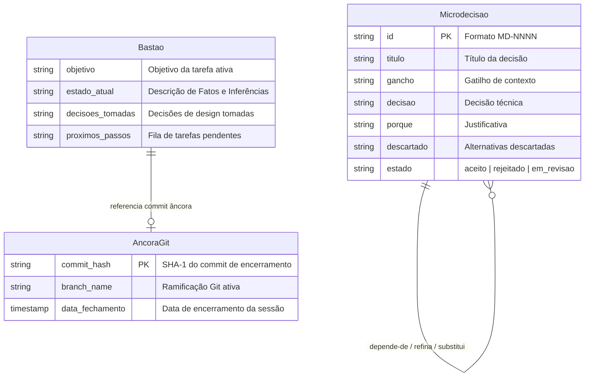

# Entity Relationship Diagram (ERD) — harness-config

> Gerado pelo Architect em 2026-06-23
> Nível de Documentação: **Completo**

Este documento detalha o modelo de dados físico e lógico implícito mapeado nos arquivos de persistência do projeto `harness-config`.

---

---

## 📋 Descrição das Entidades e Atributos

1. **Microdecisao (`decisoes/MD-*.md`):**
   * **`id` (Chave Primária):** String incremental no formato `MD-NNNN`. Utilizada como referência estável de integridade nos backlinks do sistema.
   * **`relacoes` (Auto-relacionamento):** Uma microdecisão pode se relacionar com várias outras decisões históricas sob as chaves:
     * `depende-de`: Dependência técnica direta.
     * `refina`: Evolução ou detalhamento de uma escolha anterior.
     * `substitui`: Deprecia e anula uma decisão anterior (que passa ao estado `rejeitado`).
2. **Bastão de Handoff (`~/.agent-memory/BASTAO.md`):**
   * Contém as chaves funcionais para passagem de estado semântico entre sessões. É um arquivo de escrita destrutiva (sobrescrito a cada handoff).
3. **Âncora Git (`ESTADO-DA-SESSAO.md`):**
   * Armazena dados de commit do repositório físico do host. Utilizado na inicialização do agente para certificar que ele está atuando sobre a revisão correta, evitando regressão de código.
