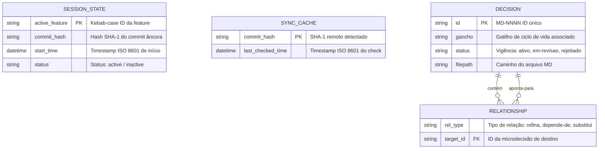

# Modelo de Entidades e Relacionamentos (ERD) — harness-core

> Gerado pelo Architect em 2026-06-23
> Nível de Documentação: **Completo**

Este documento apresenta o modelo relacional lógico das entidades persistidas e conceituais do `harness-core`.

---

---

## 📖 Descrição das Relações

1. **Relação de Grafo de Decisões:**
   - Uma **`DECISION`** (Microdecisão) pode conter zero ou mais **`RELATIONSHIP`** (Arestas de relações) declaradas em seu Front-matter.
   - Cada **`RELATIONSHIP`** aponta para outra **`DECISION`** por meio do seu ID único (target_id). A consistência destas referências é validada pelo `DecisionService`, reportando referências órfãs caso o ID destino não exista fisicamente em disco.
2. **Isolamento de Cache e Sessão:**
   - As entidades **`SESSION_STATE`** e **`SYNC_CACHE`** operam de forma isolada, servindo puramente de controle de infraestrutura local do projeto.
