# Modelo de Entidades e Estruturas (ERD) — harness-core

> Regenerado pelo Architect em 2026-06-24 (Re-extração após as features 003, 004 e 005)
> Nível de Documentação: **Completo** · Escala: 🟢 CONFIRMADO · 🟡 INFERIDO

> 🟢 **Não há banco de dados relacional.** Confirmado em `surface.json` (`database_hints: []`) e na análise de código: nenhum DDL, migration, ORM ou cliente de banco. A "persistência" do `harness-core` é inteiramente baseada em **arquivos versionados** — Markdown com front-matter YAML, JSON e TOML. O ERD abaixo modela as **estruturas de dados de configuração, estado e decisão** (modelos Pydantic v2 do domínio) como entidades lógicas, com as relações de composição reais entre elas. As "PK/FK" são lógicas (identificadores de domínio), não chaves de um SGBD.

---

## 🗂️ Diagrama de Estruturas

```mermaid
erDiagram
    %% ── Estado de sessão (.harness/estado-da-sessao.md — feature 004) ──
    SESSION_STATE {
        string commit_hash "front-matter commit · regex SHA1 ^[a-f0-9]{40}$"
        string active_feature "front-matter feature · kebab-case"
        datetime start_time "front-matter start_time · ISO, naive->UTC"
        bool is_active "front-matter status (active/inactive)"
    }
    SESSION_NARRATIVE {
        list feito "corpo: ## O que foi feito"
        list proximos_passos "corpo: ## Proximos passos"
        list pendencias "corpo: ## Pendencias / bloqueios"
        list ponteiros "corpo: ## Ponteiros"
    }

    %% ── Grafo de microdecisoes (.harness/decisoes/MD-*.md — feature 005) ──
    DECISION {
        string id "front-matter id · regex ^MD-\\d{4}$"
        string gancho "front-matter gancho"
        string status "front-matter estado (ativo/descartado · default ativo)"
        string filepath "runtime · caminho da ficha"
        string raw_content "runtime · Markdown integral (validacao)"
    }
    RELATIONSHIP {
        string rel_type "enum: depende-de/substitui/refina/relaciona/estende/bloqueia"
        string target_id "regex ^MD-\\d{4}$"
    }

    %% ── Cache de sincronia (.harness/sync_cache.json) ──
    SYNC_CACHE {
        datetime last_checked_time "ISO 8601"
        string commit_hash "regex SHA1 ^[a-f0-9]{40}$"
    }

    %% ── Configuracao tipada (harness.toml) ──
    HARNESS_CONFIG {
        string active_harness "[harness] · claude/gemini/antigravity · default claude"
    }
    FORMATTING_SECTION {
        list exclude_paths "[formatting] · default [] (NAO consumido · T4)"
        string opt_out_file "[formatting] · default .no-autoformat (NAO consumido · T4)"
    }
    SYNC_SECTION {
        int cache_ttl_hours "[sync] · default 24"
        bool remote_check_enabled "[sync] · default true"
    }
    DECISIONS_SECTION {
        string dir "[decisions] · default .harness/decisoes"
        string index_file "[decisions] · default .harness/microdecisoes.md"
        string header_file "[decisions] · default .harness/decisoes/_cabecalho.md"
    }

    %% ── Relacoes de composicao reais ──
    SESSION_STATE ||--o| SESSION_NARRATIVE : "contem (value-object)"
    DECISION ||--o{ RELATIONSHIP : "declara arestas no front-matter"
    RELATIONSHIP }o--|| DECISION : "target_id aponta para (validado: sem orfa, sem auto-relacao)"
    HARNESS_CONFIG ||--|| FORMATTING_SECTION : "compoe [formatting]"
    HARNESS_CONFIG ||--|| SYNC_SECTION : "compoe [sync]"
    HARNESS_CONFIG ||--|| DECISIONS_SECTION : "compoe [decisions]"
```

---

## 📖 Descrição das Estruturas e Relações

### 1. Estado de Sessão — `.harness/estado-da-sessao.md` (feature 004) 🟢
* **`SESSION_STATE`** (`models.py:SessionState`): persistido como front-matter YAML + corpo Markdown; round-trip por `session/serializer.py` com invariante `parse(render(x)) == x`. Campos obrigatórios no front-matter: `commit`, `feature`, `start_time`, `status` — ausência → `MalformedSessionStateError` (RN-N4).
* **`SESSION_NARRATIVE`** (`models.py:SessionNarrative`): value-object **aninhado** em `SessionState.narrative`, materializado nas 4 seções `##` do corpo. Escrito pelo agente, reinjetado pela CLI, nunca inventado. Cardinalidade **1:1 opcional** (default vazio).
* 🟡 **Ressalva T2:** o driver MCP opera sobre `ESTADO-DA-SESSAO.md` (raiz) — uma instância **paralela e divergente** da mesma estrutura, não convergente com a da CLI.

### 2. Grafo de Microdecisões — `.harness/decisoes/MD-*.md` (feature 005) 🟢
* **`DECISION`** (`models.py:Decision`): mapeia o front-matter de cada ficha. Integridade de conteúdo (`validate_integrity`) exige H1 `# MD-XXXX` e as 4 seções `D / PORQUÊ / DESCARTADO / ESTADO`.
* **`RELATIONSHIP`** (`models.py:Relationship`): aresta tipada **aninhada** em `Decision.relationships` (cada item = `"<verbo> MD-XXXX"`). Cardinalidade **1:N** (uma decisão declara 0+ relações).
* **Integridade do grafo** (`DecisionService.validate_integrity`): **auto-relação** (`target == id`) e **aresta órfã** (alvo fora do grafo) são erros. O índice `.harness/microdecisoes.md` é **derivado** com backlinks por verbos inversos (não editado à mão).
* Caminhos (`dir`/`index_file`/`header_file`) vêm de `DECISIONS_SECTION` — **não chumbados** (feature 005).

### 3. Cache de Sincronia — `.harness/sync_cache.json` 🟢
* **`SYNC_CACHE`** (`cache.py:SyncCache`): estrutura **isolada** de controle de infraestrutura; persiste o último check para honrar a janela TTL. Sem relação com as demais entidades.

### 4. Configuração Tipada — `harness.toml` (`config.py`) 🟢
* **`HARNESS_CONFIG`** compõe quatro seções: `FORMATTING_SECTION`, `SYNC_SECTION` e `DECISIONS_SECTION` (✨ nova na feature 005, chave do desacoplamento dos caminhos de decisão), além de `active_harness` em `[harness]`.
* ⚠️ **T4:** `FORMATTING_SECTION` é declarada no domínio mas **não é consumida** por `FormattingService` (blindagens e opt-out chumbados) — a estrutura existe, mas mudar `harness.toml` não altera o comportamento de formatação.

### 5. Estruturas efêmeras (não persistidas) 🟢
* **`HARNESS_DOC_DATA`** — payload JSON `{commands, rules, state}` compilado por `DocumentationService` e injetado no `template.html`; não vive em disco como entidade própria (embute-se no HTML).
* **Bloco de ganchos do `install-prompt`** (feature 003) — saída textual de `InstallPromptService.render` montada por substituição de placeholders; transitória, destinada à colagem manual.

---

## 🧭 Mudanças vs ERD anterior (feature 002)

* **Localização:** `SESSION_STATE` migrou de `ESTADO-DA-SESSAO.md` (raiz) para `.harness/estado-da-sessao.md`; `DECISION` migrou de `decisoes/` para `.harness/decisoes/`.
* **Nova entidade:** `SESSION_NARRATIVE` (value-object com 4 listas) ✨f004.
* **Nova entidade:** `DECISIONS_SECTION` na configuração tipada ✨f005.
* **Correção de domínio:** `DECISION.status` tem **dois** valores reais (`ativo`/`descartado`); o ERD anterior citava `em-revisao`/`rejeitado`, que **não constam do validador**.
* **`SYNC_CACHE`:** caminho passou para `.harness/sync_cache.json` (chumbado no MCP).
