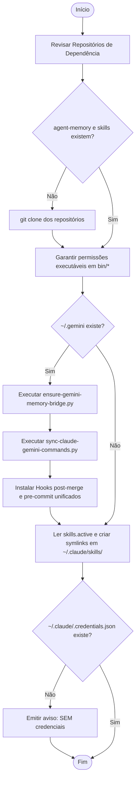
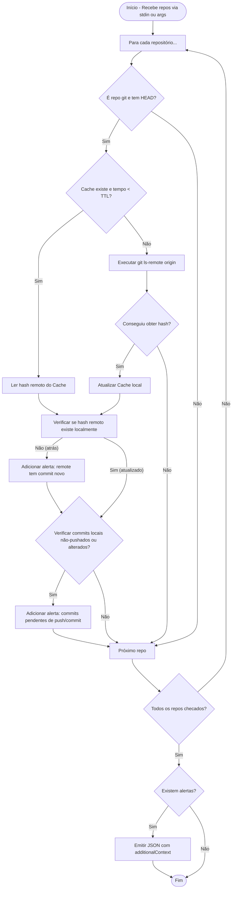
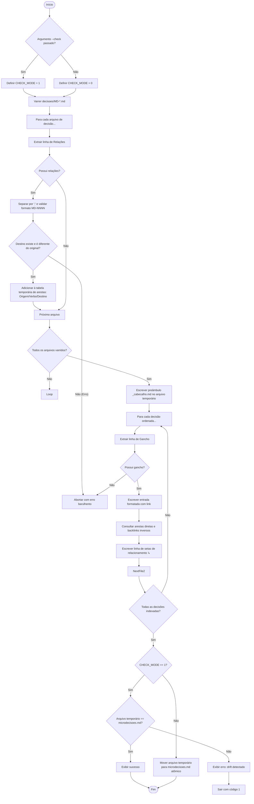

# Fluxogramas do Módulo `bin`

> Gerado pelo Archaeologist em 2026-06-23

Esta pasta contém a representação visual dos fluxos de controle e lógicas dos scripts em `bin/`.

---

## 🚀 1. bootstrap.sh

Fluxo de inicialização e reconciliação de dependências por-host.

---

## 🔄 2. sync-check.sh

Fluxo de checagem de sincronização local/remota (Hook SessionStart).

---

## 📝 3. gerar-index-decisoes.sh

Fluxo de compilação e verificação de integridade do índice de microdecisões.

