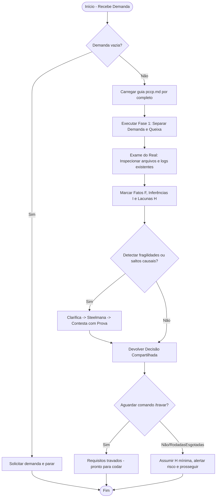

# Fluxogramas do Módulo `commands`

> Gerado pelo Archaeologist em 2026-06-23

Esta pasta contém a representação visual dos fluxos de execução das especificações de comandos customizados em `commands/`.

---

## 💬 1. /clarificar (clarificar.md)

Fluxo de clarificação de demandas complexas (PCCP).

---

## 🚪 2. /encerrar-sessao (encerrar-sessao.md)

Fluxo de finalização e consolidação da sessão no diretório do projeto.

```mermaid
graph TD
    Start([Início]) --> GetRoot[git rev-parse --show-toplevel para achar raiz do projeto]
    GetRoot --> CheckGit{É repositório Git?}
    CheckGit -- Não --> SuggestGit[Avisar usuário e oferecer git init] --> StateSave
    CheckGit -- Sim --> CommitChanges[Identificar e realizar commits pequenos/descritivos] --> StateSave
    
    StateSave[Gravar snapshot em .claude/ESTADO-DA-SESSAO.md] --> AnchorGit[Preencher hash e branch do HEAD atual como Âncora Git]
    AnchorGit --> DecisionCheck{Houve decisões não-óbvias nesta sessão?}
    
    DecisionCheck -- Sim --> WriteMD[Criar ou atualizar decisoes/MD-NNNN.md] --> CompileIndex
    DecisionCheck -- Não --> CompileIndex[Se projeto particionado: rodar gerar-index-decisoes.sh]
    
    CompileIndex --> ReconcileHook[Reconciliar hook carregar-estado-sessao.sh com o canônico]
    ReconcileHook --> HookStatus{Hook local existe e é idêntico ao canônico?}
    HookStatus -- Não (ausente) --> SetupHook[Criar script e dar +x] --> SettingsHook
    HookStatus -- Não (divergente) --> DiffHook[Exibir diff e perguntar antes de atualizar] --> SettingsHook
    HookStatus -- Sim --> SettingsHook[Atualizar hook SessionStart em .claude/settings.json]
    
    SettingsHook --> VaultCheck{Existe nota do projeto no vault Obsidian?}
    VaultCheck -- Sim --> UpdateVault[Atualizar ONDE PAREI, PRÓXIMO PASSO e data em Notas/Projetos/<nome>.md e commit] --> FinalCommit
    VaultCheck -- Não --> FinalCommit[Adicionar novos arquivos de estado/decisão no git e commitar]
    
    FinalCommit --> PushCheck{Há commits locais à frente do remote?}
    PushCheck -- Sim --> AskPush[Perguntar se deseja fazer push]
    AskPush -- Sim --> GitPush[Executar git push] --> Report
    AskPush -- Não --> Report
    PushCheck -- Não --> Report[Relatar desfecho detalhadamente ao usuário] --> End([Fim])
```

---

## 🤝 3. /handoff e /resume (handoff.md e resume.md)

Fluxo global de passagem e retomada de bastão entre agentes Claude e Gemini.

```mermaid
graph TD
    subgraph Handoff [Fluxo /handoff]
        HStart([Início /handoff]) --> ArchiveOld[Arquivar bastão anterior via handoff.sh archive]
        ArchiveOld --> WriteNew[Sobrescrever ~/.agent-memory/BASTAO.md com Objetivo, Estado Atual F, Decisões e Próximos Passos]
        WriteNew --> CommitHandoff[Executar handoff.sh commit]
        CommitHandoff --> ReportHandoff[Relatar desfecho e próxima ação] --> HEnd([Fim /handoff])
    end

    subgraph Resume [Fluxo /resume]
        RStart([Início /resume]) --> ReadBastao[Ler ~/.agent-memory/BASTAO.md]
        ReadBastao --> ActiveCheck{Contém 'SEM HANDOFF ATIVO'?}
        ActiveCheck -- Sim (inativo) --> AskStop[Informar que não há bastão ativo e parar] --> REnd([Fim /resume])
        ActiveCheck -- Não (ativo) --> Summarize[Resumir tarefa, progresso e próximo passo para o usuário]
        Summarize --> HealthStatus[Executar handoff.sh status para verificar integridade]
        HealthStatus --> ProceedNext[Executar Próximo Passo do bastão] --> REnd
    end
```

