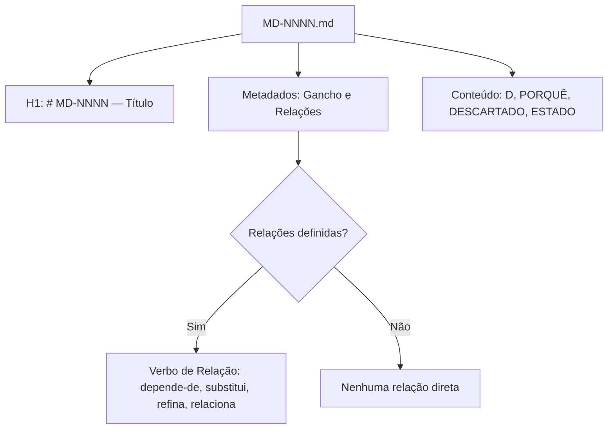
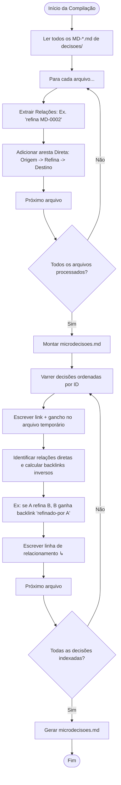

# Fluxogramas do Módulo `decisoes`

> Gerado pelo Archaeologist em 2026-06-23

Esta pasta contém a representação visual de como as microdecisões são particionadas e indexadas.

---

## 🏗️ 1. Estrutura e Relações de Microdecisões

Cada decisão em `decisoes/` representa um arquivo separado (`MD-NNNN.md`) estruturado de forma coesa:

---

## 📊 2. Compilação e Grafo de Backlinks (Passo 4.1 de /encerrar-sessao)

O script `gerar-index-decisoes.sh` faz o processamento reverso do grafo de relacionamentos:

