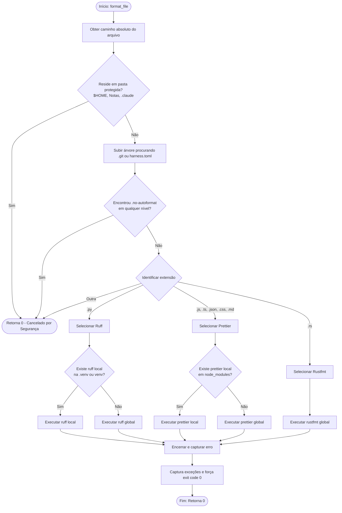
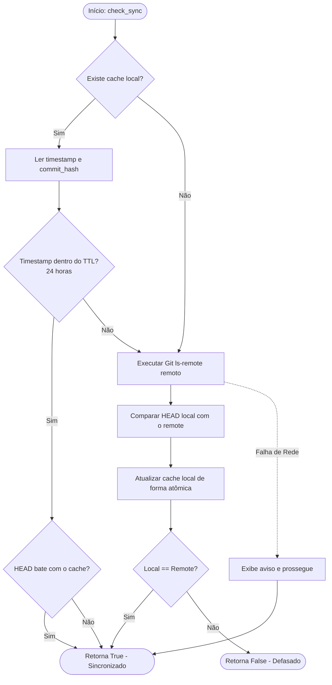
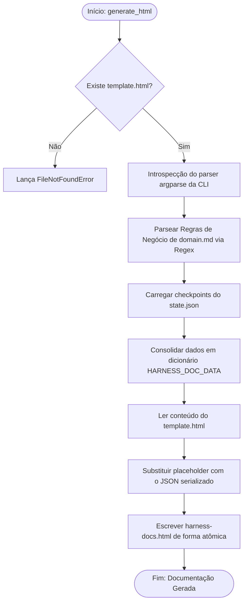

# Fluxogramas (Flowcharts) — harness-core

> Gerado pelo Archaeologist em 2026-06-23 (Re-extração após Feature 002)
> Nível de Documentação: **Completo**

Este documento ilustra o fluxo de controle e os algoritmos dos principais sub-serviços do `harness-core`.

---

## 🔄 1. Fluxo de Formatação (`FormattingService.format_file`)

O diagrama abaixo descreve o algoritmo de formatação de arquivos, incluindo verificações de diretórios protegidos, detecção de opt-out recursivo e inibição de erros de compiladores.

---

## 🔄 2. Fluxo de Verificação de Sincronia (`SyncService.check_sync`)

Este diagrama mapeia a lógica de verificação resiliente de sincronia Git do repositório de memória compartilhada.

---

## 🔄 3. Geração de Documentação (`DocumentationService.generate_html`)

Este fluxograma ilustra o fluxo de geração do arquivo HTML standalone a partir do código do core e do estado do Reversa.

