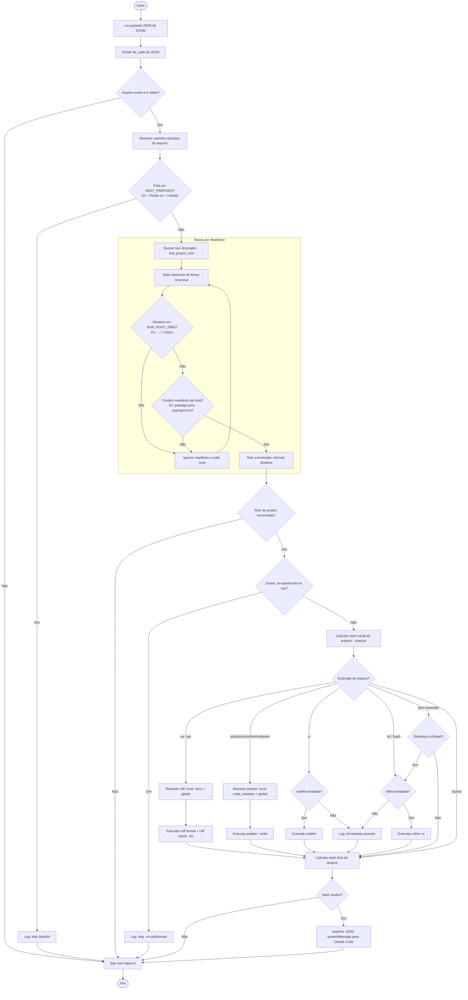

# Fluxogramas do Módulo `hooks`

> Gerado pelo Archaeologist em 2026-06-23

Esta pasta contém a representação visual dos fluxos de execução do gancho de padronização em `hooks/`.

---

## 🎨 1. Roteador de Formatação Automática (`format-on-edit.sh`)

Fluxo disparado no evento `PostToolUse` (matchers `Write` e `Edit`) do Claude Code.

,Description:
