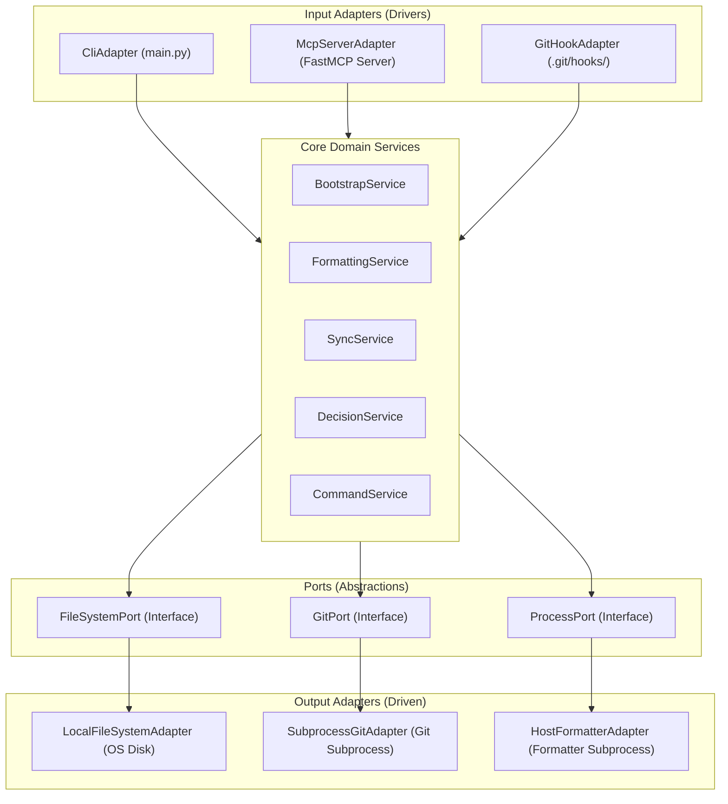

# Target Architecture

> Arquitetura alvo do sistema novo, respeitando o paradigma escolhido em `paradigm_decision.md` e a estratégia confirmada em `migration_strategy.md`.

## Visão geral
O novo sistema é concebido sob a **Arquitetura Hexagonal (Portas e Adaptadores) em Python OO**. As regras de negócio são divididas em casos de uso e serviços de domínio puros, desacoplados do sistema de arquivos e comandos do Git por meio de Portas (interfaces abstratas). Os adaptadores de entrada incluem um Servidor MCP local e ganchos Git, enquanto os adaptadores de saída encapsulam chamadas físicas de terminal e acesso ao disco local via TOML.

## Diagrama (Mermaid)

## Componentes

| Componente | Tipo | Responsabilidade | Origem (legado / novo / fundido) |
|---|---|---|---|
| `McpServerAdapter` | API / Serviço | Servidor MCP que expõe ferramentas de formatação, sync e microdecisões para Claude Code, Gemini CLI e Antigravity. | novo |
| `CliAdapter` | API | Entrypoint de linha de comando (`main.py`) para execução direta de tarefas administrativas. | novo |
| `GitHookAdapter` | Worker | Scripts de ganchos Git (`pre-commit`, `post-merge`) que invocam o CLI/MCP Python. | fundido (anteriormente scripts Bash puros) |
| `BootstrapService` | Serviço | Orquestra a instalação de hooks e compilação de configurações. | fundido (`bootstrap.sh`) |
| `FormattingService` | Serviço | Resolve e executa formatadores de código respeitando precedência local e `.no-autoformat`. | fundido (`format-on-edit.sh`) |
| `SyncService` | Serviço | Valida se commits do repositório local estão defasados com o remoto (TTL cache 24h). | fundido (`sync-check.sh`) |
| `DecisionService` | Serviço | Executa parsing das microdecisões Markdown, valida backlinks estruturais e compila `microdecisoes.md`. | fundido (`gerar-index-decisoes.sh` e parser) |
| `CommandService` | Serviço | Interpretador agnóstico de slash-commands e PCCP. | fundido (`commands/` legados) |

## Bounded contexts

### BC-01: Automations (Ganchos e Utilitários)
- **Responsabilidade**: Orquestrar a execução de formatação e verificação de sincronia em rede e ganchos de ciclo de vida do repositório Git.
- **Justificativa do agrupamento / separação**: Agrupa todos os gatilhos determinísticos de verificação que respondem a eventos físicos (gravação, commit, merge, checkout).
- **Componentes internos**: `BootstrapService`, `FormattingService`, `SyncService`
- **Eventos publicados**: nenhum (opera em modelo síncrono/transacional).

### BC-02: DecisionRegistry (Registro de Microdecisões)
- **Responsabilidade**: Ler, validar integridade semântica de relacionamentos de grafo, backlinks e consolidar o índice das decisões arquiteturais em Markdown.
- **Justificativa do agrupamento / separação**: Isola o parser e compilador de grafos de metadados do restante das automações de infraestrutura.
- **Componentes internos**: `DecisionService`

### BC-03: InteractiveSession (Sessão de Comandos)
- **Responsabilidade**: Interpretar slash commands e orientar o fluxo interativo com o desenvolvedor ou agentes externos (PCCP/handoff).
- **Justificativa do agrupamento / separação**: Contexto focado no fluxo de diálogo do terminal de forma portável entre Harnesses.
- **Componentes internos**: `CommandService`

## Decisões arquiteturais (ADR-style resumido)

### AD-01: Isolamento de Entrada via MCP Server
- **Decisão**: Utilizar o protocolo MCP (Model Context Protocol) para conectar o núcleo Python a harnesses de IA como Gemini CLI, Antigravity e Claude Code.
- **Alternativas descartadas**: Wrappers de terminal exclusivos para cada harness ou arquivos JSON de eventos em cache.
- **Justificativa**: Garante alta coesão e independência física. Qualquer nova IA compatível com MCP poderá invocar as ferramentas nativamente sem alteração de lógica do core.
- **Rastreabilidade**: `target_business_rules.md § BR-HUMANA-001`

### AD-02: Porta de Sistema de Arquivos (FileSystemPort)
- **Decisão**: Toda leitura e escrita em disco é abstraída pela interface `FileSystemPort`, permitindo injeção de dependência.
- **Alternativas descartadas**: Chamadas diretas do módulo `os` ou `shutil` do Python espalhadas pelos serviços de domínio.
- **Justificativa**: Permite testar as regras de backlinks de decisões e formatação com 100% de cobertura sem tocar fisicamente no disco local (utilizando Mocks de FS).
- **Rastreabilidade**: `paradigm_decision.md § Implicação 3`

## Honra ao paradigma escolhido

- **Paradigma alvo**: Orientação a Objetos com Injeção de Dependências (Core Python).
- **Como a arquitetura honra esse paradigma**:
  - Camadas físicas bem definidas: a lógica de regras de negócio (`core/`) nunca importa nada da camada de infraestrutura (`adapters/`).
  - Utilização de Interfaces (Abstract Base Classes em Python) para definir Portas (`FileSystemPort`, `GitPort`, `ProcessPort`).
  - Os serviços do domínio recebem as dependências das Portas no construtor (`__init__`), permitindo injeção limpa de mocks nos testes de unidade.

## Bordas com o legado durante a migração
- **Coexistência de Homologação (Parallel Run)**: Os ganchos git legados do Claude Code (`settings.json` legados apontando para `.sh`) continuam ativos. O `bootstrap` novo gerará adaptadores que invocam a CLI Python no modo "shadow" em background, escrevendo logs em `.reversa/logs/shadow-validation.log` para conferir divergências antes do cutover definitivo.

## Notas
A latência de cold start do Python é prevenida fazendo com que os ganchos do Git locais disparem scripts de shell leves que validam de forma barata a existência de arquivos de opt-out (como `.no-autoformat`) antes de bootar o interpretador Python completo.
