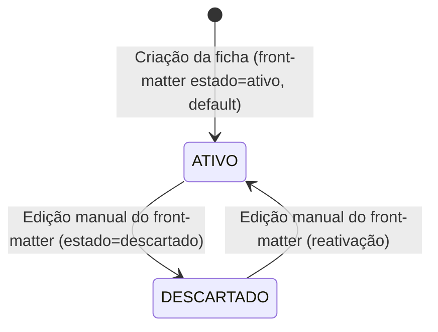

# Máquinas de Estado (State Machines) — harness-core

> Regenerado pelo Detective em 2026-06-24 (re-extração após as features 003, 004 e 005)
> Nível de Documentação: **Completo**

Ciclo de vida e transições das entidades centrais do `harness-core` com status explícito: a **Sessão do Agente** e a **Microdecisão**. Esta versão corrige a extração anterior em dois pontos: (1) o estado de sessão vive agora em `.harness/estado-da-sessao.md`, não em `ESTADO-DA-SESSAO.md`; (2) a Microdecisão tem apenas **dois** estados reais no código (`ativo`/`descartado`) — os valores `em-revisao`/`rejeitado` citados antes **não constam do validador** (`Decision.status`).

---

## 🤝 1. Sessão do Agente (`SessionState`)

Persistida em `.harness/estado-da-sessao.md` (front-matter YAML + corpo Markdown). O campo `status` ∈ {`active`, `inactive`} mapeia para `is_active`. O ciclo cobre boot, reinjeção e encerramento.

```mermaid
stateDiagram-v2
    [*] --> AUSENTE : Nenhum arquivo de estado

    AUSENTE --> ATIVA : ./harness cmd resume (cria SessionState com HEAD atual)
    INATIVA --> ATIVA : ./harness cmd resume (reativa, preserva narrativa)
    ATIVA --> ATIVA : ./harness cmd resume (reinjeta narrativa; alerta se HEAD ≠ âncora)

    ATIVA --> INATIVA : ./harness cmd encerrar-sessao (grava commit-âncora)

    MALFORMADA : MALFORMADA (corrompida)
    AUSENTE --> MALFORMADA : arquivo presente mas inválido → MalformedSessionStateError
    INATIVA --> MALFORMADA : arquivo presente mas inválido → MalformedSessionStateError
```

### ⚡ Transições e Condições (Sessão do Agente)

| Origem | Destino | Gatilho / Condição | Confiança |
| :--- | :--- | :--- | :--- |
| `AUSENTE` | `ATIVA` | `cmd resume` sem arquivo: cria `SessionState` com HEAD atual e feature `args[0]` (ou `default_feature`), salva, retorna "Nova sessão". | 🟢 CONFIRMADO |
| `INATIVA`/`ATIVA` | `ATIVA` | `cmd resume` com arquivo: `start_session` reativa **preservando a narrativa** (RN-N3). Se HEAD ≠ `commit_hash` da âncora, antecede `⚠️ ALERTA` de divergência (RN-07) e reinjeta a narrativa pelo *sink* do harness. | 🟢 CONFIRMADO |
| `ATIVA` | `INATIVA` | `cmd encerrar-sessao`: exige sessão ativa (senão erro), lê HEAD, `close_session(commit)` grava o commit-âncora, salva atomicamente. | 🟢 CONFIRMADO |
| `AUSENTE`/`INATIVA` | `MALFORMADA` | Arquivo presente mas inválido (sem `---`, YAML inválido, campo obrigatório ausente, commit não-SHA1) → `MalformedSessionStateError`. Distinto de "ausente" (RN-N4: falha barulhenta). | 🟢 CONFIRMADO |

> **Reinjeção no boot (RN-N6):** ao reativar, o estado é entregue ao contexto pelo *sink* do `active_harness` — `HookContextSink` (Claude/Gemini, via `hookSpecificOutput.additionalContext`, truncado em 10000 chars) ou `FileProjectionSink` (Antigravity, projetado em `.agents/rules/estado-sessao.md`). Ver MD-0003.
>
> 🟡 **Ressalva (T2):** via MCP, `session_command` opera sobre `ESTADO-DA-SESSAO.md` na raiz — uma máquina de estado paralela e divergente da CLI. Bug latente, não corrigido.

---

## 📄 2. Microdecisão (`Decision`)

Status de vigência de uma decisão arquitetural. **Apenas dois estados existem no validador** (`Decision.status`, default `ativo`): `ATIVO` e `DESCARTADO`. O estado é o campo `estado` no front-matter da ficha `MD-NNNN.md`; muda por edição manual do Markdown — não há transição programática de status no código.

### ⚡ Transições e Condições (Microdecisão)

| Origem | Destino | Gatilho / Condição | Confiança |
| :--- | :--- | :--- | :--- |
| `(criação)` | `ATIVO` | Nova ficha sem `estado` no front-matter assume `ativo` (default do modelo). | 🟢 CONFIRMADO |
| `ATIVO` | `DESCARTADO` | Edição manual do campo `estado` para `descartado` na ficha. Não há gatilho automático no código. | 🟢 CONFIRMADO |
| `DESCARTADO` | `ATIVO` | Edição manual de volta para `ativo`. | 🟡 INFERIDO (simetria do campo; sem caminho de código dedicado) |

> 🟡 **Nota sobre substituição:** a relação `substitui MD-XXXX` registra a aresta no grafo (e gera o backlink `substituído-por` no índice), mas **não** altera automaticamente o `estado` da decisão substituída para `descartado` — a depreciação efetiva continua sendo uma edição manual do front-matter. A extração anterior inferia uma transição `ATIVO→REJEITADO` disparada pela relação; o código não a implementa.
>
> 🔴 **LACUNA:** não há, no código, máquina de aprovação/revisão de decisões (o `em-revisao`/`rejeitado` da extração anterior era inferência sem respaldo). Decisões nascem `ativo` e a única alavanca de status é a edição do Markdown.
