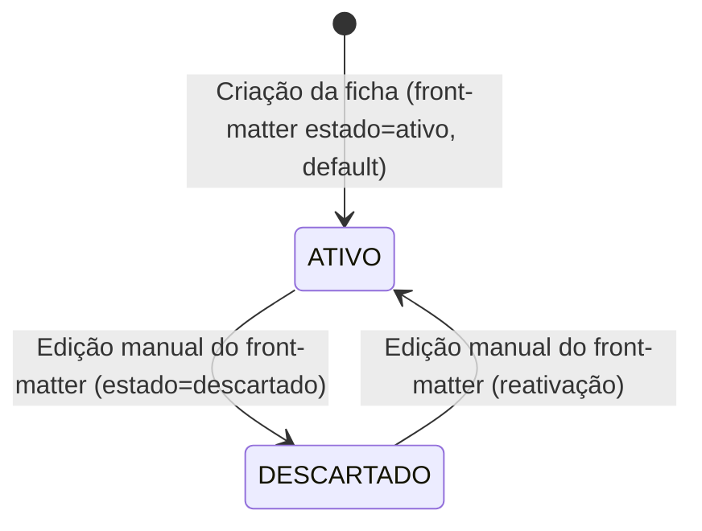

# Máquinas de Estado (State Machines) — harness-core

> Regenerado pelo Detective em 2026-06-24 (re-extração após as features 003, 004 e 005)
> Nível de Documentação: **Completo**
> **Reconciliação de 2026-07-05** (Detective, pós-features 019-021): a transição `ATIVA → INATIVA` por `cmd encerrar-sessao` ganhou **gates de aborto** que este documento não registrava (introduzidos pelas features 016/018/019, fora do escopo original desta extração, mas relevantes o bastante para a máquina de estado que valem registro aqui). Ver nota após a tabela de transições da Sessão.
> **Reconciliação de 2026-07-15** (Detective, pós-features 022-023): terceiro gate de aborto (registro de microdecisões) na mesma transição, com anti-loop por fingerprint persistido no próprio estado e escape `--sem-decisao`; `close_session` passou a **zerar** os fingerprints do gate no fechamento. Ver nota atualizada abaixo.
> **Reconciliação de 2026-08-11** (Detective, pós-features 024-025): o portão 1 (pré-check de pendência) virou **oferta consentida** e o commit de encerramento passou a depender de **consentimento tri-estado** (feature 024, RN-N48/N49 do domain.md §2.22): a transição `ATIVA → INATIVA` agora tem dois desfechos válidos — com ou sem commit do estado no git — ambos com o commit-âncora gravado no arquivo. A máquina de estados em si não muda (mesmos estados, mesmas transições); o que muda é o fluxo de portões e o efeito colateral no git. Nota abaixo atualizada.

Ciclo de vida e transições das entidades centrais do `harness-core` com status explícito: a **Sessão do Agente** e a **Microdecisão**. Esta versão corrige a extração anterior em dois pontos: (1) o estado de sessão vive agora em `.harness/estado-da-sessao.md`, não em `ESTADO-DA-SESSAO.md`; (2) a Microdecisão tem apenas **dois** estados reais no código (`ativo`/`descartado`) — os valores `em-revisao`/`rejeitado` citados antes **não constam do validador** (`Decision.status`).

---

## 🤝 1. Sessão do Agente (`SessionState`)

Persistida em `.harness/estado-da-sessao.md` (front-matter YAML + corpo Markdown). O campo `status` ∈ {`active`, `inactive`} mapeia para `is_active`. O ciclo cobre boot, reinjeção e encerramento.

```mermaid
stateDiagram-v2
    [*] --> AUSENTE : Nenhum arquivo de estado

    AUSENTE --> ATIVA : ./harness cmd resume (cria SessionState com HEAD atual)
    INATIVA --> ATIVA : ./harness cmd resume (reativa, preserva narrativa)
    ATIVA --> ATIVA : ./harness cmd resume (reinjeta narrativa; alerta se HEAD ≠ âncora)

    ATIVA --> INATIVA : ./harness cmd encerrar-sessao (grava commit-âncora)

    MALFORMADA : MALFORMADA (corrompida)
    AUSENTE --> MALFORMADA : arquivo presente mas inválido → MalformedSessionStateError
    INATIVA --> MALFORMADA : arquivo presente mas inválido → MalformedSessionStateError
```

### ⚡ Transições e Condições (Sessão do Agente)

| Origem              | Destino      | Gatilho / Condição                                                                                                                                                                                                   | Confiança     |
| :------------------ | :----------- | :------------------------------------------------------------------------------------------------------------------------------------------------------------------------------------------------------------------- | :------------ |
| `AUSENTE`           | `ATIVA`      | `cmd resume` sem arquivo: cria `SessionState` com HEAD atual e feature `args[0]` (ou `default_feature`), salva, retorna "Nova sessão".                                                                               | 🟢 CONFIRMADO |
| `INATIVA`/`ATIVA`   | `ATIVA`      | `cmd resume` com arquivo: `start_session` reativa **preservando a narrativa** (RN-N3). Se HEAD ≠ `commit_hash` da âncora, antecede `⚠️ ALERTA` de divergência (RN-07) e reinjeta a narrativa pelo _sink_ do harness. | 🟢 CONFIRMADO |
| `ATIVA`             | `INATIVA`    | `cmd encerrar-sessao`: exige sessão ativa (senão erro), lê HEAD, `close_session(commit)` grava o commit-âncora, salva atomicamente.                                                                                  | 🟢 CONFIRMADO |
| `AUSENTE`/`INATIVA` | `MALFORMADA` | Arquivo presente mas inválido (sem `---`, YAML inválido, campo obrigatório ausente, commit não-SHA1) → `MalformedSessionStateError`. Distinto de "ausente" (RN-N4: falha barulhenta).                                | 🟢 CONFIRMADO |

> **Gates de aborto antes de `ATIVA → INATIVA` (features 016/018, estendidos na 019 e na 022):** `cmd encerrar-sessao` não transiciona direto — `SessionCloseFlow.run` (§2.15/RN-N33 do domain.md) impõe **três portões** antes de chamar `CommandService.execute_command`: (1) **pré-check de pendência** — há trabalho não commitado, exceto o próprio `session_file`? Desde a 019 isso cobre também decisões e o índice em `.harness/`, não só o fora dele (RN-N34). Desde a **024** (RN-N48) o desfecho positivo virou **oferta consentida** (`conduct_commit_pendente`): com TTY, anuncia a contagem e pergunta se o mantenedor quer encerrar mesmo assim (`s` prossegue, com rastro declarativo na narrativa; `n` aborta); sem TTY, só a flag `--com-pendencias` autoriza — sem ela, aborta (marker/lista) e a sessão **permanece `ATIVA`**; (2) **gate de narrativa viva** — a narrativa está vazia ou idêntica à do commit-âncora de partida? Se sim, aborta e a sessão **permanece `ATIVA`**; (3) **gate de registro de microdecisões** (feature 022, RN-N43..N46) — houve trabalho substantivo desde a âncora sem ficha `MD-*.md` tocada? Se sim e sem `--sem-decisao`, aborta (marker `DECISAO_PENDENTE`) e a sessão **permanece `ATIVA`**, gravando o fingerprint fino no estado; na reexecução com o **mesmo** estado de pendência, o portão avisa "não sanada" e **libera** (anti-loop); com `--sem-decisao`, grava a declaração na narrativa e libera. Só quando os três portões liberam é que `close_session(commit)` executa e a transição para `INATIVA` de fato ocorre — e `close_session` **zera** os fingerprints do gate (não vazam para a próxima sessão). **Desde a 024**, entre os portões e a execução resolve-se o consentimento tri-estado do commit de encerramento (RN-N48): com TTY pergunta `[S/n]` (default afirmativo); sem TTY, o silêncio é recusa (`--com-commit-encerramento` autoriza; `--sem-commit-encerramento` recusa; ambas juntas são erro de uso). O consentimento negado NÃO impede a transição: `execute_command(..., versionar_estado=False)` fecha o estado no arquivo (âncora = HEAD), pula o commit no git, grava linha declarativa na narrativa e emite o marker `ENCERRAMENTO_NAO_VERSIONADO` com `motivo` (esquecimento vs recusa) após o sucesso e antes da oferta de push (RN-N49). Este diagrama registra o estado final da entidade, não o fluxo de aborto — ver o fluxograma 6 em `flowcharts/harness-core.md` para a sequência completa.
>
> **Reinjeção no boot (RN-N6):** ao reativar, o estado é entregue ao contexto pelo _sink_ do `active_harness` — `HookContextSink` (Claude/Gemini, via `hookSpecificOutput.additionalContext`, truncado em 10000 chars) ou `FileProjectionSink` (Antigravity, projetado em `.agents/rules/estado-sessao.md`). Ver MD-0003. **Desde a feature 021**, no Claude, essa mesma entrega passa a incluir também o apêndice do índice de decisões (`domain.md#2.18`, RN-N41) — não é uma transição da máquina de estado da sessão, é conteúdo adicional composto na borda do `resume`.
>
> 🟢 **Ressalva (T2) RESOLVIDA (feature 006, via configuração):** à época desta extração, via MCP, `session_command` operava sobre `ESTADO-DA-SESSAO.md` na raiz — uma máquina de estado paralela e divergente da CLI. A feature 006 unificou o caminho por configuração: `HarnessConfig` ganhou `SessionSection` (`state_file = .harness/estado-da-sessao.md`) e tanto a CLI (`main.py:169`) quanto o MCP (`server.py:94`) leem `config.session.state_file`. CLI e MCP operam agora sobre a **mesma** máquina de estado. Registro histórico preservado; bug fechado. Ver MD-0005, ADR 0013.

---

## 📄 2. Microdecisão (`Decision`)

Status de vigência de uma decisão arquitetural. **Apenas dois estados existem no validador** (`Decision.status`, default `ativo`): `ATIVO` e `DESCARTADO`. O estado é o campo `estado` no front-matter da ficha `MD-NNNN.md`; muda por edição manual do Markdown — não há transição programática de status no código.

### ⚡ Transições e Condições (Microdecisão)

| Origem       | Destino      | Gatilho / Condição                                                                               | Confiança                                                       |
| :----------- | :----------- | :----------------------------------------------------------------------------------------------- | :-------------------------------------------------------------- |
| `(criação)`  | `ATIVO`      | Nova ficha sem `estado` no front-matter assume `ativo` (default do modelo).                      | 🟢 CONFIRMADO                                                   |
| `ATIVO`      | `DESCARTADO` | Edição manual do campo `estado` para `descartado` na ficha. Não há gatilho automático no código. | 🟢 CONFIRMADO                                                   |
| `DESCARTADO` | `ATIVO`      | Edição manual de volta para `ativo`.                                                             | 🟡 INFERIDO (simetria do campo; sem caminho de código dedicado) |

> 🟡 **Nota sobre substituição:** a relação `substitui MD-XXXX` registra a aresta no grafo (e gera o backlink `substituído-por` no índice), mas **não** altera automaticamente o `estado` da decisão substituída para `descartado` — a depreciação efetiva continua sendo uma edição manual do front-matter. A extração anterior inferia uma transição `ATIVO→REJEITADO` disparada pela relação; o código não a implementa.
>
> 🔴 **LACUNA:** não há, no código, máquina de aprovação/revisão de decisões (o `em-revisao`/`rejeitado` da extração anterior era inferência sem respaldo). Decisões nascem `ativo` e a única alavanca de status é a edição do Markdown.
