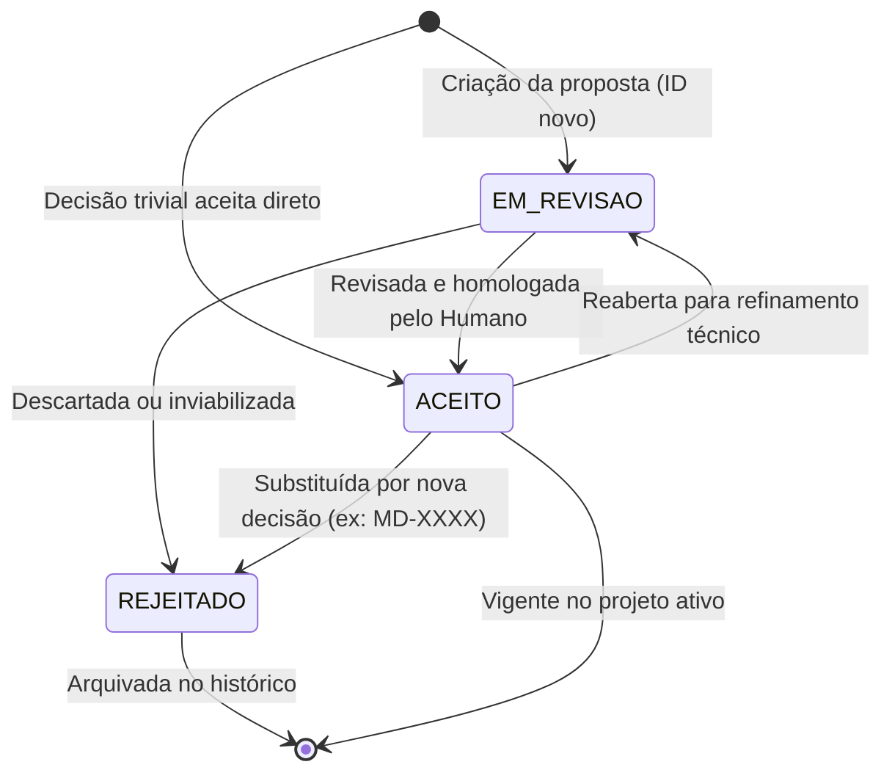
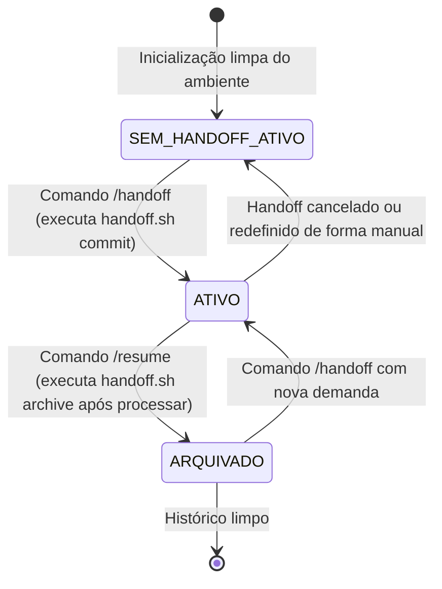

# Máquinas de Estado (State Machines) — harness

> Gerado pelo Detetive em 2026-06-23
> Nível de Documentação: **Completo**

Este documento detalha o ciclo de vida e as transições de estado das duas entidades centrais do sistema que possuem comportamento de estado explícito: as **Microdecisões** e o **Bastão de Handoff**.

---

## 📄 1. Máquina de Estados: Microdecisão (`Microdecisao`)

O campo `estado` em cada arquivo `MD-NNNN.md` reflete o status de validação daquela tomada de decisão de design de arquitetura.

### ⚡ Transições e Condições (Microdecisão)

| Origem | Destino | Gatilho / Condição | Confiança |
| :--- | :--- | :--- | :--- |
| `EM_REVISAO` | `ACEITO` | Usuário humano aprova a lógica proposta pelo agente. | 🟢 CONFIRMADO |
| `ACEITO` | `REJEITADO` | Criação de uma nova decisão de design contendo metadado `substitui MD-NNNN`. O script `gerar-index-decisoes.sh` atualiza os backlinks correlacionados. | 🟢 CONFIRMADO |
| `ACEITO` | `EM_REVISAO` | Identificação de bugs de portabilidade ou necessidade de modificação estrutural. | 🟡 INFERIDO |

---

## 🤝 2. Máquina de Estados: Bastão de Handoff (`Bastao`)

O estado da sincronização do Bastão física sob `~/.agent-memory/BASTAO.md` gerencia o fluxo de trabalho colaborativo cross-agent.

### ⚡ Transições e Condições (Bastão)

| Origem | Destino | Gatilho / Condição | Confiança |
| :--- | :--- | :--- | :--- |
| `SEM_HANDOFF_ATIVO` | `ATIVO` | Criação do arquivo `BASTAO.md` com estrutura de Objetivo, Estado Atual, Decisões e Próximos Passos pelo comando `/handoff`. | 🟢 CONFIRMADO |
| `ATIVO` | `ARQUIVADO` | Comando `/resume` detecta o bastão ativo, consome as informações para ambientar o novo agente e executa a limpeza pós-leitura arquivando o bastão anterior. | 🟢 CONFIRMADO |
| `ATIVO` | `SEM_HANDOFF_ATIVO` | Remoção manual ou limpeza do arquivo de memória compartilhada. | 🟡 INFERIDO |
