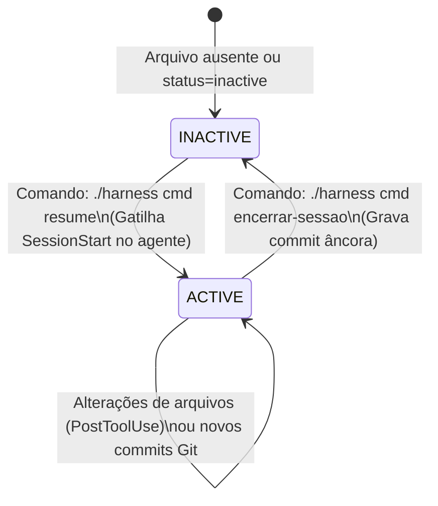
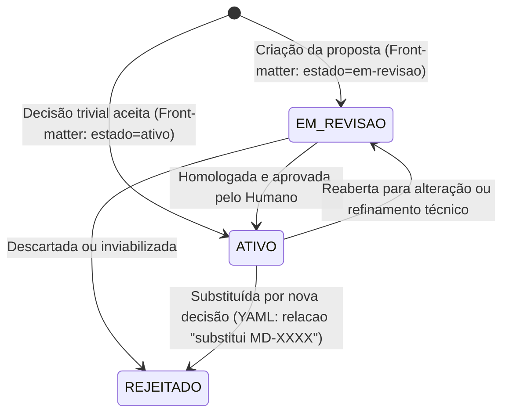

# Máquinas de Estado (State Machines) — harness-core

> Gerado pelo Detective em 2026-06-23
> Nível de Documentação: **Completo**

Este documento detalha o ciclo de vida e as transições de estado das entidades centrais do `harness-core` que possuem status explícitos: a **Sessão do Agente** e as **Microdecisões**.

---

## 🤝 1. Máquina de Estados: Sessão do Agente (`SessionState`)

O estado da sessão do agente local é persistido em `ESTADO-DA-SESSAO.md` e gerencia as transições de boot e encerramento.

### ⚡ Transições e Condições (Sessão do Agente)

| Origem | Destino | Gatilho / Condição | Confiança |
| :--- | :--- | :--- | :--- |
| `INACTIVE` | `ACTIVE` | Execução de `cmd resume`. Se a hash do HEAD atual divergir da âncora anterior, emite alerta, mas avança. | 🟢 CONFIRMADO |
| `ACTIVE` | `INACTIVE` | Execução de `cmd encerrar-sessao`. Valida se o diretório do repositório está limpo e grava a hash do commit âncora no arquivo de estado. | 🟢 CONFIRMADO |

---

## 📄 2. Máquina de Estados: Microdecisão (`Decision`)

O status de vigência das decisões arquiteturais tomadas no projeto.

### ⚡ Transições e Condições (Microdecisão)

| Origem | Destino | Gatilho / Condição | Confiança |
| :--- | :--- | :--- | :--- |
| `EM_REVISAO` | `ATIVO` | Alteração manual do campo `estado` no front-matter do markdown correspondente. | 🟢 CONFIRMADO |
| `ATIVO` | `REJEITADO` | Criação de uma microdecisão que possui a relação `substitui MD-XXXX`. O indexador recompila o backlinks e atualiza o grafo. | 🟢 CONFIRMADO |
